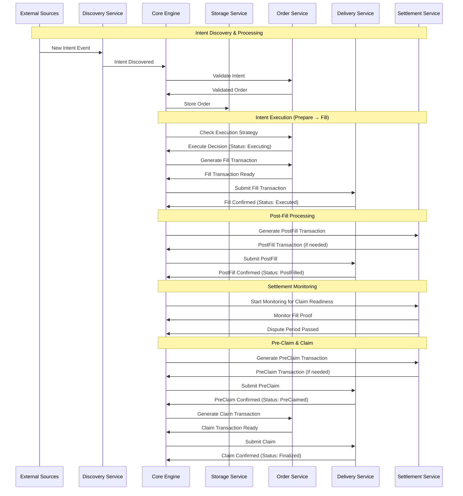
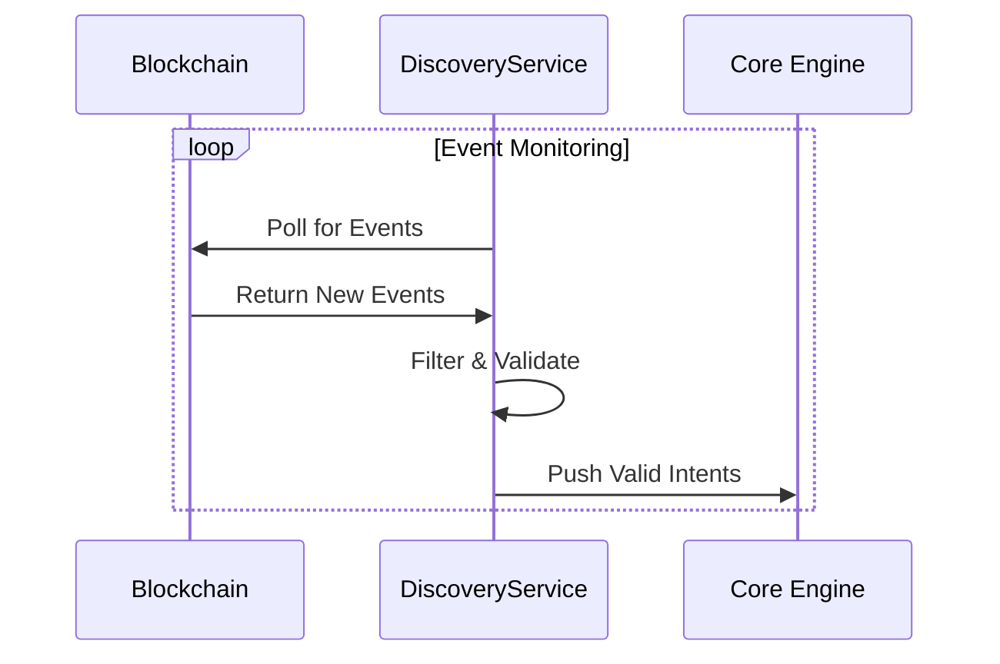
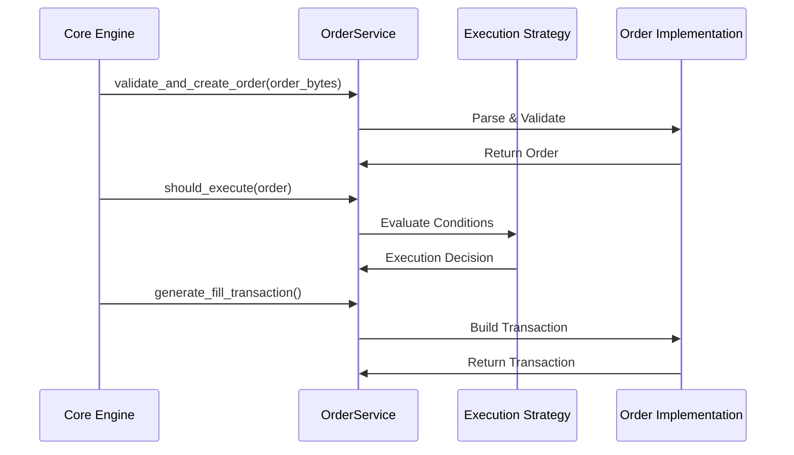
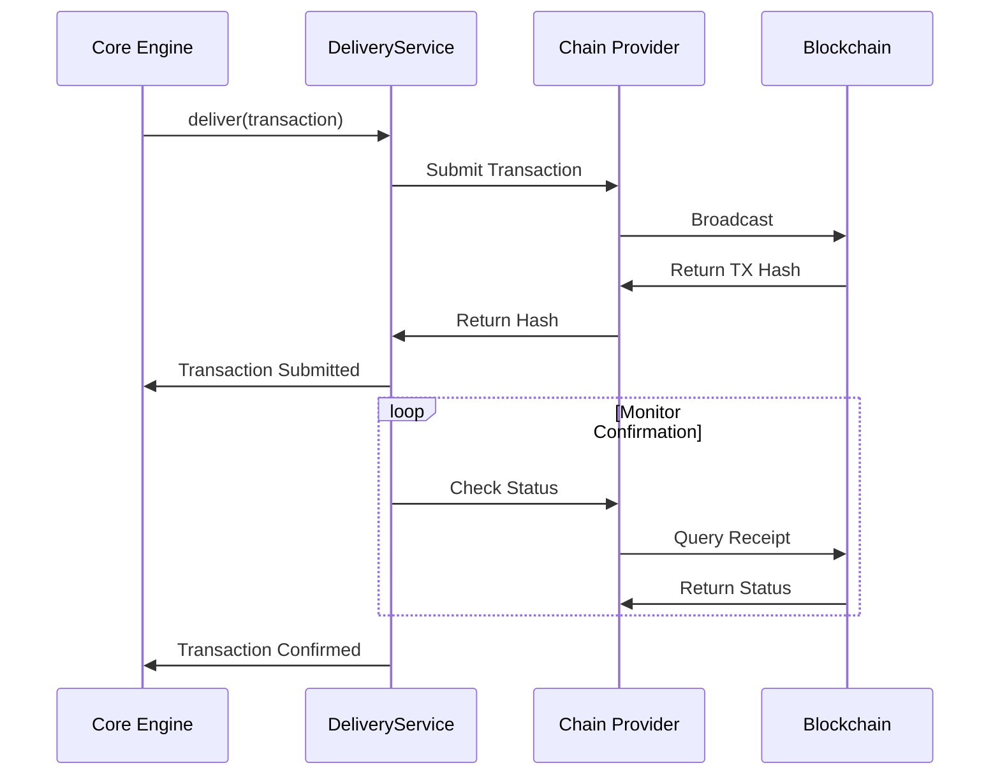
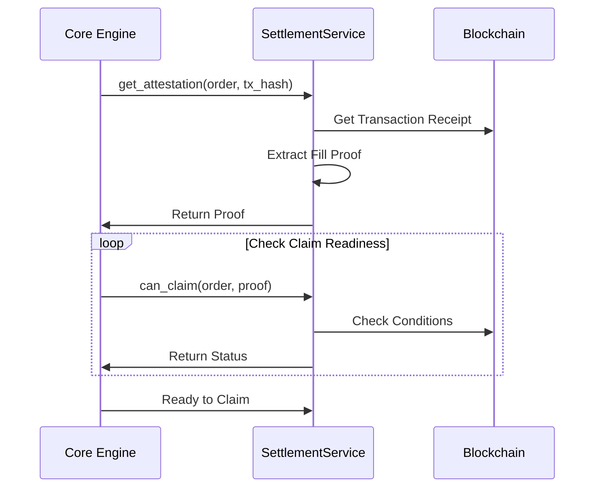
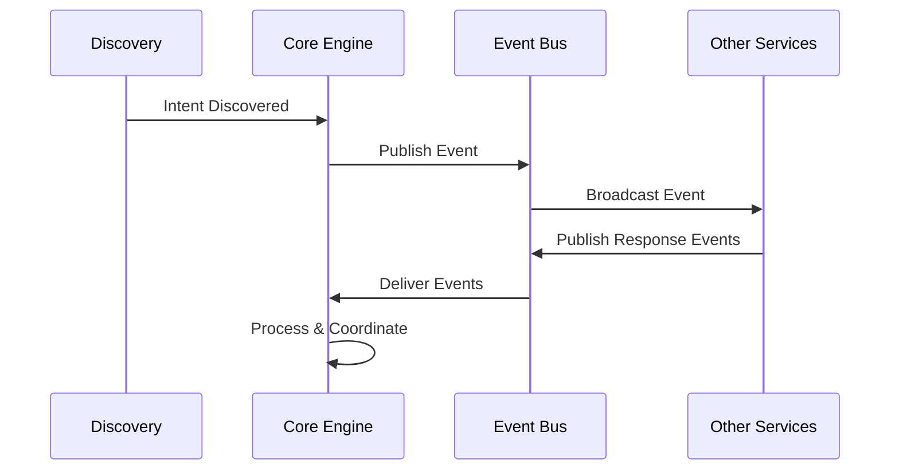

# OIF Solver Overview

The OIF Solver is a high-performance cross-chain order execution system designed for the Open Intents Framework. It discovers (on-chain) or receives (off-chain) intents, validates and executes orders through optimal paths, and manages settlement processes. The solver operates as an autonomous service that monitors blockchain events, makes intelligent execution decisions, and ensures reliable transaction delivery across networks.

## High-Level Project Structure

The OIF Solver uses Rust for its performance-critical requirements in cross-chain transaction execution. Rust provides zero-cost abstractions for the modular architecture, compile-time guarantees for concurrent blockchain monitoring across multiple chains, and predictable latency without garbage collection pauses, essential when competing to execute orders. Additionally, the memory safety guarantees are crucial when handling cryptographic operations simultaneously.

The solver is organized as a Rust workspace with multiple crates, each serving a specific purpose in the cross-chain order execution pipeline. This modular design allows for:

- **Independent Development**: Each crate can be developed and tested in isolation
- **Clear Boundaries**: Well-defined interfaces between components prevent tight coupling
- **Reusability**: Components like `solver-types` and `solver-account` can be used by external projects
- **Scalability**: New execution strategies or chain integrations can be added without modifying core logic
- **Testability**: Each module has its own test suite with mocked dependencies

```
oif-solver/
├── Cargo.toml                   # Workspace definition
├── crates/                      # Modular components
│   ├── solver-account/          # Cryptographic operations
│   ├── solver-config/           # Configuration management
│   ├── solver-core/             # Orchestration engine
│   ├── solver-delivery/         # Transaction submission
│   ├── solver-demo/             # Testing and demo CLI
│   ├── solver-discovery/        # Intent monitoring
│   ├── solver-order/            # Order processing
│   ├── solver-pricing/          # Price and profitability calculations
│   ├── solver-service/          # Main executable
│   ├── solver-settlement/       # Settlement verification
│   ├── solver-storage/          # State persistence
│   └── solver-types/            # Shared types
├── config/                      # Configuration examples
└── scripts/                     # E2E testing and deployment scripts
```

## Directory Responsibilities

### Core Infrastructure

- **solver-types**: Common data structures and trait definitions shared across all modules
- **solver-config**: TOML-based configuration parsing and validation
- **solver-storage**: Persistent state management with custom backends
- **solver-account**: Secure key management and transaction signing

### Service Layer

- **solver-discovery**: Multi-chain event monitoring and intent detection
- **solver-order**: Intent validation, strategy evaluation, and transaction generation
- **solver-delivery**: Reliable transaction submission and confirmation monitoring
- **solver-settlement**: Fill validation and oracle verification management
- **solver-pricing**: Pricing oracle implementations for asset valuation and profitability calculations

### Orchestration

- **solver-core**: Event-driven orchestration of the entire order lifecycle
- **solver-service**: Binary entry point that wires up all components

### Development & Testing

- **solver-demo**: CLI tool for testing and demonstrating cross-chain intent execution in development environments

## High-Level System Flow



## Transaction State Transitions

The solver manages orders through distinct transaction states with the following progression:

1. **Prepare** → Status: `Executing` (emits `OrderEvent::Executing`)
2. **Fill** → Status: `Executed` (emits `SettlementEvent::PostFillReady`)
3. **PostFill** → Status: `PostFilled` (emits `SettlementEvent::StartMonitoring`)
4. **PreClaim** → Status: `PreClaimed` (emits `SettlementEvent::ClaimReady`)
5. **Claim** → Status: `Finalized` (emits `SettlementEvent::Completed`)

Each transition updates the order status in storage and triggers appropriate events for downstream processing.

## Module Deep Dive

### solver-discovery

Monitors multiple chains simultaneously for new intent events.



### solver-order

Processes intents through validation, strategy evaluation, and transaction generation.



### solver-delivery

Handles reliable transaction submission with monitoring and retry logic.



### solver-settlement

Validates fills and manages the claim process for completed orders.



### solver-core

Orchestrates the entire solver workflow through event-driven architecture.



## Conclusion

The event-driven architecture ensures responsive processing of intents, while the clear separation of concerns makes the system easy to understand and extend. Whether used as a complete solver or as individual components, the OIF Solver provides the building blocks for sophisticated cross-chain execution strategies.