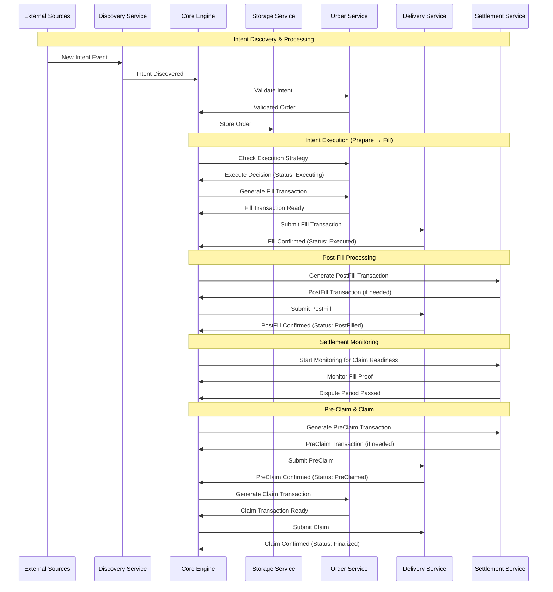

# OIF Solver

[](https://deepwiki.com/openintentsframework/oif-solver)

A high-performance cross-chain solver implementation for the Open Intents Framework (OIF). This solver enables efficient cross-chain order execution by discovering intents, finding optimal execution paths, and settling transactions across multiple blockchain networks.

## Table of Contents

- [Overview](#overview)
- [High-Level Architecture](#high-level-architecture)
- [Architecture](#architecture)
- [Project Structure](#project-structure)
- [Component Responsibilities](#component-responsibilities)
- [Quick Start](#quick-start)
- [Configuration](#configuration)
- [API Reference](#api-reference)
- [OIF Demo CLI Tool](#oif-demo-cli-tool)
- [Development](#development)
- [License](#license)

## Overview

The OIF Solver is designed to:

- Discover and monitor cross-chain intents from multiple sources
- Find optimal execution paths across different chains and liquidity sources
- Execute transactions efficiently while minimizing costs
- Provide comprehensive monitoring and observability
- Support multiple order types and protocols (currently EIP-7683)

## High-Level Architecture



### Transaction State Transitions

The solver manages orders through distinct transaction states with the following progression:

1. **Prepare** → Status: `Executing` (emits `OrderEvent::Executing`)
2. **Fill** → Status: `Executed` (emits `SettlementEvent::PostFillReady`)
3. **PostFill** → Status: `PostFilled` (emits `SettlementEvent::StartMonitoring`)
4. **PreClaim** → Status: `PreClaimed` (emits `SettlementEvent::ClaimReady`)
5. **Claim** → Status: `Finalized` (emits `SettlementEvent::Completed`)

Each transition updates the order status in storage and triggers appropriate events for downstream processing.

## Architecture

The solver is built as a modular Rust workspace with clearly defined service boundaries:

### Core Components

- **solver-core**: Orchestrates the entire solver workflow and coordinates between services
- **solver-types**: Defines shared data structures, traits, and interfaces used across all components
- **solver-config**: Handles configuration loading and validation
- **solver-storage**: Provides persistent storage abstraction with TTL management for solver state
- **solver-account**: Manages cryptographic keys and signing operations

### Service Components

- **solver-discovery**: Discovers new intents/orders from various blockchain and off-chain sources
- **solver-order**: Validates intents, manages execution strategies, and generates transactions
- **solver-delivery**: Handles transaction preparation, submission, and monitoring across multiple chains
- **solver-settlement**: Manages settlement verification and claim processing after transaction execution

### Binary

- **solver-service**: Main executable that wires up all components and runs the solver

## Project Structure

```
oif-solver/
├── Cargo.toml                   # Workspace definition
├── crates/                      # Modular components
│   ├── solver-account/          # Cryptographic operations
│   ├── solver-config/           # Configuration management
│   ├── solver-core/             # Orchestration engine
│   ├── solver-delivery/         # Transaction submission
│   ├── solver-discovery/        # Intent monitoring
│   ├── solver-order/            # Order processing
│   ├── solver-service/          # Main executable
│   ├── solver-settlement/       # Settlement verification
│   ├── solver-storage/          # State persistence
│   └── solver-types/            # Shared types
├── config/                      # Configuration examples
└── scripts/                     # Deployment and demo scripts
```

## Component Responsibilities

### solver-core

- Orchestrates the entire order lifecycle
- Manages event-driven communication between services
- Implements the main solver loop
- Handles graceful shutdown
- Provides factory pattern for building solver instances

### solver-discovery

- Monitors blockchain events for new intents
- Supports multiple discovery sources simultaneously
- Filters and validates discovered intents
- Pushes valid intents to the core engine

### solver-order

- Validates intents and converts them to orders
- Implements execution strategies (when to execute)
- Generates fill and claim transactions
- Manages order-specific logic for different protocols

### solver-delivery

- Submits transactions to multiple blockchains
- Monitors transaction confirmation status
- Manages gas estimation and pricing
- Handles transaction retries and failures

### solver-settlement

- Validates fill transactions
- Extracts and stores fill proofs
- Monitors when orders can be claimed
- Manages dispute periods and settlement interactions

### solver-storage

- Provides persistent storage for orders and state
- Implements TTL (time-to-live) for temporary data
- Supports different storage backends
- Ensures data consistency across services

### solver-account

- Manages private keys and signing operations
- Supports different key management backends
- Provides secure signing for transactions
- Handles address derivation

## Quick Start

```bash
# Build the project
cargo build

# Run tests
cargo test

# Run the solver service with info logs
cargo run -- --config config/example.toml

# Run with debug logs for solver modules only
RUST_LOG=solver_core=debug,solver_delivery=debug,info cargo run -- --config config/example.toml
```

## Configuration

The solver uses TOML configuration files with support for modular configuration through file includes.

### Modular Configuration (Recommended)

Split your configuration into multiple files for better organization:

```toml
# config/main.toml - Main configuration file
include = [
    "networks.toml",  # Network and token configurations
    "api.toml",       # API server settings
    "storage.toml",   # Storage backend configuration
    # ... other modules
]

[solver]
id = "oif-solver-local"
monitoring_timeout_minutes = 5
```

**Important**: Each top-level section must be unique across all files. Duplicate sections will cause an error.

See `config/demo/` for a complete modular configuration example.

### Single File Configuration

You can also use a single configuration file. See `config/example.toml` for a complete example:

```toml
# Solver identity and settings
[solver]
id = "oif-solver-local"
monitoring_timeout_minutes = 5

# Networks configuration - defines supported chains and tokens
[networks.31337]  # Origin chain
input_settler_address = "0x9fE46736679d2D9a65F0992F2272dE9f3c7fa6e0"
output_settler_address = "0xCf7Ed3AccA5a467e9e704C703E8D87F634fB0Fc9"
[[networks.31337.tokens]]
address = "0x5FbDB2315678afecb367f032d93F642f64180aa3"
symbol = "TOKA"
decimals = 18
[[networks.31337.tokens]]
address = "0xe7f1725E7734CE288F8367e1Bb143E90bb3F0512"
symbol = "TOKB"
decimals = 18

[networks.31338]  # Destination chain
input_settler_address = "0x9fE46736679d2D9a65F0992F2272dE9f3c7fa6e0"
output_settler_address = "0xCf7Ed3AccA5a467e9e704C703E8D87F634fB0Fc9"
[[networks.31338.tokens]]
address = "0x5FbDB2315678afecb367f032d93F642f64180aa3"
symbol = "TOKA"
decimals = 18

# Storage configuration with TTL management
[storage]
primary = "file"
cleanup_interval_seconds = 3600

[storage.implementations.file]
storage_path = "./data/storage"
ttl_orders = 0                  # Permanent
ttl_intents = 86400             # 24 hours
ttl_order_by_tx_hash = 86400    # 24 hours

# Account management
[account]
primary = "local"  # Specifies which account to use as default

[account.implementations.local]
private_key = "0xac0974bec39a17e36ba4a6b4d238ff944bacb478cbed5efcae784d7bf4f2ff80"

# Optional: Additional accounts for per-network signing
# [account.implementations.local2]
# private_key = "0x59c6995e998f97a5a0044966f0945389dc9e86dae88c7a8412f4603b6b78690d"

# Delivery implementations for different chains
[delivery]
min_confirmations = 1

[delivery.implementations.evm_alloy]
network_ids = [31337, 31338]  # Supports multiple networks in one implementation
# Optional: Map specific networks to different accounts
# accounts = { 31337 = "local", 31338 = "local2" }

# Discovery implementations for finding intents
[discovery.implementations.onchain_eip7683]
network_id = 31337  # Required: specifies which chain to monitor

[discovery.implementations.offchain_eip7683]
api_host = "127.0.0.1"
api_port = 8081
network_ids = [31337]  # Optional: declares multi-chain support

# Order execution strategy
[order]
[order.implementations.eip7683]
# Uses networks config for settler addresses

[order.strategy]
primary = "simple"

[order.strategy.implementations.simple]
max_gas_price_gwei = 100

# Settlement configuration
[settlement]
[settlement.domain]
chain_id = 1  # For EIP-712 signatures
address = "0x9fE46736679d2D9a65F0992F2272dE9f3c7fa6e0"

[settlement.implementations.eip7683]
network_ids = [31337, 31338]  # Monitor multiple chains for oracle verification
oracle_addresses = { 31337 = "0xDc64a140Aa3E981100a9becA4E685f962f0cF6C9", 31338 = "0xDc64a140Aa3E981100a9becA4E685f962f0cF6C9" }
dispute_period_seconds = 1

# API server (optional)
[api]
enabled = true
host = "127.0.0.1"
port = 3000
timeout_seconds = 30
max_request_size = 1048576  # 1MB
```

### Key Configuration Sections

- **networks**: Defines supported chains with their settler contracts and available tokens
- **storage**: Configures persistence backend with TTL for different data types
- **account**: Manages signing keys for the solver (supports multiple accounts)
- **delivery**: Handles transaction submission to multiple chains (supports per-network account mapping)
- **discovery**: Sources for discovering new intents (on-chain events, off-chain APIs)
- **order**: Execution strategy and protocol-specific settings
- **settlement**: Configuration for claiming rewards and handling disputes
- **api**: Optional REST API server for receiving off-chain intents

### Running with Custom Configuration

```bash
# Using command line flag
cargo run -- --config path/to/your/config.toml

# Using environment variable
CONFIG_FILE=path/to/your/config.toml cargo run
```

## API Reference

The solver provides a REST API for interacting with the system and submitting off-chain intents. Full OpenAPI specifications are available in the `api-spec/` directory.

### API Specifications

- **Orders API**: [`api-spec/orders-api.yaml`](api-spec/orders-api.yaml) - Submit and track cross-chain intent orders
- **Tokens API**: [`api-spec/tokens-api.yaml`](api-spec/tokens-api.yaml) - Query supported tokens and networks

### Available Endpoints

#### Quotes

- **POST `/api/quotes`** - Get a price quote for a cross-chain swap
  - Request body: `{ originChainId, outputChainId, inputToken, outputToken, inputAmount }`
  - Returns: Quote with `quoteId`, amounts, and cost breakdown

#### Orders

- **POST `/api/orders`** - Submit a new order (direct or from quote)

  - Direct submission: `{ order: "0x...", sponsor: "0x...", signature: "0x00...", lock_type: "..." }`
  - Quote acceptance: `{ quoteId: "...", signature: "0x..." }`
  - Returns: `{ status: "success", order_id: "...", message: null }`

- **GET `/api/orders/{id}`** - Get order status and details
  - Returns complete order information including status, amounts, settlement data, and fill transaction

#### Tokens

- **GET `/api/tokens`** - Get all supported tokens across all networks

  - Returns a map of chain IDs to network configurations with supported tokens

- **GET `/api/tokens/{chain_id}`** - Get supported tokens for a specific chain
  - Returns network configuration including settler addresses and token list

### Example Usage

```bash
# Submit an off-chain intent order
curl -X POST http://localhost:3000/api/orders \
  -H "Content-Type: application/json" \
  -d '{
    "order": "0x...",
    "sponsor": "0x70997970C51812dc3A010C7d01b50e0d17dc79C8",
    "signature": "0x00..."
  }'

# Check order status
curl http://localhost:3000/api/orders/1fa518079ecf01372290adf75c55858771efcbcee080594cc8bc24e3309a3a09

# Get supported tokens for chain 31338
curl http://localhost:3000/api/tokens/31338

# Get all supported tokens
curl http://localhost:3000/api/tokens
```

The API server is enabled by default on port 3000 when the solver is running. You can disable it or change the port in the configuration file.

### Logging Configuration

The solver uses the `RUST_LOG` environment variable for fine-grained logging control. You can specify different log levels for different modules:

```bash
# Show debug logs for solver modules only
RUST_LOG=solver_core=debug,solver_delivery=debug,info cargo run -- --config config/demo.toml

# Reduce noise from external crates
RUST_LOG=info,hyper=warn,alloy_provider=warn cargo run -- --config config/demo.toml

# Debug specific modules
RUST_LOG=solver_core=debug,solver_delivery=info,alloy=warn,hyper=warn cargo run -- --config config/demo.toml

# Show all debug logs (very verbose)
RUST_LOG=debug cargo run -- --config config/demo.toml
```

Available log levels (from most to least verbose):

- `trace` - Very detailed debugging information
- `debug` - Debugging information
- `info` - General information (default)
- `warn` - Warning messages
- `error` - Error messages only

The `--log-level` flag acts as a fallback when `RUST_LOG` is not set:

```bash
# Uses info level for all modules when RUST_LOG is not set
cargo run -- --config config/demo.toml --log-level info
```

## OIF Demo CLI Tool

The project includes a unified CLI tool (`./oif-demo`) for testing cross-chain intent execution between two local chains. This tool provides a streamlined interface for all demo operations.

**Note:** The demo has been tested on macOS systems only.

### Prerequisites

- [Foundry](https://book.getfoundry.sh/getting-started/installation) (for Anvil, Forge, and Cast)
- Rust toolchain (stable)
- Bash version > 4.0 (for `declare -g` support)
- Additional dependencies: `jq`, `curl`, `bc`, `perl`

### Quick Start

```bash
# 1. Start local environment and generate configuration
./oif-demo env up

# 2. In another terminal, start the solver
cargo run --bin solver -- --config config/demo.toml

# 3. Test a complete quote flow (build → submit → get quote → accept)
./oif-demo quote test escrow permit2 A2B   # Using Permit2 authorization
# OR
./oif-demo quote test escrow eip3009 A2B   # Using EIP-3009 authorization
# OR for onchain submission (direct to blockchain):
./oif-demo intent test --onchain escrow A2B  # Submit directly to InputSettler

# 4. Monitor balances in real-time
./oif-demo monitor 3 all
```

### Commands Overview

#### Environment Management

```bash
# Start Anvil chains, deploy contracts, generate config
./oif-demo env up

# Check chain status and connectivity
./oif-demo env status

# Stop Anvil chains
./oif-demo env down

# Reset all data and environment
./oif-demo env reset
```

#### Configuration Management

```bash
./oif-demo init config/demo.toml
```

#### Intent Operations

The demo supports two submission modes:
- **Offchain**: Intents are submitted to the solver API (default)
- **Onchain**: Intents are submitted directly to the blockchain via InputSettler.open()

##### Offchain Intent Submission (via Solver API)

```bash
# Build various types of intents for offchain submission
# Format: intent build <lock_type> <auth_type> <origin_chain> <dest_chain> <from_token> <to_token>
./oif-demo intent build escrow permit2 31337 31338 TokenA TokenB   # Escrow with Permit2
./oif-demo intent build escrow eip3009 31337 31338 TokenA TokenB   # Escrow with EIP-3009
./oif-demo intent build compact permit2 31337 31338 TokenB TokenA  # Compact with Permit2 (EIP-3009 not supported)

# Submit intent to solver API
./oif-demo intent submit demo-output/post_intent.req.json

# Test command - builds and submits in one step
# Format: intent test <lock_type> <auth_type> <token_pair>
./oif-demo intent test escrow permit2 A2B   # Escrow lock with Permit2 auth
./oif-demo intent test escrow eip3009 A2B   # Escrow lock with EIP-3009 auth
./oif-demo intent test compact permit2 B2A  # Compact lock with Permit2 auth (EIP-3009 not supported)
```

##### Onchain Intent Submission (Direct to Blockchain)

```bash
# Build intent for onchain submission (no auth_type needed)
# Format: intent build --onchain escrow <origin_chain> <dest_chain> <from_token> <to_token>
./oif-demo intent build --onchain escrow 31337 31338 TokenA TokenB

# Submit intent directly to blockchain
./oif-demo intent submit --onchain demo-output/post_intent.req.json

# Test command - builds and submits onchain in one step
# Format: intent test --onchain escrow <token_pair>
./oif-demo intent test --onchain escrow A2B   # Submit directly to InputSettler
./oif-demo intent test --onchain escrow B2A   # TokenB → TokenA onchain

# Note: Onchain submission:
# - Only supports escrow intents (not compact/resource locks)
# - Requires token approval before submission
# - Submits directly to InputSettler.open() on the blockchain
# - Does not require permit2/eip3009 signatures
```

##### Token Formats Supported

```bash
# Token formats:
# - Symbol names: TokenA, TokenB
# - Direct addresses: 0x5FbDB2315678afecb367f032d93F642f64180aa3
# - Token pairs for test: A2A, A2B, B2A, B2B
```

#### Quote Operations

```bash
# Get quote for an intent
./oif-demo quote get demo-output/get_quote.req.json

# Accept and execute a quote
./oif-demo quote accept demo-output/get_quote.res.json

# Test command - full flow: build → get quote → accept
# Format: quote test <lock_type> <auth_type> <token_pair>
./oif-demo quote test escrow permit2 A2B   # Full flow with escrow lock and Permit2
./oif-demo quote test escrow eip3009 A2B   # Full flow with escrow lock and EIP-3009
./oif-demo quote test compact B2A  # Full flow with compact lock and Permit2 (EIP-3009 not supported)
```

#### Balance Monitoring

```bash
# Check all balances
./oif-demo balance all

# Check specific balance types
./oif-demo balance user       # User wallet balances
./oif-demo balance recipient  # Recipient balances
./oif-demo balance solver     # Solver balances
./oif-demo balance settlers   # All settler contract balances
./oif-demo balance escrow     # Escrow settler balances only
./oif-demo balance compact    # Compact settler balances only

# Monitor balances with auto-refresh
./oif-demo monitor 5 all      # Refresh every 5 seconds, show all
./oif-demo monitor 3 user     # Refresh every 3 seconds, user only
./oif-demo monitor 10 settlers # Refresh every 10 seconds, settlers only
```

### Output File Naming Conventions

The demo tool generates files in the `demo-output/` directory following a clear naming convention:

- **`.req.json`** - Request payloads sent to the API
- **`.res.json`** - Responses received from the API

| File | Description | Generated By |
|------|-------------|--------------|
| `post_intent.req.json` | Intent submission request payload | `intent build` |
| `post_intent.res.json` | Intent submission response | `intent submit` |
| `get_quote.req.json` | Quote request payload | `intent build` |
| `get_quote.res.json` | Quote response with pricing | `quote get` |
| `post_quote.req.json` | Signed quote acceptance request | `quote accept` |
| `post_quote.res.json` | Quote acceptance response | `quote accept` |

### Environment Setup Details

When you run `./oif-demo env up`, the tool will:

1. **Start Blockchain Networks**:

   - Origin chain (ID: 31337) on port 8545
   - Destination chain (ID: 31338) on port 8546

2. **Deploy Smart Contracts**:

   - Test tokens (TokenA, TokenB) on both chains
   - Escrow settlers (InputSettler, OutputSettler)
   - Compact settlers
   - Oracle contracts for attestations

3. **Generate Configuration**:

   - Creates `config/demo.toml` with all contract addresses
   - Configures network settings and token mappings
   - Sets up account keys and signing configuration

4. **Initialize Test Environment**:
   - Funds test accounts with tokens
   - Approves token spending for settler contracts
   - Validates all deployments and connectivity

### Running the Solver

After setting up the environment, start the solver in a separate terminal:

```bash
# Build the project
cargo build

# Run the solver with local configuration
cargo run --bin solver -- --config config/demo.toml

# Or with debug logs for debugging
RUST_LOG=solver_core=debug,solver_delivery=info,info cargo run --bin solver -- --config config/demo.toml
```

The solver will:

- Connect to both local chains
- Start monitoring for new intents
- Process discovered intents automatically

## Development

This project uses a Rust workspace structure. Each crate is independently versioned and can be used separately.

### Building from Source

```bash
# Build all crates
cargo build --all

# Build in release mode
cargo build --release

# Run all tests
cargo test --all

# Run tests with output
cargo test --all -- --nocapture
```

## License

Licensed under MIT
