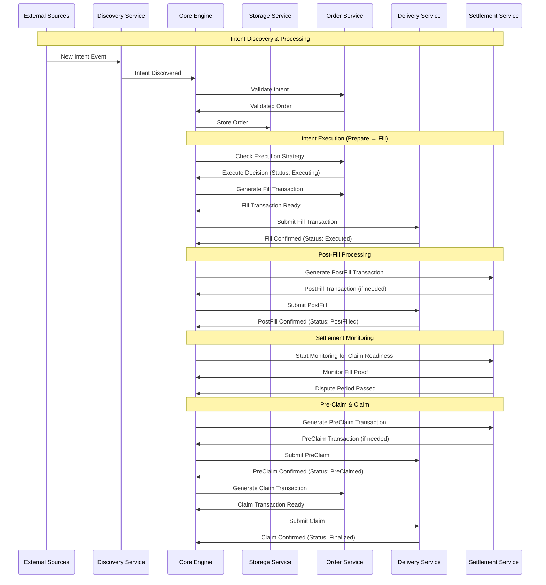

# OIF Solver

[](https://deepwiki.com/openintentsframework/oif-solver)

A high-performance cross-chain solver implementation for the Open Intents Framework (OIF). This solver enables efficient cross-chain order execution by discovering intents, finding optimal execution paths, and settling transactions across multiple blockchain networks.

## Table of Contents

- [Overview](#overview)
- [High-Level Architecture](#high-level-architecture)
- [Architecture](#architecture)
- [Project Structure](#project-structure)
- [Component Responsibilities](#component-responsibilities)
- [Quick Start](#quick-start)
- [Configuration](#configuration)
- [API Reference](#api-reference)
- [Testing and Development with solver-demo](#testing-and-development-with-solver-demo)
- [Development](#development)
- [License](#license)

## Overview

The OIF Solver is designed to:

- Discover and monitor cross-chain intents from multiple sources
- Find optimal execution paths across different chains and liquidity sources
- Execute transactions efficiently while minimizing costs
- Provide comprehensive monitoring and observability
- Support multiple order types and protocols (currently EIP-7683)

## High-Level Architecture



### Transaction State Transitions

The solver manages orders through distinct transaction states with the following progression:

1. **Prepare** → Status: `Executing` (emits `OrderEvent::Executing`)
2. **Fill** → Status: `Executed` (emits `SettlementEvent::PostFillReady`)
3. **PostFill** → Status: `PostFilled` (emits `SettlementEvent::StartMonitoring`)
4. **PreClaim** → Status: `PreClaimed` (emits `SettlementEvent::ClaimReady`)
5. **Claim** → Status: `Finalized` (emits `SettlementEvent::Completed`)

Each transition updates the order status in storage and triggers appropriate events for downstream processing.

## Architecture

The solver is built as a modular Rust workspace with clearly defined service boundaries:

### Core Components

- **solver-core**: Orchestrates the entire solver workflow and coordinates between services
- **solver-types**: Defines shared data structures, traits, and interfaces used across all components
- **solver-config**: Handles configuration loading and validation
- **solver-storage**: Provides persistent storage abstraction with TTL management for solver state
- **solver-account**: Manages cryptographic keys and signing operations

### Service Components

- **solver-discovery**: Discovers new intents/orders from various blockchain and off-chain sources
- **solver-order**: Validates intents, manages execution strategies, and generates transactions
- **solver-delivery**: Handles transaction preparation, submission, and monitoring across multiple chains
- **solver-settlement**: Manages settlement verification and claim processing after transaction execution

### Binaries

- **solver-service**: Main executable that wires up all components and runs the solver in production
- **solver-demo**: CLI tool for testing and demonstrating cross-chain intent execution in development environments

## Project Structure

```
oif-solver/
├── Cargo.toml                   # Workspace definition
├── crates/                      # Modular components
│   ├── solver-account/          # Cryptographic operations
│   ├── solver-config/           # Configuration management
│   ├── solver-core/             # Orchestration engine
│   ├── solver-delivery/         # Transaction submission
│   ├── solver-demo/             # Testing and demo CLI
│   ├── solver-discovery/        # Intent monitoring
│   ├── solver-order/            # Order processing
│   ├── solver-pricing/          # Price and profitability calculations
│   ├── solver-service/          # Main executable
│   ├── solver-settlement/       # Settlement verification
│   ├── solver-storage/          # State persistence
│   └── solver-types/            # Shared types
├── config/                      # Configuration examples
└── scripts/                     # E2E testing and deployment scripts
```

## Component Responsibilities

### solver-core

- Orchestrates the entire order lifecycle
- Manages event-driven communication between services
- Implements the main solver loop
- Handles graceful shutdown
- Provides factory pattern for building solver instances

### solver-discovery

- Monitors blockchain events for new intents
- Supports multiple discovery sources simultaneously
- Filters and validates discovered intents
- Pushes valid intents to the core engine

### solver-order

- Validates intents and converts them to orders
- Implements execution strategies (when to execute)
- Evaluates order profitability against minimum thresholds
- Generates fill and claim transactions
- Manages order-specific logic for different protocols

### solver-delivery

- Submits transactions to multiple blockchains
- Monitors transaction confirmation status
- Manages gas estimation and pricing
- Handles transaction retries and failures

### solver-settlement

- Validates fill transactions
- Extracts and stores fill proofs
- Monitors when orders can be claimed
- Manages dispute periods and settlement interactions

### solver-storage

- Provides persistent storage for orders and state
- Implements TTL (time-to-live) for temporary data
- Supports different storage backends
- Ensures data consistency across services

### solver-account

- Manages private keys and signing operations
- Supports different key management backends
- Provides secure signing for transactions
- Handles address derivation

### solver-pricing

- Provides pricing oracle implementations for asset valuation
- Converts between wei amounts and fiat currencies
- Supports multiple pricing backends
- Manages pricing configuration (commission, gas buffer, rate buffer)
- Enables profitability calculations and cost estimation

### solver-demo

- Provides CLI tool for testing and demonstrating the solver
- Manages local test environments with Anvil chains
- Deploys and configures test contracts
- Handles token operations (minting, approvals, balance checks)
- Builds and submits test intents and quotes
- Supports both on-chain and off-chain intent submission modes

## Quick Start

```bash
# Build the project
cargo build

# Run tests
cargo test

# Run the solver service with info logs
cargo run -- --config config/example.toml

# Run with debug logs for solver modules only
RUST_LOG=solver_core=debug,solver_delivery=debug,info cargo run -- --config config/example.toml
```

## Configuration

The solver uses TOML configuration files with support for modular configuration through file includes.

### Modular Configuration (Recommended)

Split your configuration into multiple files for better organization:

```toml
# config/main.toml - Main configuration file
include = [
    "networks.toml",  # Network and token configurations
    "api.toml",       # API server settings
    "storage.toml",   # Storage backend configuration
    # ... other modules
]

[solver]
id = "oif-solver-local"
monitoring_timeout_seconds = 300
```

**Important**: Each top-level section must be unique across all files. Duplicate sections will cause an error.

See `config/demo/` for a complete modular configuration example.

### Single File Configuration

You can also use a single configuration file. See `config/example.toml` for a complete example:

```toml
# Solver identity and settings
[solver]
id = "oif-solver-local"
monitoring_timeout_seconds = 300
# Minimum profitability percentage required for intent execution
min_profitability_pct = 1.0

# Networks configuration - defines supported chains and tokens
[networks.31337]  # Origin chain
input_settler_address = "0x9fE46736679d2D9a65F0992F2272dE9f3c7fa6e0"
output_settler_address = "0xCf7Ed3AccA5a467e9e704C703E8D87F634fB0Fc9"
[[networks.31337.tokens]]
address = "0x5FbDB2315678afecb367f032d93F642f64180aa3"
symbol = "TOKA"
decimals = 18
[[networks.31337.tokens]]
address = "0xe7f1725E7734CE288F8367e1Bb143E90bb3F0512"
symbol = "TOKB"
decimals = 18

[networks.31338]  # Destination chain
input_settler_address = "0x9fE46736679d2D9a65F0992F2272dE9f3c7fa6e0"
output_settler_address = "0xCf7Ed3AccA5a467e9e704C703E8D87F634fB0Fc9"
[[networks.31338.tokens]]
address = "0x5FbDB2315678afecb367f032d93F642f64180aa3"
symbol = "TOKA"
decimals = 18

# Storage configuration with TTL management
[storage]
primary = "file"
cleanup_interval_seconds = 3600

[storage.implementations.file]
storage_path = "./data/storage"
ttl_orders = 0                  # Permanent
ttl_intents = 86400             # 24 hours
ttl_order_by_tx_hash = 86400    # 24 hours

# Account management
[account]
primary = "local"  # Specifies which account to use as default

[account.implementations.local]
private_key = "0xac0974bec39a17e36ba4a6b4d238ff944bacb478cbed5efcae784d7bf4f2ff80"

# Optional: Additional accounts for per-network signing
# [account.implementations.local2]
# private_key = "0x59c6995e998f97a5a0044966f0945389dc9e86dae88c7a8412f4603b6b78690d"

# Delivery implementations for different chains
[delivery]
min_confirmations = 1

[delivery.implementations.evm_alloy]
network_ids = [31337, 31338]  # Supports multiple networks in one implementation
# Optional: Map specific networks to different accounts
# accounts = { 31337 = "local", 31338 = "local2" }

# Discovery implementations for finding intents
[discovery.implementations.onchain_eip7683]
network_id = 31337  # Required: specifies which chain to monitor

[discovery.implementations.offchain_eip7683]
api_host = "127.0.0.1"
api_port = 8081
network_ids = [31337]  # Optional: declares multi-chain support

# Order execution strategy
[order]
[order.implementations.eip7683]
# Uses networks config for settler addresses

[order.strategy]
primary = "simple"

[order.strategy.implementations.simple]
max_gas_price_gwei = 100

# Pricing configuration
[pricing]
primary = "mock"  # Use "coingecko" for real pricing

[pricing.implementations.mock]
# Uses default ETH/USD price of 4615.16

# Coingecko example
[pricing.implementations.coingecko]
# Free tier configuration (no API key required)
# api_key = "CG-YOUR-API-KEY-HERE"
cache_duration_seconds = 60
rate_limit_delay_ms = 1200

# Settlement configuration
[settlement]
settlement_poll_interval_seconds = 3

[settlement.implementations.direct]
order = "eip7683"
network_ids = [31337, 31338]
dispute_period_seconds = 1
# Oracle selection strategy when multiple oracles are available (First, RoundRobin, Random)
oracle_selection_strategy = "First"

# Oracle configuration with multiple oracle support
[settlement.implementations.direct.oracles]
# Input oracles (on origin chains)
input = { 31337 = [
    "0xa513E6E4b8f2a923D98304ec87F64353C4D5C853",
], 31338 = [
    "0xa513E6E4b8f2a923D98304ec87F64353C4D5C853",
] }
# Output oracles (on destination chains)
output = { 31337 = [
    "0x2279B7A0a67DB372996a5FaB50D91eAA73d2eBe6",
], 31338 = [
    "0x2279B7A0a67DB372996a5FaB50D91eAA73d2eBe6",
] }

# Valid routes: from origin chain -> to destination chains
[settlement.implementations.direct.routes]
31337 = [31338]
31338 = [31337]

# API server (optional)
[api]
enabled = true
host = "127.0.0.1"
port = 3000
timeout_seconds = 30
max_request_size = 1048576  # 1MB
```

### Key Configuration Sections

- **networks**: Defines supported chains with their settler contracts and available tokens
- **storage**: Configures persistence backend with TTL for different data types
- **account**: Manages signing keys for the solver (supports multiple accounts)
- **delivery**: Handles transaction submission to multiple chains (supports per-network account mapping)
- **discovery**: Sources for discovering new intents (on-chain events, off-chain APIs)
- **order**: Execution strategy and protocol-specific settings
- **pricing**: Configures pricing oracles for asset valuation and profitability calculations (supports mock and CoinGecko)
- **settlement**: Configuration for claiming rewards and handling disputes
- **api**: Optional REST API server for receiving off-chain intents

### Running with Custom Configuration

```bash
# Using command line flag
cargo run -- --config path/to/your/config.toml

# Using environment variable
CONFIG_FILE=path/to/your/config.toml cargo run
```

## API Reference

The solver provides a REST API for interacting with the system and submitting off-chain intents. Full OpenAPI specifications are available in the `api-spec/` directory.

### API Specifications

- **Orders API**: [`api-spec/orders-api.yaml`](api-spec/orders-api.yaml) - Submit and track cross-chain intent orders
- **Tokens API**: [`api-spec/tokens-api.yaml`](api-spec/tokens-api.yaml) - Query supported tokens and networks

### Available Endpoints

#### Quotes

- **POST `/api/quotes`** - Get a price quote for a cross-chain swap
  - Request body: `{ originChainId, outputChainId, inputToken, outputToken, inputAmount }`
  - Returns: Quote with `quoteId`, amounts, and cost breakdown

#### Orders

- **POST `/api/orders`** - Submit a new order (direct or from quote)

  - Direct submission: `{ order: "0x...", sponsor: "0x...", signature: "0x00...", lock_type: "..." }`
  - Quote acceptance: `{ quoteId: "...", signature: "0x..." }`
  - Returns: `{ status: "success", order_id: "...", message: null }`

- **GET `/api/orders/{id}`** - Get order status and details
  - Returns complete order information including status, amounts, settlement data, and fill transaction

#### Tokens

- **GET `/api/tokens`** - Get all supported tokens across all networks

  - Returns a map of chain IDs to network configurations with supported tokens

- **GET `/api/tokens/{chain_id}`** - Get supported tokens for a specific chain
  - Returns network configuration including settler addresses and token list

### Example Usage

```bash
# Submit an off-chain intent order
curl -X POST http://localhost:3000/api/orders \
  -H "Content-Type: application/json" \
  -d '{
    "order": "0x...",
    "sponsor": "0x70997970C51812dc3A010C7d01b50e0d17dc79C8",
    "signature": "0x00..."
  }'

# Check order status
curl http://localhost:3000/api/orders/1fa518079ecf01372290adf75c55858771efcbcee080594cc8bc24e3309a3a09

# Get supported tokens for chain 31338
curl http://localhost:3000/api/tokens/31338

# Get all supported tokens
curl http://localhost:3000/api/tokens
```

The API server is enabled by default on port 3000 when the solver is running. You can disable it or change the port in the configuration file.

### Logging Configuration

The solver uses the `RUST_LOG` environment variable for fine-grained logging control. You can specify different log levels for different modules:

```bash
# Show debug logs for solver modules only
RUST_LOG=solver_core=debug,solver_delivery=debug,info cargo run -- --config config/demo.toml

# Reduce noise from external crates
RUST_LOG=info,hyper=warn,alloy_provider=warn cargo run -- --config config/demo.toml

# Debug specific modules
RUST_LOG=solver_core=debug,solver_delivery=info,alloy=warn,hyper=warn cargo run -- --config config/demo.toml

# Show all debug logs (very verbose)
RUST_LOG=debug cargo run -- --config config/demo.toml
```

Available log levels (from most to least verbose):

- `trace` - Very detailed debugging information
- `debug` - Debugging information
- `info` - General information (default)
- `warn` - Warning messages
- `error` - Error messages only

The `--log-level` flag acts as a fallback when `RUST_LOG` is not set:

```bash
# Uses info level for all modules when RUST_LOG is not set
cargo run -- --config config/demo.toml --log-level info
```

## Testing and Development with solver-demo

The project includes a Rust-based CLI tool (`solver-demo`) for testing cross-chain intent execution. This tool provides comprehensive functionality for setting up test environments, managing tokens, and testing intent execution flows.

**Note:** The demo has been tested on macOS systems only.

### Prerequisites

- [Foundry](https://book.getfoundry.sh/getting-started/installation) (for Anvil and deployment)
- Rust toolchain (stable, 1.86.0+)
- Contract compilation tools (Foundry) (for deploying test contracts)

### Quick Start

```bash
# 1. Initialize configuration and load it
cargo run -p solver-demo -- init new config/demo.toml
cargo run -p solver-demo -- init load config/demo.toml --local

# 2. Start local environment (Anvil chains)
cargo run -p solver-demo -- env start

# 3. Deploy contracts and setup test environment
cargo run -p solver-demo -- env deploy --all
cargo run -p solver-demo -- env setup

# 4. In another terminal, start the solver
cargo run --bin solver -- --config config/demo.toml

# 5. Build and test intents
# Build an intent request
cargo run -p solver-demo -- intent build 31337 31338 TokenA TokenB 100 \
    --swap-type exact-input --settlement escrow --auth permit2

# Get quote and sign
cargo run -p solver-demo -- quote get .oif-demo/requests/get_quote.req.json
cargo run -p solver-demo -- quote sign .oif-demo/requests/get_quote.res.json

# Submit the order
cargo run -p solver-demo -- intent submit .oif-demo/requests/post_order.req.json

# 6. Monitor token balances
cargo run -p solver-demo -- token balance all
```

**Important:** The demo tool requires the Permit2 contract bytecode file located at `crates/solver-demo/src/operations/env/data/permit2_bytecode.hex`. This file contains the canonical Permit2 bytecode and is essential for deploying contracts to local Anvil chains. The bytecode is automatically used during the `env deploy` step.

### Commands Overview

#### Initialization Commands

```bash
# Create new configuration template
cargo run -p solver-demo -- init new <config-path> --chains <chain-ids>

# Load existing configuration
cargo run -p solver-demo -- init load <config-path> [--local]

# Show current configuration
cargo run -p solver-demo -- config
```

#### Environment Management

```bash
# Start Anvil chains
cargo run -p solver-demo -- env start

# Stop Anvil chains
cargo run -p solver-demo -- env stop


# Deploy contracts
cargo run -p solver-demo -- env deploy --all


# Setup test environment (mint tokens, approvals, etc.)
cargo run -p solver-demo -- env setup [--chain <id>] [--amount <amount>]
```

#### Intent Operations

```bash
# Build an intent request
# Format: intent build <from-chain> <to-chain> <from-token> <to-token> <amount>
cargo run -p solver-demo -- intent build 31337 31338 TokenA TokenB 100 \
    --swap-type exact-input \
    --settlement escrow \
    --auth permit2 \
    [--output <path>]

# Build batch intents from JSON file
cargo run -p solver-demo -- intent build-batch <input-file> [--output <path>]

# Submit intent to solver API (off-chain)
cargo run -p solver-demo -- intent submit <request-file>

# Submit intent directly to blockchain (on-chain)
cargo run -p solver-demo -- intent submit <request-file> --onchain

# Check intent/order status
cargo run -p solver-demo -- intent status <order-id>

# Test batch intent submission
cargo run -p solver-demo -- intent test <post-orders-file>
```

**Supported Options:**

- `--swap-type`: `exact-input` or `exact-output`
- `--settlement`: `escrow` or `compact` (resource locks)
- `--auth`: `permit2` or `eip3009` (for off-chain submission)

#### Quote Operations

```bash
# Get quote from solver API
cargo run -p solver-demo -- quote get <quote-request-file> [--output <path>]

# Sign a quote (prepares order request for submission)
cargo run -p solver-demo -- quote sign <quote-response-file> \
    [--quote-index <index>] \
    [--signature <sig>] \
    [--output <path>]

# Test batch quote flow (get quotes and sign them)
cargo run -p solver-demo -- quote test <quote-requests-file>
```

#### Token Operations

```bash
# List tokens on all or specific chains
cargo run -p solver-demo -- token list [--chains <chain-ids>]

# Mint tokens to an account
cargo run -p solver-demo -- token mint <chain> <token> <amount> [--to <address>]

# Approve token spending
cargo run -p solver-demo -- token approve <chain> <token> <spender> <amount>

# Check token balances
cargo run -p solver-demo -- token balance <account> [--chains <chain-ids>]
cargo run -p solver-demo -- token balance all  # All accounts
cargo run -p solver-demo -- token balance user  # Just user account

# Monitor balances with auto-refresh
cargo run -p solver-demo -- token balance <account> --follow <seconds>
```

#### Account Management

```bash
# List configured accounts
cargo run -p solver-demo -- account list

# Show account details
cargo run -p solver-demo -- account info <account-name>
```

### Output File Naming Conventions

The demo tool generates files in the `.oif-demo/requests/` directory following a clear naming convention:

- **`.req.json`** - Request payloads sent to the API
- **`.res.json`** - Responses received from the API

| File                   | Description                 | Generated By         |
| ---------------------- | --------------------------- | -------------------- |
| `get_quote.req.json`   | Quote request payload       | `intent build`       |
| `get_quote.res.json`   | Quote response with pricing | `quote get`          |
| `post_order.req.json`  | Signed order request        | `quote sign`         |
| `get_quotes.req.json`  | Batch quote requests        | `intent build-batch` |
| `post_orders.req.json` | Batch signed orders         | `quote test`         |

### Environment Setup Details

The demo tool provides a complete workflow for setting up a test environment:

1. **Initialize Configuration** (`init new` / `init load`):

   - Creates or loads solver configuration
   - Sets up network definitions and RPC endpoints
   - Configures account keys and signing
   - Stores session data in `.oif-demo/` directory

2. **Start Blockchain Networks** (`env start`):

   - Launches Anvil chains (default: 31337 on port 8545, 31338 on port 8546)
   - Manages chain processes in the background
   - Validates connectivity to each chain

3. **Deploy Smart Contracts** (`env deploy`):

   - Deploys test tokens (TokenA, TokenB) on configured chains
   - Deploys escrow settlers (InputSettler, OutputSettler)
   - Deploys compact settlers and Permit2 contracts
   - Updates session with deployed contract addresses

4. **Setup Test Environment** (`env setup`):
   - Mints tokens to test accounts (user, solver, recipient)
   - Approves token spending for Permit2 and settler contracts
   - Registers allocator with TheCompact
   - Validates all approvals and registrations

### Running the Solver

After setting up the environment, start the solver in a separate terminal:

```bash
# Build the project
cargo build

# Run the solver with local configuration
cargo run --bin solver -- --config config/demo.toml

# Or with debug logs for debugging
RUST_LOG=solver_core=debug,solver_delivery=info,info cargo run --bin solver -- --config config/demo.toml
```

The solver will:

- Connect to both local chains
- Start monitoring for new intents
- Process discovered intents automatically

## Development

This project uses a Rust workspace structure. Each crate is independently versioned and can be used separately.

### Building from Source

```bash
# Build all crates
cargo build --all

# Build in release mode
cargo build --release

# Run all tests
cargo test --all

# Run tests with output
cargo test --all -- --nocapture
```

## License

Licensed under MIT
