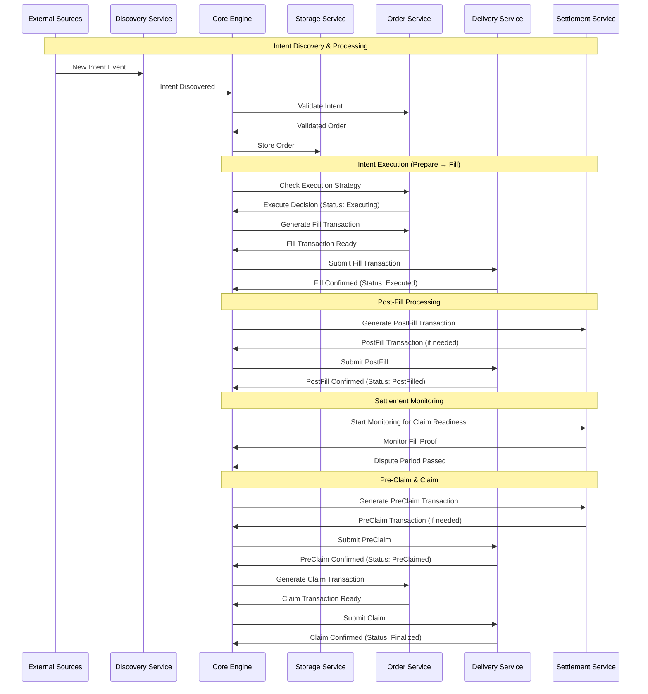
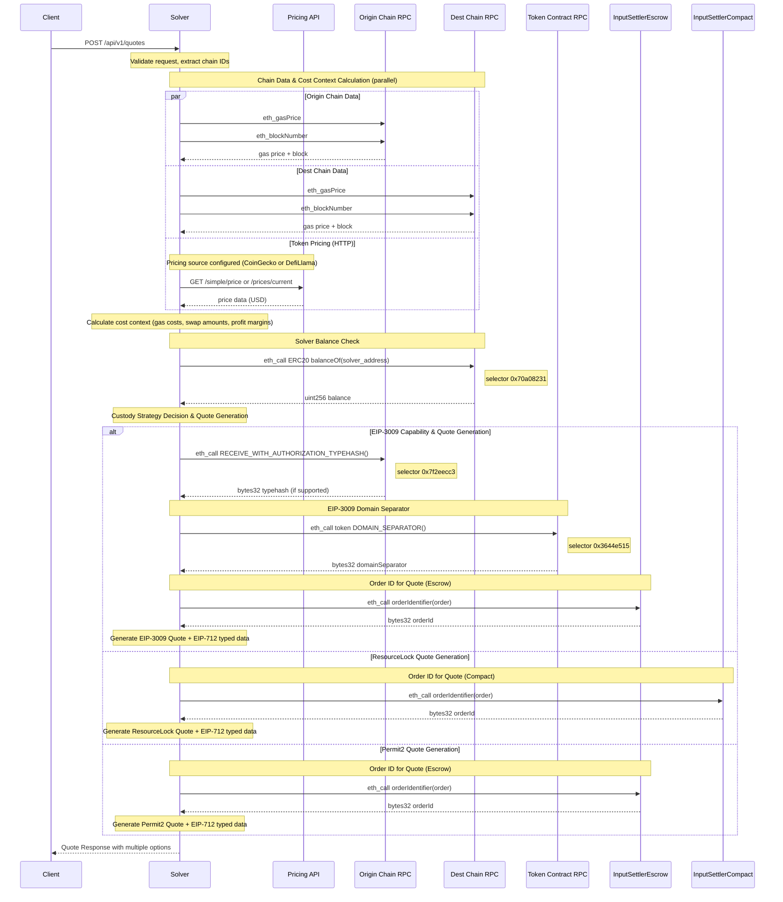
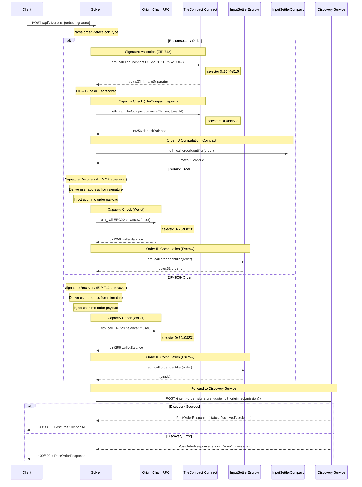

# OIF Solver

[](https://deepwiki.com/openintentsframework/oif-solver)
[](https://codecov.io/github/openintentsframework/oif-solver)

> :warning: This software is in alpha. Use in production environments at your own risk.

A high-performance cross-chain solver implementation for the Open Intents Framework (OIF). This solver enables efficient cross-chain order execution by discovering intents, finding optimal execution paths, and settling transactions across multiple blockchain networks.

## Table of Contents

- [Overview](#overview)
- [High-Level Architecture](#high-level-architecture)
- [Architecture](#architecture)
- [Project Structure](#project-structure)
- [Component Responsibilities](#component-responsibilities)
- [Quick Start](#quick-start)
- [Configuration](#configuration)
- [API Reference](#api-reference)
- [Testing and Development with solver-demo](#testing-and-development-with-solver-demo)
- [Development](#development)
- [License](#license)

## Overview

The OIF Solver is designed to:

- Discover and monitor cross-chain intents from multiple sources
- Find optimal execution paths across different chains and liquidity sources
- Execute transactions efficiently while minimizing costs
- Provide comprehensive monitoring and observability
- Support multiple order types and protocols (currently EIP-7683)

## High-Level Architecture



### Transaction State Transitions

The solver manages orders through distinct transaction states with the following progression:

1. **Prepare** → Status: `Executing` (emits `OrderEvent::Executing`)
2. **Fill** → Status: `Executed` (emits `SettlementEvent::PostFillReady`)
3. **PostFill** → Status: `PostFilled` (emits `SettlementEvent::StartMonitoring`)
4. **PreClaim** → Status: `PreClaimed` (emits `SettlementEvent::ClaimReady`)
5. **Claim** → Status: `Finalized` (emits `SettlementEvent::Completed`)

Each transition updates the order status in storage and triggers appropriate events for downstream processing.

## Architecture

The solver is built as a modular Rust workspace with clearly defined service boundaries:

### Core Components

- **solver-core**: Orchestrates the entire solver workflow and coordinates between services
- **solver-types**: Defines shared data structures, traits, and interfaces used across all components
- **solver-config**: Handles configuration loading and validation
- **solver-storage**: Provides persistent storage abstraction with TTL management for solver state
- **solver-account**: Manages cryptographic keys and signing operations

### Service Components

- **solver-discovery**: Discovers new intents/orders from various blockchain and off-chain sources
- **solver-order**: Validates intents, manages execution strategies, and generates transactions
- **solver-delivery**: Handles transaction preparation, submission, and monitoring across multiple chains
- **solver-settlement**: Manages settlement verification and claim processing after transaction execution

### Binaries

- **solver-service**: Main executable that wires up all components and runs the solver in production
- **solver-demo**: CLI tool for testing and demonstrating cross-chain intent execution in development environments

## Project Structure

```
oif-solver/
├── Cargo.toml                   # Workspace definition
├── crates/                      # Modular components
│   ├── solver-account/          # Cryptographic operations
│   ├── solver-config/           # Configuration management
│   ├── solver-core/             # Orchestration engine
│   ├── solver-delivery/         # Transaction submission
│   ├── solver-demo/             # Testing and demo CLI
│   ├── solver-discovery/        # Intent monitoring
│   ├── solver-order/            # Order processing
│   ├── solver-pricing/          # Price and profitability calculations
│   ├── solver-service/          # Main executable
│   ├── solver-settlement/       # Settlement verification
│   ├── solver-storage/          # State persistence
│   └── solver-types/            # Shared types
├── config/                      # Seed overrides and demo settings
└── scripts/                     # E2E testing and deployment scripts
```

## Component Responsibilities

### solver-core

- Orchestrates the entire order lifecycle
- Manages event-driven communication between services
- Implements the main solver loop
- Handles graceful shutdown
- Provides factory pattern for building solver instances

### solver-discovery

- Monitors blockchain events for new intents
- Supports multiple discovery sources simultaneously
- Filters and validates discovered intents
- Pushes valid intents to the core engine

### solver-order

- Validates intents and converts them to orders
- Implements execution strategies (when to execute)
- Evaluates order profitability against minimum thresholds
- Generates fill and claim transactions
- Manages order-specific logic for different protocols
- Supports callback data for settlement notifications

### solver-delivery

- Submits transactions to multiple blockchains
- Monitors transaction confirmation status
- Manages gas estimation and pricing
- Handles transaction retries and failures

### solver-settlement

- Validates fill transactions
- Extracts and stores fill proofs
- Monitors when orders can be claimed
- Manages dispute periods and settlement interactions

### solver-storage

- Provides persistent storage for orders and state
- Implements TTL (time-to-live) for automatic data expiration
- Supports multiple storage backends:
  - **Memory**: Fast, non-persistent (for testing)
  - **File**: File-based persistence with custom binary format
  - **Redis**: Production-ready with native TTL and connection pooling
- Index-based querying for efficient lookups
- Ensures data consistency across services

### solver-account

- Manages private keys and signing operations
- Supports different key management backends
- Provides secure signing for transactions
- Handles address derivation

### solver-pricing

- Provides pricing oracle implementations for asset valuation
- Converts between wei amounts and fiat currencies
- Supports multiple pricing backends
- Manages pricing configuration
- Enables profitability calculations and cost estimation

### solver-demo

- Provides CLI tool for testing and demonstrating the solver
- Manages local test environments with Anvil chains
- Deploys and configures test contracts
- Handles token operations (minting, approvals, balance checks)
- Builds and submits test intents and quotes
- Supports both on-chain and off-chain intent submission modes

## Quick Start

```bash
# 1. Start Redis
redis-server

# 2. Set required environment variables
export REDIS_URL=redis://localhost:6379
export SOLVER_PRIVATE_KEY=your_64_hex_character_private_key

# 3. First run: Seed configuration from preset + deployment config
cargo run -- --seed testnet --seed-overrides config/seed-overrides-testnet.json

# 4. Subsequent runs: Configuration loads automatically from Redis
cargo run --
```

See [docs/config-storage.md](docs/config-storage.md) for detailed documentation.

## Configuration

The solver uses Redis as the single source of truth for runtime configuration. Configuration is seeded once and then loaded from Redis on subsequent startups.

### Seeding Configuration

```bash
# Seed testnet configuration (using file)
cargo run -- --seed testnet --seed-overrides config/seed-overrides-testnet.json

# Seed mainnet configuration (using file)
cargo run -- --seed mainnet --seed-overrides config/seed-overrides-mainnet.json

# Or pass JSON directly (useful for deployment services)
cargo run -- --seed testnet --seed-overrides '{"solver_id":"my-solver","networks":[{"chain_id":11155420,"tokens":[{"symbol":"USDC","address":"0x191688B2Ff5Be8F0A5BCAB3E819C900a810FAaf6","decimals":6}]},{"chain_id":84532,"tokens":[{"symbol":"USDC","address":"0x73c83DAcc74bB8a704717AC09703b959E74b9705","decimals":6}]}]}'

# Force re-seed (overwrite existing)
cargo run -- --seed testnet --seed-overrides config/seed-overrides-testnet.json --force-seed
```

### Environment Variables

| Variable | Required | Description |
|----------|----------|-------------|
| `REDIS_URL` | Yes | Redis connection URL (default: `redis://localhost:6379`) |
| `SOLVER_PRIVATE_KEY` | Yes | 64-character hex private key (without 0x prefix) |
| `SOLVER_ID` | For loading | Solver ID to load from Redis (set after first seed) |

### Seed Overrides Format

Create a JSON file specifying which networks and tokens to support (these override/extend the seed preset defaults):

```json
{
  "solver_id": "my-solver-instance",
  "networks": [
    {
      "chain_id": 11155420,
      "tokens": [
        {
          "symbol": "USDC",
          "address": "0x191688B2Ff5Be8F0A5BCAB3E819C900a810FAaf6",
          "decimals": 6
        }
      ]
    },
    {
      "chain_id": 84532,
      "tokens": [
        {
          "symbol": "USDC",
          "address": "0x73c83DAcc74bB8a704717AC09703b959E74b9705",
          "decimals": 6
        }
      ],
      "rpc_urls": ["https://my-custom-rpc.com"]
    }
  ]
}
```

**Note:** The `solver_id` field is optional but recommended. If provided, seeding becomes idempotent (re-running `--seed` with same config skips seeding). After seeding, set `SOLVER_ID` env var for subsequent runs.

### Supported Networks

**Testnet:**
| Chain | Chain ID |
|-------|----------|
| Optimism Sepolia | 11155420 |
| Base Sepolia | 84532 |

**Mainnet:**
| Chain | Chain ID |
|-------|----------|
| Optimism | 10 |
| Base | 8453 |
| Arbitrum | 42161 |

### Running Redis

```bash
# Using Docker
docker run -d --name redis -p 6379:6379 redis:latest

# Or install locally
redis-server
```

## API Reference

The solver provides a REST API for interacting with the system and submitting off-chain intents. Full OpenAPI specifications are available in the `api-spec/` directory.

### API Specifications

- **Orders API**: [`api-spec/orders-api.yaml`](api-spec/orders-api.yaml) - Submit and track cross-chain intent orders
- **Tokens API**: [`api-spec/tokens-api.yaml`](api-spec/tokens-api.yaml) - Query supported tokens and networks
- **Admin API**: [`docs/openapi-admin.json`](docs/openapi-admin.json) - Wallet-based admin operations (EIP-712 signed)

### API Flows

The following diagrams show the detailed RPC interactions for each API endpoint.

#### Quote Request Flow

**RPC calls:** 8 (EIP-3009) · 6 (ResourceLock) · 6 (Permit2)



#### Order Submission Flow

**RPC calls:** 2 (EIP-3009) · 3 (ResourceLock) · 2 (Permit2)



### Available Endpoints

#### Quotes

- **POST `/api/v1/quotes`** - Request price quotes for a cross-chain swap
  - Request body:
    ```json
    {
      "user": "...",
      "intent": {
        "intentType": "...",
        "inputs": [...],
        "outputs": [...],
        "swapType": "...",
        "originSubmission": {...}
      },
      "supportedTypes": [...]
    }
    ```
  - Returns: Array of quotes with `quoteId`, order structure ready for signing, and preview of amounts

#### Orders

- **POST `/api/v1/orders`** - Submit a new order (direct or from quote)

  - Quote acceptance:
    ```json
    {
      "quoteId": "...",
      "signature": "0x..."
    }
    ```
  - Direct submission:
    ```json
    {
      "order": { "type": "...", "payload": {...} },
      "signature": "0x...",
      "originSubmission": {...}
    }
    ```
  - Supported order types: `oif-escrow-v0`, `oif-resource-lock-v0`, `oif-3009-v0`
  - Returns:
    ```json
    {
      "orderId": "...",
      "status": "received",
      "message": null
    }
    ```

- **GET `/api/v1/orders/{id}`** - Get order status and details
  - Returns complete order information including status, amounts, settlement data, and fill transaction

#### Tokens

- **GET `/api/v1/tokens`** - Get all supported tokens across all networks

  - Returns a map of chain IDs to network configurations with supported tokens

- **GET `/api/v1/tokens/{chain_id}`** - Get supported tokens for a specific chain
  - Returns network configuration including settler addresses and token list

#### Health

- **GET `/health`** - Health check endpoint
  - Returns solver health status including Redis connectivity and persistence info
  - Response:
    ```json
    {
      "status": "healthy",
      "redis": {
        "connected": true,
        "persistence_enabled": true,
        "rdb_enabled": true,
        "aof_enabled": false
      },
      "solver_id": "my-solver",
      "version": "0.1.0"
    }
    ```
  - Status codes: `200 OK` (healthy), `503 Service Unavailable` (unhealthy)

#### Admin API (Wallet-Based Authentication)

The admin API enables authorized wallet addresses to perform administrative operations using EIP-712 signed messages. This provides secure, decentralized admin access without shared secrets.

**Setup:** Configure admin addresses in your seed overrides or TOML config:

```json
{
  "admin": {
    "enabled": true,
    "domain": "solver.example.com",
    "chain_id": 1,
    "admin_addresses": ["0xYourAdminWalletAddress"]
  }
}
```

**Endpoints:**

- **GET `/api/v1/admin/nonce`** - Get a nonce for signing admin actions
  - Response:
    ```json
    {
      "nonce": "1706184000123456",
      "expiresIn": 300,
      "domain": "solver.example.com",
      "chainId": 1
    }
    ```

- **GET `/api/v1/admin/types`** - Get EIP-712 type definitions for client-side signing
  - Returns domain and type definitions for all admin actions (AddToken, RemoveToken, etc.)

- **POST `/api/v1/admin/tokens`** - Add a new token to a network
  - Request body:
    ```json
    {
      "signature": "0x...",
      "contents": {
        "chainId": 10,
        "symbol": "USDC",
        "tokenAddress": "0x...",
        "decimals": 6,
        "nonce": 1706184000123456,
        "deadline": 1706184300
      }
    }
    ```
  - The signature must be an EIP-712 typed data signature from an authorized admin
  - Changes are hot-reloaded immediately (no restart required)

**Admin Action Flow:**

1. Call `GET /api/v1/admin/nonce` to get a fresh nonce
2. Call `GET /api/v1/admin/types` to get EIP-712 type definitions
3. Construct the typed data with the nonce and a deadline
4. Sign with your admin wallet (EIP-712)
5. Submit the signed action to the appropriate endpoint

### Example Usage

```bash
# Request a quote for a cross-chain swap
curl -X POST http://localhost:3000/api/v1/quotes \
  -H "Content-Type: application/json" \
  -d '{
    "user": "0x74...,
    "intent": {
      "intentType": "oif-swap",
      "inputs": [{
        "user": "0x74...",
        "asset": "0x12...",
        "amount": "1000000"
      }],
      "outputs": [{
        "receiver": "0x11...",
        "asset": "0x11...",
        "amount": "990000"
      }],
      "swapType": "exact-input",
      "originSubmission": {
        "mode": "user",
        "schemes": ["permit2"]
      }
    },
    "supportedTypes": ["oif-escrow-v0"]
  }'

# Accept a quote (submit order with quoteId)
curl -X POST http://localhost:3000/api/v1/orders \
  -H "Content-Type: application/json" \
  -d '{
    "quoteId": "quote_abc123def456",
    "signature": "0x1234567890abcdef..."
  }'

# Submit an order directly (without quote)
curl -X POST http://localhost:3000/api/v1/orders \
  -H "Content-Type: application/json" \
  -d '{
    "order": {
      "type": "oif-escrow-v0",
      "payload": {
        "signatureType": "eip712",
        "domain": {...},
        "primaryType": "PermitBatchWitnessTransferFrom",
        "message": {...}
      }
    },
    "signature": "0x1234567890abcdef...",
    "originSubmission": {
      "mode": "user",
      "schemes": ["permit2"]
    }
  }'

# Check order status
curl http://localhost:3000/api/v1/orders/1fa518079ecf01372290adf75c55858771efcbcee080594cc8bc24e3309a3a09

# Get supported tokens for chain 31338
curl http://localhost:3000/api/v1/tokens/31338

# Get all supported tokens
curl http://localhost:3000/api/v1/tokens

# Health check
curl http://localhost:3000/health

# Admin: Get nonce for signing
curl http://localhost:3000/api/v1/admin/nonce

# Admin: Get EIP-712 types for signing
curl http://localhost:3000/api/v1/admin/types
```

The API server is enabled by default on port 3000 when the solver is running. You can disable it or change the port in the configuration file.

### Logging Configuration

The solver uses the `RUST_LOG` environment variable for fine-grained logging control. You can specify different log levels for different modules:

```bash
# Show debug logs for solver modules only
RUST_LOG=solver_core=debug,solver_delivery=debug,info cargo run

# Reduce noise from external crates
RUST_LOG=info,hyper=warn,alloy_provider=warn cargo run

# Debug specific modules
RUST_LOG=solver_core=debug,solver_delivery=info,alloy=warn,hyper=warn cargo run

# Show all debug logs (very verbose)
RUST_LOG=debug cargo run
```

Available log levels (from most to least verbose):

- `trace` - Very detailed debugging information
- `debug` - Debugging information
- `info` - General information (default)
- `warn` - Warning messages
- `error` - Error messages only

The `--log-level` flag acts as a fallback when `RUST_LOG` is not set:

```bash
# Uses info level for all modules when RUST_LOG is not set
cargo run -- --log-level info
```

## Testing and Development with solver-demo

The project includes a Rust-based CLI tool (`solver-demo`) for testing cross-chain intent execution. This tool provides comprehensive functionality for setting up test environments, managing tokens, and testing intent execution flows.

**Note:** The demo has been tested on macOS systems only.

### Prerequisites

- [Foundry](https://book.getfoundry.sh/getting-started/installation) (for Anvil and deployment)
- Rust toolchain (stable, 1.86.0+)
- Contract compilation tools (Foundry) (for deploying test contracts)

### Quick Start

> **Note:** The solver-demo tool uses local Anvil chains for testing. The main solver binary uses Redis-based configuration for production deployments. See below for demo-specific setup.

```bash
# 1. Initialize configuration and load it
cargo run -p solver-demo -- init new config/demo.toml
cargo run -p solver-demo -- init load config/demo.toml --local

# 2. Start local environment (Anvil chains)
cargo run -p solver-demo -- env start

# 3. Deploy contracts and setup test environment
cargo run -p solver-demo -- env deploy --all
cargo run -p solver-demo -- env setup

# 4. In another terminal, the demo tests can be run without starting the main solver
#    The solver-demo tool handles intent building, quoting, and submission for testing

# 5. Build and test intents
# Build an intent request
cargo run -p solver-demo -- intent build 31337 31338 TokenA TokenB 100 \
    --swap-type exact-input --settlement escrow --auth permit2

# Get quote and sign
cargo run -p solver-demo -- quote get .oif-demo/requests/get_quote.req.json
cargo run -p solver-demo -- quote sign .oif-demo/requests/get_quote.res.json

# Submit the order
cargo run -p solver-demo -- intent submit .oif-demo/requests/post_order.req.json

# 6. Monitor token balances
cargo run -p solver-demo -- token balance all
```

> The demo tool requires the Permit2 contract bytecode file located at `crates/solver-demo/data/permit2_bytecode.hex`. This file contains the canonical Permit2 bytecode and is essential for deploying contracts to local Anvil chains. The bytecode is automatically used during the `env deploy` step.
>
> To fetch and store the Permit2 bytecode, run this command from the project root:
>
> ```bash
> # Fetch Permit2 bytecode from Ethereum mainnet and save to the required location
> # This will skip if the file already exists
> [ ! -f crates/solver-demo/data/permit2_bytecode.hex ] && mkdir -p crates/solver-demo/data && cast code 0x000000000022D473030F116dDEE9F6B43aC78BA3 --rpc-url https://eth.llamarpc.com > crates/solver-demo/data/permit2_bytecode.hex || echo "Permit2 bytecode already exists at crates/solver-demo/data/permit2_bytecode.hex"
> ```

### Commands Overview

#### Initialization Commands

```bash
# Create new configuration template
cargo run -p solver-demo -- init new <config-path> --chains <chain-ids>

# Load existing configuration
cargo run -p solver-demo -- init load <config-path> [--local]

# Show current configuration
cargo run -p solver-demo -- config
```

#### Environment Management

```bash
# Start Anvil chains
cargo run -p solver-demo -- env start

# Stop Anvil chains
cargo run -p solver-demo -- env stop


# Deploy contracts
cargo run -p solver-demo -- env deploy --all


# Setup test environment (mint tokens, approvals, etc.)
cargo run -p solver-demo -- env setup [--chain <id>] [--amount <amount>]
```

#### Intent Operations

```bash
# Build an intent request
# Format: intent build <from-chain> <to-chain> <from-token> <to-token> <amount>
cargo run -p solver-demo -- intent build 31337 31338 TokenA TokenB 100 \
    --swap-type exact-input \
    --settlement escrow \
    --auth permit2 \
    [--output <path>]

# Build batch intents from JSON file
cargo run -p solver-demo -- intent build-batch <input-file> [--output <path>]

# Submit intent to solver API (off-chain)
cargo run -p solver-demo -- intent submit <request-file>

# Submit intent directly to blockchain (on-chain)
cargo run -p solver-demo -- intent submit <request-file> --onchain

# Check intent/order status
cargo run -p solver-demo -- intent status <order-id>

# Test batch intent submission
cargo run -p solver-demo -- intent test <post-orders-file>
```

**Supported Options:**

- `--swap-type`: `exact-input` or `exact-output`
- `--settlement`: `escrow` or `compact` (resource locks)
- `--auth`: `permit2` or `eip3009` (for off-chain submission)
- `--callback-recipient`: Address to receive callback after fill (optional)
- `--callback-data`: Hex-encoded data to pass to callback (optional)

**Example with Callback:**

```bash
# Build intent with callback for post-fill notification
# - callback-recipient: MockCallbackExecutorWithFee contract on Base Sepolia
# - callback-data: ABI-encoded address to receive the fee (0xd890aa4d1b1517a16f9c3d938d06721356e48b7d)
oif-demo intent build \
    --to-chain 84532 \
    --from-chain 11155420 \
    --from-token USDC \
    --to-token USDC \
    --swap-type exact-output \
    --amount 1 \
    --settlement escrow \
    --auth permit2 \
    --callback-recipient 0xf2a313a3Dc028295e1dFa3BEE34EaFD2f801C994 \
    --callback-data 0x000000000000000000000000d890aa4d1b1517a16f9c3d938d06721356e48b7d
```

The callback recipient will be called after the fill transaction with the provided callback data. The solver simulates the callback during gas estimation to ensure it won't revert and to accurately estimate gas costs.

#### Quote Operations

```bash
# Get quote from solver API
cargo run -p solver-demo -- quote get <quote-request-file> [--output <path>]

# Sign a quote (prepares order request for submission)
cargo run -p solver-demo -- quote sign <quote-response-file> \
    [--quote-index <index>] \
    [--signature <sig>] \
    [--output <path>]

# Test batch quote flow (get quotes and sign them)
cargo run -p solver-demo -- quote test <quote-requests-file>
```

#### Token Operations

```bash
# List tokens on all or specific chains
cargo run -p solver-demo -- token list [--chains <chain-ids>]

# Mint tokens to an account
cargo run -p solver-demo -- token mint <chain> <token> <amount> [--to <address>]

# Approve token spending
cargo run -p solver-demo -- token approve <chain> <token> <spender> <amount>

# Check token balances
cargo run -p solver-demo -- token balance <account> [--chains <chain-ids>]
cargo run -p solver-demo -- token balance all  # All accounts
cargo run -p solver-demo -- token balance user  # Just user account

# Monitor balances with auto-refresh
cargo run -p solver-demo -- token balance <account> --follow <seconds>
```

#### Account Management

```bash
# List configured accounts
cargo run -p solver-demo -- account list

# Show account details
cargo run -p solver-demo -- account info <account-name>
```

### Output File Naming Conventions

The demo tool generates files in the `.oif-demo/requests/` directory following a clear naming convention:

- **`.req.json`** - Request payloads sent to the API
- **`.res.json`** - Responses received from the API

| File                   | Description                 | Generated By         |
| ---------------------- | --------------------------- | -------------------- |
| `get_quote.req.json`   | Quote request payload       | `intent build`       |
| `get_quote.res.json`   | Quote response with pricing | `quote get`          |
| `post_order.req.json`  | Signed order request        | `quote sign`         |
| `get_quotes.req.json`  | Batch quote requests        | `intent build-batch` |
| `post_orders.req.json` | Batch signed orders         | `quote test`         |

### Environment Setup Details

The demo tool provides a complete workflow for setting up a test environment:

1. **Initialize Configuration** (`init new` / `init load`):

   - Creates or loads solver configuration
   - Sets up network definitions and RPC endpoints
   - Configures account keys and signing
   - Stores session data in `.oif-demo/` directory

2. **Start Blockchain Networks** (`env start`):

   - Launches Anvil chains (default: 31337 on port 8545, 31338 on port 8546)
   - Manages chain processes in the background
   - Validates connectivity to each chain

3. **Deploy Smart Contracts** (`env deploy`):

   - Deploys test tokens (TokenA, TokenB) on configured chains
   - Deploys escrow settlers (InputSettler, OutputSettler)
   - Deploys compact settlers and Permit2 contracts
   - Updates session with deployed contract addresses

4. **Setup Test Environment** (`env setup`):
   - Mints tokens to test accounts (user, solver, recipient)
   - Approves token spending for Permit2 and settler contracts
   - Registers allocator with TheCompact
   - Validates all approvals and registrations

### Running the Solver (Production)

For production deployments, the solver uses Redis-based configuration:

```bash
# Build the project
cargo build

# Seed configuration (first run only)
cargo run -- --seed testnet --seed-overrides config/seed-overrides-testnet.json

# Run the solver (loads config from Redis)
export SOLVER_ID=your-solver-id  # Output from seeding step
cargo run

# Or with debug logs for debugging
RUST_LOG=solver_core=debug,solver_delivery=info,info cargo run
```

The solver will:

- Connect to configured chains
- Start monitoring for new intents
- Process discovered intents automatically

## Development

This project uses a Rust workspace structure. Each crate is independently versioned and can be used separately.

### Building from Source

```bash
# Build all crates
cargo build --all

# Build in release mode
cargo build --release

# Run all tests
cargo test --all

# Run tests with output
cargo test --all -- --nocapture
```

## License

Licensed under MIT
