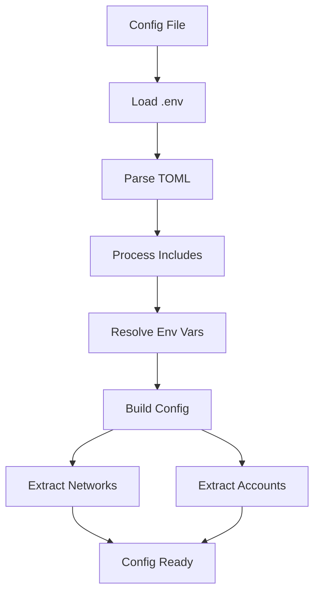
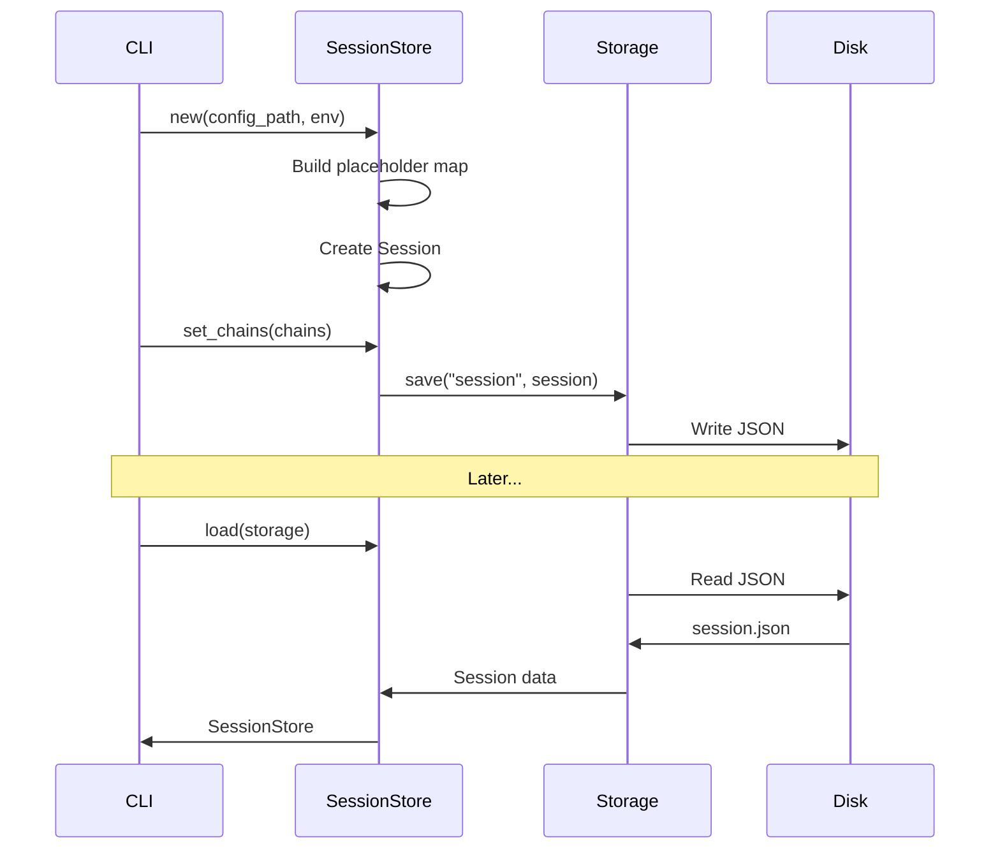
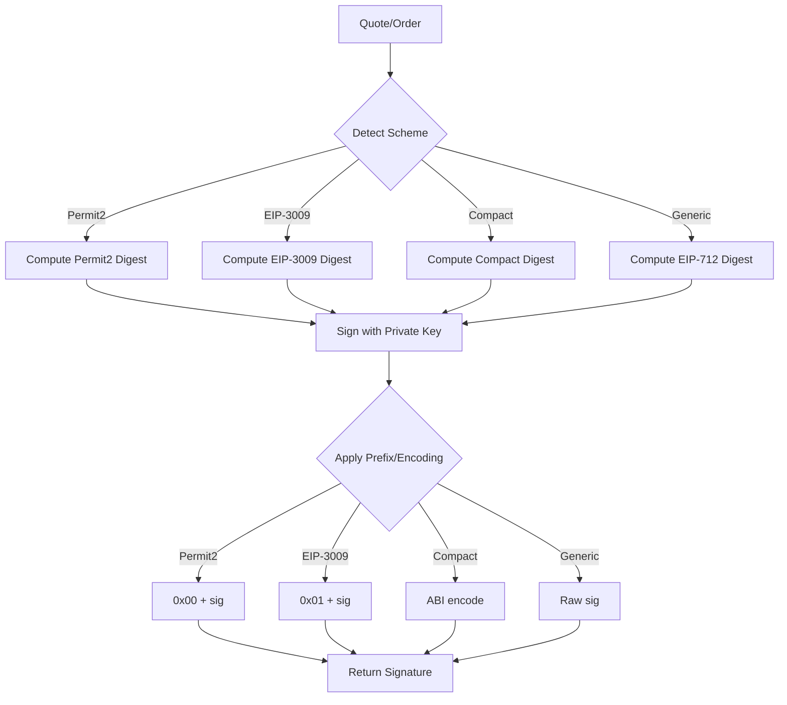
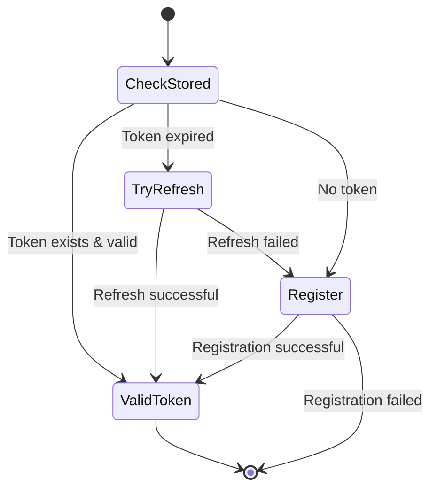
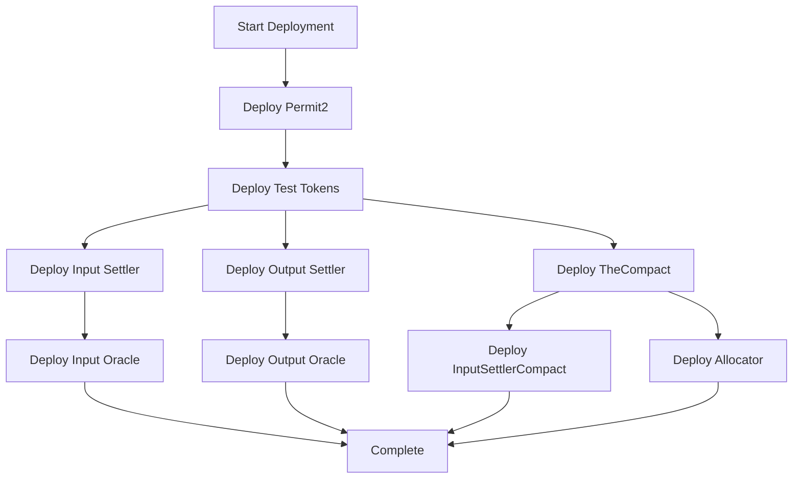
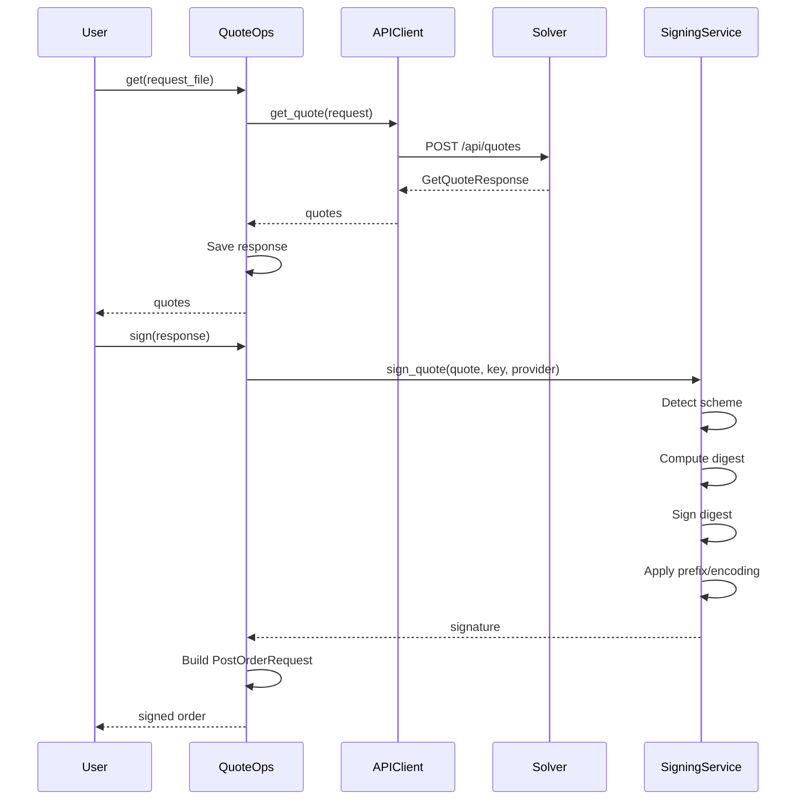
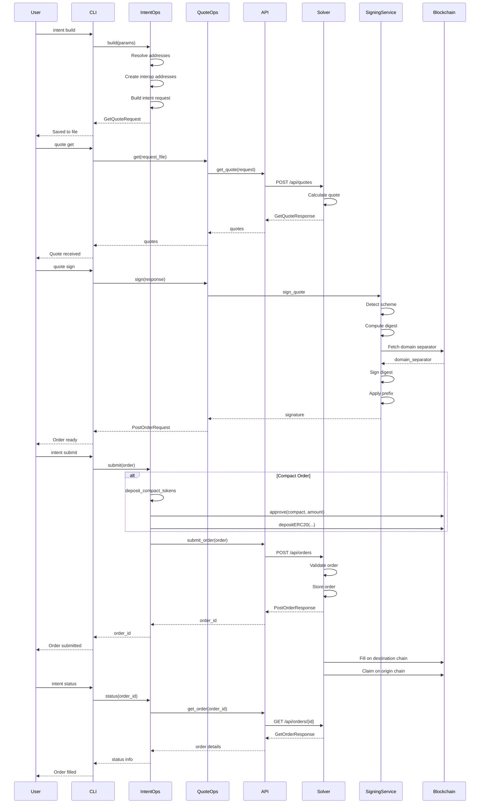

# `solver-demo` Crate - Comprehensive Technical Documentation

## Table of Contents
1. [Executive Summary](#executive-summary)
2. [Architecture Overview](#architecture-overview)
3. [Core Components](#core-components)
4. [Type System](#type-system)
5. [Operations Layer](#operations-layer)
6. [CLI Interface](#cli-interface)
7. [Data Flow](#data-flow)
8. [Design Patterns](#design-patterns)
9. [Key Technical Details](#key-technical-details)

---

## Executive Summary

The `solver-demo` crate is a sophisticated command-line application for testing and demonstrating the **Open Intent Framework (OIF) Solver** capabilities for executing cross-chain intents. It serves as both a development tool and reference implementation for cross-chain intent resolution.

### Purpose
- **Testing Tool**: Enables comprehensive testing of cross-chain intent workflows
- **Demo Platform**: Demonstrates OIF Solver capabilities across multiple blockchain networks
- **Reference Implementation**: Showcases proper integration patterns for OIF components

### Key Capabilities
- Multi-chain blockchain environment management (Anvil-based local chains)
- Smart contract deployment and lifecycle management
- Token operations (mint, approve, balance queries)
- Cross-chain intent construction and submission
- Multiple settlement types (Escrow/Permit2/EIP-3009, Compact/Resource Lock)
- Quote generation and signature handling (EIP-712, Permit2, EIP-3009, Compact)
- JWT authentication and API communication

### Technology Stack
```toml
[dependencies]
alloy-* = { workspace = true }      # Ethereum interaction (v1.0+)
clap = { version = "4" }            # CLI parsing with derive
reqwest = { version = "0.12" }      # HTTP client
serde = { version = "1" }            # Serialization
tokio = { version = "1.41" }        # Async runtime
anyhow = "1"                         # Error handling
solver-account                       # Internal account management
solver-config                        # Configuration loading
solver-types                         # Shared type definitions
```

---

## Architecture Overview

### High-Level Architecture

The crate follows a **layered architecture** pattern with clear separation of concerns:

```
┌─────────────────────────────────────────────────────────────┐
│                   CLI Layer (bin/)                           │
│  ┌──────────┐  ┌──────────┐  ┌──────────┐  ┌──────────┐   │
│  │ Commands │  │ Parsing  │  │ Dispatch │  │ Logging  │   │
│  └──────────┘  └──────────┘  └──────────┘  └──────────┘   │
└─────────────────────────────────────────────────────────────┘
                            ↓
┌─────────────────────────────────────────────────────────────┐
│              Operations Layer (operations/)                  │
│  ┌──────────┐  ┌──────────┐  ┌──────────┐  ┌──────────┐   │
│  │   Init   │  │   Env    │  │  Token   │  │ Intent   │   │
│  └──────────┘  └──────────┘  └──────────┘  └──────────┘   │
│  ┌──────────┐                                               │
│  │  Quote   │   (Business Logic Layer)                     │
│  └──────────┘                                               │
└─────────────────────────────────────────────────────────────┘
                            ↓
┌─────────────────────────────────────────────────────────────┐
│                Core Services Layer (core/)                   │
│  ┌───────────┐  ┌───────────┐  ┌───────────┐  ┌─────────┐ │
│  │   API     │  │Blockchain │  │ Contracts │  │  JWT    │ │
│  │  Client   │  │ Provider  │  │  Manager  │  │ Service │ │
│  └───────────┘  └───────────┘  └───────────┘  └─────────┘ │
│  ┌───────────┐  ┌───────────┐  ┌───────────┐  ┌─────────┐ │
│  │  Storage  │  │  Session  │  │  Signing  │  │  Token  │ │
│  │           │  │   Store   │  │  Service  │  │Registry │ │
│  └───────────┘  └───────────┘  └───────────┘  └─────────┘ │
└─────────────────────────────────────────────────────────────┘
                            ↓
┌─────────────────────────────────────────────────────────────┐
│                 Foundation Layer (types/)                    │
│  ┌───────────┐  ┌───────────┐  ┌───────────┐  ┌─────────┐ │
│  │  ChainId  │  │   Error   │  │  Session  │  │ Models  │ │
│  └───────────┘  └───────────┘  └───────────┘  └─────────┘ │
│  ┌───────────┐  ┌───────────┐                              │
│  │    Hex    │  │Extensions │    (Type Definitions)        │
│  └───────────┘  └───────────┘                              │
└─────────────────────────────────────────────────────────────┘
```

### Module Organization

```
solver-demo/
├── src/
│   ├── bin/
│   │   └── solver-demo.rs          # Binary entry point
│   ├── lib.rs                       # Library root with Context
│   ├── constants.rs                 # Hardcoded values
│   ├── types/                       # Foundation layer
│   │   ├── chain.rs                 # ChainId type
│   │   ├── error.rs                 # Error types
│   │   ├── models.rs                # Data models
│   │   ├── session.rs               # Session types
│   │   ├── hex.rs                   # Hex utilities
│   │   └── extensions.rs            # Type extensions
│   ├── core/                        # Core services
│   │   ├── api.rs                   # API client
│   │   ├── blockchain.rs            # Provider & TxBuilder
│   │   ├── config.rs                # Config management
│   │   ├── contracts.rs             # Contract interaction
│   │   ├── jwt.rs                   # JWT authentication
│   │   ├── logging.rs               # Logging utilities
│   │   ├── session.rs               # Session management
│   │   ├── signing.rs               # Signature generation
│   │   ├── storage.rs               # File storage
│   │   └── tokens.rs                # Token registry
│   ├── operations/                  # Business logic
│   │   ├── init/                    # Initialization
│   │   ├── env/                     # Environment mgmt
│   │   │   ├── anvil.rs             # Anvil process mgmt
│   │   │   └── deploy.rs            # Contract deployment
│   │   ├── token/                   # Token operations
│   │   │   ├── mint.rs              # Minting
│   │   │   ├── balance.rs           # Balance queries
│   │   │   └── approve.rs           # Approvals
│   │   ├── intent/                  # Intent operations
│   │   └── quote/                   # Quote operations
│   └── cli/                         # CLI layer
│       └── commands/                # Command definitions
│           ├── init.rs
│           ├── env.rs
│           ├── token.rs
│           ├── intent.rs
│           ├── quote.rs
│           └── account.rs
└── Cargo.toml
```

### Design Philosophy

1. **Separation of Concerns**: Clear boundaries between CLI, operations, core services, and types
2. **Dependency Injection**: The `Context` struct provides dependency injection
3. **Async Throughout**: Full async/await support with Tokio runtime
4. **Type Safety**: Strong typing with custom types (ChainId, Address, U256)
5. **Error Handling**: Comprehensive error types with context preservation
6. **Testability**: Modular design enables unit and integration testing

---

## Core Components

### 1. Context - The Central Hub

**Location**: `src/lib.rs:62-216`

The `Context` struct is the **heart** of the application, providing centralized access to all services and configuration.

```rust
pub struct Context {
    pub config: Config,                     // Configuration management
    pub storage: Storage,                   // File-based persistence
    pub session: SessionStore,              // Session state
    pub tokens: TokenRegistry,              // Token information
    pub contracts: RwLock<Contracts>,       // Contract ABIs/addresses
    pub signing: SigningService,            // Signature generation
    pub jwt: JwtService,                    // JWT authentication
}
```

**Key Methods**:

```rust
// Initialize from config file
pub async fn init(config_path: &Path, is_local: bool) -> Result<Self>

// Load existing session
pub async fn load_existing() -> Result<Self>

// Create blockchain provider
pub async fn provider(&self, chain: ChainId) -> Result<Provider>

// Create authenticated API client
pub async fn api_client(&self) -> Result<ApiClient>

// Resolve address from name or hex
pub fn resolve_address(&self, address_or_name: &str) -> Result<Address>
```

**Why This Matters**:
- **Single Source of Truth**: All components share the same configuration and state
- **Thread Safety**: Uses `Arc` for shared ownership and `RwLock` for contracts
- **Lifecycle Management**: Handles initialization and resource cleanup
- **Address Resolution**: Converts friendly names (`"user"`, `"solver"`) to addresses

**Usage Example**:
```rust
// Initialize context
let ctx = Context::init(config_path, true).await?;

// Get provider for chain
let provider = ctx.provider(ChainId::from_u64(31337)).await?;

// Resolve user address
let user_addr = ctx.resolve_address("user")?;  // Returns actual Address

// Get API client with JWT
let api = ctx.api_client().await?;
```

### 2. Configuration System

**Location**: `src/core/config.rs:21-214`

Sophisticated configuration management with environment variable overrides and automatic reload.

```rust
pub struct Config {
    pub path: PathBuf,                      // Config file location
    pub solver: SolverFullConfig,           // Full solver config
    networks: HashMap<ChainId, NetworkConfig>, // Network configurations
    accounts: Accounts,                     // Account information
}

pub struct Accounts {
    pub user: Account,
    pub solver: Account,
    pub recipient: Account,
}

pub struct Account {
    pub address: String,
    pub private_key: Option<solver_types::SecretString>,
}
```

**Configuration Loading**:



**Key Features**:
- **Include Directives**: Supports modular configuration files
```toml
include = ["demo/networks.toml", "demo/api.toml", "demo/gas.toml"]
```
- **Environment Variables**: Override values with env vars
```rust
USER_ADDRESS=0x...
SOLVER_PRIVATE_KEY=0x...
```
- **Hot Reload**: `reload()` method updates config without restart
- **Network Discovery**: Automatically loads all network configurations

**Network Configuration Example**:
```toml
[networks.31337]
input_settler_address = "0x..."
output_settler_address = "0x..."
the_compact_address = "0x..."
allocator_address = "0x..."

[[networks.31337.rpc_urls]]
http = "http://localhost:8545"
ws = "ws://localhost:8545"

[[networks.31337.tokens]]
address = "0x..."
symbol = "TOKA"
decimals = 18
```

### 3. Storage System

**Location**: `src/core/storage.rs:17-186`

Simple yet effective JSON-based persistence for session data and configuration.

```rust
pub struct Storage {
    root: Arc<PathBuf>,  // Root directory
}
```

**Operations**:
```rust
// Save data as JSON
storage.save("session", &session_data)?;

// Load data from JSON
let session: Session = storage.load("session")?;

// Check existence
if storage.exists("session") { ... }

// Delete
storage.delete("session")?;

// Create subdirectory storage
let contracts_storage = storage.subdir("contracts")?;
```

**Storage Structure**:
```
.oif-demo/
├── session.json          # Session state
├── anvil_processes.json  # Running Anvil PIDs
└── requests/             # Subdirectory
    ├── get_quote.req.json
    ├── get_quote.res.json
    └── post_order.req.json
```

**Why JSON?**:
- Human-readable for debugging
- Easy inspection and manual editing
- Version control friendly
- Cross-platform compatible

### 4. Session Management

**Location**: `src/core/session.rs:28-613`

Thread-safe session state with automatic persistence.

```rust
pub struct SessionStore {
    session: Arc<RwLock<Session>>,
    storage: Storage,
}

pub struct Session {
    pub config_path: PathBuf,
    pub config_sections: HashMap<String, PathBuf>,
    pub placeholder_map: HashMap<String, String>,
    pub environment: Environment,
    pub chains: Vec<ChainId>,
    pub jwt_tokens: HashMap<String, JwtToken>,
    pub deployed_contracts: HashMap<String, ContractSet>,
}
```

**Session Lifecycle**:



**Key Features**:
- **Thread-Safe**: Uses `Arc<RwLock<>>` for concurrent access
- **Auto-Persistence**: Automatically saves on modification
- **Contract Tracking**: Stores deployed contract addresses
- **JWT Management**: Handles token lifecycle with expiration
- **Placeholder System**: Maps placeholder addresses to real addresses

**Contract Management**:
```rust
// Store deployed contracts
session.set_contract_addresses(chain, addresses)?;

// Check if contracts deployed
if session.has_contracts(chain) { ... }

// Get contracts for chain
let contracts = session.contracts(chain)?;
```

### 5. Blockchain Provider

**Location**: `src/core/blockchain.rs:23-361`

Abstraction over Alloy for blockchain interaction.

```rust
pub struct Provider {
    inner: Arc<dyn AlloyProvider + Send + Sync>,
    chain: ChainId,
    rpc_url: reqwest::Url,
}

pub struct TxBuilder {
    provider: Provider,
    signer: Option<PrivateKeySigner>,
}
```

**Provider Features**:
```rust
// Create provider
let provider = Provider::new(chain, "http://localhost:8545").await?;

// Query balance
let balance = provider.balance(address).await?;

// Get block number
let block = provider.block_number().await?;

// Check connectivity
if provider.is_connected().await { ... }

// Special Anvil RPC
provider.set_code(address, bytecode).await?;
```

**Transaction Builder**:
```rust
// Build transaction
let tx_builder = TxBuilder::new(provider)
    .with_signer(signer);

// Send transaction
let tx_hash = tx_builder.send(tx).await?;

// Wait for receipt
let receipt = tx_builder.wait(tx_hash).await?;

// Send and wait (convenience)
let receipt = tx_builder.send_and_wait(tx).await?;
```

**Automatic Features**:
- **Gas Estimation**: Automatic if not specified
- **Nonce Management**: Handled by provider
- **Gas Price**: Fetched automatically
- **Chain ID**: Set from provider configuration
- **Receipt Polling**: Built-in with timeout

### 6. Contract Manager

**Location**: `src/core/contracts.rs:28-693`

Manages contract ABIs and addresses with dynamic interaction.

```rust
pub struct Contracts {
    abis: Arc<HashMap<String, JsonAbi>>,
    addresses: Arc<HashMap<ChainId, ContractAddresses>>,
}
```

**Supported Contracts**:
- **ERC20**: Standard token interface with mint
- **TheCompact**: Resource lock protocol
- **Settlers**: Input/output settlement contracts

**Contract Interaction**:
```rust
// ERC20 operations
let balance = contracts.erc20_balance(provider, token, owner).await?;
let approve_data = contracts.erc20_approve(spender, amount)?;
let mint_data = contracts.erc20_mint(recipient, amount)?;

// TheCompact operations
let deposit_data = contracts.thecompact_deposit(
    token,
    allocator_lock_tag,
    amount,
    recipient
)?;

let register_data = contracts.thecompact_register_allocator(
    allocator,
    proof
)?;

// Input Settler
let open_data = contracts.input_settler_open(&standard_order)?;
```

**Dynamic ABIs**:
```rust
fn erc20_abi(&self) -> JsonAbi {
    serde_json::from_str(r#"[
        {
            "type": "function",
            "name": "balanceOf",
            "inputs": [{"name": "owner", "type": "address"}],
            "outputs": [{"name": "", "type": "uint256"}],
            "stateMutability": "view"
        },
        ...
    ]"#).expect("Invalid ERC20 ABI")
}
```

### 7. Signing Service

**Location**: `src/core/signing.rs:25-665`

Multi-scheme signature generation supporting Permit2, EIP-3009, Compact, and generic EIP-712.

```rust
pub struct SigningService {}

pub enum SignatureScheme {
    Permit2,    // 0x00 prefix
    Eip3009,    // 0x01 prefix
    Compact,    // ABI-encoded tuple
    Generic,    // No prefix
}
```

**Signature Flow**:



**Key Method**:
```rust
pub async fn sign_quote(
    &self,
    quote: &Quote,
    private_key: &str,
    provider: Provider,
) -> Result<String>
```

**Scheme-Specific Handling**:

**Permit2**:
```rust
// Digest: reconstruct_permit2_digest(payload)
// Prefix: 0x00 + signature (65 bytes)
let mut prefixed = vec![0x00];
prefixed.extend_from_slice(&sig_bytes);
```

**EIP-3009**:
```rust
// Digest: reconstruct_eip3009_digest(payload, domain_separator)
// Fetch domain separator from token contract
let domain_separator = self.fetch_domain_separator(
    chain_id,
    verifying_contract,
    provider
).await?;
// Prefix: 0x01 + signature
let mut prefixed = vec![0x01];
prefixed.extend_from_slice(&sig_bytes);
```

**Compact**:
```rust
// Digest: reconstruct_compact_digest(payload, domain_separator)
// Encoding: ABI-encode (sponsorSig, allocatorSig) tuple
fn encode_compact_signature(&self, sponsor_sig: Vec<u8>) -> Vec<u8> {
    let allocator_sig: Vec<u8> = Vec::new();  // Empty for basic flow
    
    // Manual ABI encoding to match Solidity (bytes,bytes)
    let mut encoded = Vec::new();
    
    // Offset to first bytes (0x40 = 64 bytes)
    encoded.extend_from_slice(&[0u8; 28]);
    encoded.extend_from_slice(&0x40u32.to_be_bytes());
    
    // Offset to second bytes
    let second_offset = 64 + 32 + ((sponsor_sig.len() + 31) & !31);
    encoded.extend_from_slice(&[0u8; 28]);
    encoded.extend_from_slice(&(second_offset as u32).to_be_bytes());
    
    // Encode sponsor signature
    encoded.extend_from_slice(&[0u8; 28]);
    encoded.extend_from_slice(&(sponsor_sig.len() as u32).to_be_bytes());
    encoded.extend_from_slice(&sponsor_sig);
    let padding = (32 - (sponsor_sig.len() % 32)) % 32;
    encoded.extend_from_slice(&vec![0u8; padding]);
    
    // Encode allocator signature
    encoded.extend_from_slice(&[0u8; 28]);
    encoded.extend_from_slice(&0u32.to_be_bytes());
    
    encoded
}
```

### 8. JWT Service

**Location**: `src/core/jwt.rs:47-349`

Manages JWT lifecycle with automatic refresh and client registration.

```rust
pub struct JwtService {
    client: Client,
    base_url: String,
    client_id: String,
}

pub struct JwtTokenResponse {
    pub access_token: String,
    pub refresh_token: String,
    pub client_id: String,
    pub access_token_expires_at: i64,
    pub refresh_token_expires_at: i64,
    pub scopes: Vec<String>,
    pub token_type: String,
}
```

**Token Lifecycle**:



**API Integration**:
```rust
// Get valid token (handles refresh/registration)
let token = jwt_service.get_valid_token(&session_store).await?;

// Create API client with token
let api = ApiClient::new(&api_url)?.with_jwt(token);

// Token is automatically stored in session
```

**Client Registration**:
```rust
async fn register_client(&self) -> Result<JwtTokenResponse> {
    let scopes = vec![
        AuthScope::ReadOrders.to_string(),
        AuthScope::CreateOrders.to_string(),
        AuthScope::CreateQuotes.to_string(),
        AuthScope::ReadQuotes.to_string(),
    ];

    let request = json!({
        "client_id": self.client_id,
        "scopes": scopes,
        "expiry_hours": 24,
    });

    let response = self.client
        .post(&format!("{}/api/auth/register", self.base_url))
        .json(&request)
        .send()
        .await?;

    response.json().await
}
```

**Unique Client ID**:
```rust
fn generate_client_id() -> String {
    let hostname = hostname::get()
        .map(|h| h.to_string_lossy().to_string())
        .unwrap_or_else(|_| "unknown".to_string());
    let timestamp = Utc::now().timestamp();
    let uuid = uuid::Uuid::new_v4();
    format!("oif-demo-v2-{}-{}-{}", hostname, timestamp, uuid.simple())
}
```

### 9. Token Registry

**Location**: `src/core/tokens.rs:21-254`

Central registry for token information across chains.

```rust
pub struct TokenRegistry {
    tokens: HashMap<(ChainId, String), TokenInfo>,
}

pub struct TokenInfo {
    pub symbol: String,
    pub address: Address,
    pub decimals: u8,
    pub chain: ChainId,
}
```

**Operations**:
```rust
// Register token
registry.register(TokenInfo {
    symbol: "USDC".to_string(),
    address: usdc_address,
    decimals: 6,
    chain: ChainId::from_u64(1),
});

// Get token (case-insensitive)
let token = registry.get(chain, "usdc")?;

// Get by address
let token = registry.get_by_address(chain, address)?;

// Get all tokens for chain
let tokens = registry.tokens_for_chain(chain);

// Decimal conversions
let wei = token_info.to_wei(1.5);  // 1.5 -> 1500000000000000000
let amount = token_info.from_wei(wei);  // 1500000000000000000 -> 1.5
```

**Configuration Loading**:
```rust
pub fn from_config(config: &Config) -> Result<Self> {
    let mut registry = Self::new();

    for chain in config.chains() {
        if let Some(network) = config.network(chain) {
            for token in &network.tokens {
                let info = TokenInfo {
                    symbol: token.symbol.clone(),
                    address: parse_address(&token.address)?,
                    decimals: token.decimals,
                    chain,
                };
                registry.register(info);
            }
        }
    }

    Ok(registry)
}
```

---

## Type System

### ChainId Type

**Location**: `src/types/chain.rs:14-83`

Strongly-typed chain identifier with display formatting.

```rust
#[derive(Debug, Clone, Copy, PartialEq, Eq, Hash, Serialize, Deserialize)]
pub enum ChainId {
    Mainnet,
    Custom { id: u64 },
}

impl ChainId {
    pub fn from_u64(id: u64) -> Self {
        match id {
            1 => Self::Mainnet,
            id => Self::Custom { id },
        }
    }

    pub fn id(&self) -> u64 {
        match self {
            Self::Mainnet => 1,
            Self::Custom { id } => *id,
        }
    }

    pub fn name(&self) -> &str {
        match self {
            Self::Mainnet => "Ethereum Mainnet",
            Self::Custom { id: 1 } => "Ethereum Mainnet",
            Self::Custom { id: 5 } => "Goerli",
            Self::Custom { id: 11155111 } => "Sepolia",
            Self::Custom { id: 137 } => "Polygon",
            Self::Custom { id: 42161 } => "Arbitrum One",
            Self::Custom { id: 10 } => "Optimism",
            Self::Custom { .. } => "Custom Chain",
        }
    }
}

impl fmt::Display for ChainId {
    fn fmt(&self, f: &mut fmt::Formatter<'_>) -> fmt::Result {
        write!(f, "{} ({})", self.id(), self.name())
    }
}
```

**Usage**:
```rust
let chain = ChainId::from_u64(31337);
println!("{}", chain);  // "31337 (Custom Chain)"
```

### Error Types

**Location**: `src/types/error.rs:18-167`

Comprehensive error hierarchy with context preservation.

```rust
#[derive(thiserror::Error, Debug)]
pub enum Error {
    // Chain errors
    #[error("Chain not found: {0}")]
    ChainNotFound(ChainId),

    #[error("Invalid chain ID: {0}")]
    InvalidChain(u64),

    #[error("RPC connection failed: {0}")]
    RpcError(String),

    // Config errors
    #[error("Configuration file not found: {0}")]
    ConfigNotFound(PathBuf),

    #[error("Invalid configuration format: {0}")]
    InvalidConfig(String),

    // API errors
    #[error("API request failed: {0}")]
    ApiRequestFailed(String),

    #[error("Authentication failed")]
    AuthFailed,

    // Token errors
    #[error("Token not found: {0} on chain {1}")]
    TokenNotFound(String, u64),

    // Contract errors
    #[error("Contract not deployed on chain {0}")]
    ContractNotDeployed(u64),

    #[error("Contract call failed: {0}")]
    ContractCallFailed(String),

    // Signing errors
    #[error("Invalid private key")]
    InvalidPrivateKey,

    #[error("Signing failed: {0}")]
    SigningFailed(String),

    // Environment errors
    #[error("Anvil not running on chain {0}")]
    AnvilNotRunning(u64),

    #[error("Failed to start Anvil: {0}")]
    AnvilStartFailed(String),

    // Validation errors
    #[error("Invalid hex string: {0}")]
    InvalidHex(String),

    #[error("Invalid address: {0}")]
    InvalidAddress(String),

    // External error wrapping
    #[error("IO error: {0}")]
    Io(#[from] std::io::Error),

    #[error("JSON error: {0}")]
    Json(#[from] serde_json::Error),

    #[error(transparent)]
    Other(#[from] anyhow::Error),
}
```

**Error Conversions**:
```rust
impl From<solver_config::ConfigError> for Error {
    fn from(err: solver_config::ConfigError) -> Self {
        Error::InvalidConfig(err.to_string())
    }
}
```

### Session Types

**Location**: `src/types/session.rs:18-170`

```rust
pub struct Session {
    pub config_path: PathBuf,
    pub config_sections: HashMap<String, PathBuf>,
    pub placeholder_map: HashMap<String, String>,
    pub environment: Environment,
    pub chains: Vec<ChainId>,
    pub jwt_tokens: HashMap<String, JwtToken>,
    pub deployed_contracts: HashMap<String, ContractSet>,
}

#[derive(Debug, Clone, Copy, PartialEq, Eq, Serialize, Deserialize)]
pub enum Environment {
    Local,
    Production,
}

pub struct JwtToken {
    pub token: String,
    pub expires_at: i64,
}

impl JwtToken {
    pub fn is_expired(&self) -> bool {
        let now = chrono::Utc::now().timestamp();
        now >= self.expires_at
    }
}

pub struct ContractSet {
    pub input_settler: Option<String>,
    pub input_settler_compact: Option<String>,
    pub output_settler: Option<String>,
    pub permit2: Option<String>,
    pub compact: Option<String>,
    pub allocator: Option<String>,
    pub input_oracle: Option<String>,
    pub output_oracle: Option<String>,
    pub tokens: HashMap<String, SessionTokenInfo>,
}
```

---

## Operations Layer

### Init Operations

**Location**: `src/operations/init/mod.rs:33-817`

Handles configuration creation and loading.

**Configuration Generation**:

```rust
pub async fn create(&self, path: PathBuf, chains: Vec<u64>, force: bool) -> Result<()> {
    // Generate placeholder map for all chains
    let placeholders = generate_placeholder_map(&chains);
    
    // Generate main config file
    let config_content = generate_demo_config(&chains, config_name, &placeholders)?;
    std::fs::write(path, config_content)?;
    
    // Create includes directory
    let include_dir = parent.join(config_name);
    std::fs::create_dir_all(&include_dir)?;
    
    // Write networks.toml
    std::fs::write(
        include_dir.join("networks.toml"),
        generate_networks_config(&chains, &placeholders)?
    )?;
    
    // Write gas.toml
    std::fs::write(
        include_dir.join("gas.toml"),
        generate_gas_config()?
    )?;
    
    // Write api.toml
    std::fs::write(
        include_dir.join("api.toml"),
        generate_api_config()?
    )?;
    
    Ok(())
}
```

**Placeholder System**:

The placeholder system allows for template-based configuration that gets filled in with actual deployed addresses:

```rust
fn generate_placeholder_map(chain_ids: &[u64]) -> HashMap<String, String> {
    let mut map = HashMap::new();
    let mut counter = PLACEHOLDER_START_COUNTER;  // 0x3e8 = 1000

    for chain_id in chain_ids {
        // Generate unique placeholder addresses
        map.insert(
            format!("PLACEHOLDER_INPUT_SETTLER_{}", chain_id),
            format!("0x{:040x}", counter)  // 0x0000...03e8
        );
        counter += 1;
        
        map.insert(
            format!("PLACEHOLDER_OUTPUT_SETTLER_{}", chain_id),
            format!("0x{:040x}", counter)  // 0x0000...03e9
        );
        counter += 1;
        
        // ... more placeholders
    }

    map
}
```

**Why Placeholders?**:
- Allows configuration generation before deployment
- Easy to search/replace with actual addresses
- Human-readable sequential addresses
- Prevents configuration errors from copy-paste

### Environment Operations

**Location**: `src/operations/env/mod.rs:37-762`

Manages local development environment and contract deployment.

**Anvil Management**:

```rust
pub async fn start(&mut self) -> Result<()> {
    let chains = self.ctx.config.chains();
    let mut to_start = Vec::new();

    // Check which chains need starting
    for chain in &chains {
        if !self.anvil.is_running(*chain) {
            to_start.push(*chain);
        }
    }

    // Start chains in parallel
    for chain in &to_start {
        self.anvil.start_chain(*chain)?;
    }

    // Wait for all to be ready
    for chain in &to_start {
        self.anvil.wait_for_chain(*chain).await?;
    }

    Ok(())
}
```

**Anvil Process Management**:

```rust
pub fn start_chain(&mut self, chain: ChainId) -> Result<()> {
    let port = self.get_port(chain)?;

    // Build Anvil command
    let mut cmd = Command::new("anvil");
    cmd.arg("--port").arg(port.to_string())
        .arg("--accounts").arg("10")
        .arg("--balance").arg("10000")
        .arg("--mnemonic").arg("test test test test test test test test test test test junk")
        .arg("--chain-id").arg(chain.id().to_string())
        .arg("--block-time").arg("2")
        .stdout(Stdio::null())
        .stderr(Stdio::null());

    // Start process
    let child = cmd.spawn()?;
    let pid = child.id();

    // Store process info
    self.store_process_info(AnvilProcess { chain, pid, port })?;

    // Detach process to run in background
    std::mem::forget(child);

    Ok(())
}
```

**Contract Deployment**:

Parallel deployment across multiple chains:

```rust
pub async fn deploy(&mut self, force: bool) -> Result<()> {
    let chains = self.ctx.config.chains();
    
    // Filter chains that need deployment
    let chains_to_deploy: Vec<ChainId> = chains
        .into_iter()
        .filter(|&chain| force || !self.ctx.session.has_contracts(chain))
        .collect();

    // Create deployment tasks
    let mut deployment_handles = Vec::new();

    for chain in &chains_to_deploy {
        let deployer = self.deployer.clone();
        let chain = *chain;

        // Spawn async task for each chain
        let handle = tokio::spawn(async move {
            let addresses = deployer.deploy_to_chain(chain).await?;
            Ok::<(ChainId, ContractAddresses), Error>((chain, addresses))
        });

        deployment_handles.push(handle);
    }

    // Wait for all deployments
    for handle in deployment_handles {
        let (chain, addresses) = handle.await??;

        // Store addresses in session
        self.ctx.session.set_contract_addresses(chain, addresses.clone())?;

        // Update TOML files if local
        if self.ctx.is_local() {
            self.replace_config_placeholders(chain, addresses).await?;
        }
    }

    Ok(())
}
```

**Environment Setup**:

Comprehensive setup including token minting, approvals, and allocator registration:

```rust
pub async fn setup(&mut self, target_chain: Option<u64>, amount: u64) -> Result<()> {
    let chain_ids: Vec<ChainId> = if let Some(chain_id) = target_chain {
        vec![ChainId::from(chain_id)]
    } else {
        self.ctx.config.chains()
    };

    // Create setup tasks for all chains
    let mut setup_handles = Vec::new();

    for chain in &chain_ids {
        let ctx = self.ctx.clone();
        let chain = *chain;

        let handle = tokio::spawn(async move {
            Self::setup_single_chain(ctx, chain, amount).await?;
            Ok::<ChainId, Error>(chain)
        });

        setup_handles.push(handle);
    }

    // Wait for all setups
    for handle in setup_handles {
        handle.await??;
    }

    Ok(())
}

async fn setup_single_chain(ctx: Arc<Context>, chain: ChainId, amount: u64) -> Result<()> {
    let token_ops = TokenOps::new(ctx.clone());
    let contracts = ctx.session.contracts(chain)?;

    // 1. Mint tokens to user and solver
    for (symbol, token_info) in &contracts.tokens {
        let mint_amount = U256::from(amount) 
            * U256::from(10).pow(U256::from(token_info.decimals));

        // Mint to user
        token_ops.mint(chain, symbol, Some("user"), mint_amount).await?;

        // Mint to solver
        token_ops.mint(chain, symbol, Some("solver"), mint_amount).await?;
    }

    // 2. Approve Permit2 for input settlers
    if let Some(permit2_addr) = &contracts.permit2 {
        for symbol in contracts.tokens.keys() {
            token_ops.approve(chain, symbol, permit2_addr, None).await?;
        }
    }

    // 3. Register allocator with TheCompact
    if let (Some(compact_addr), Some(allocator_addr)) = 
        (&contracts.compact, &contracts.allocator) {
        register_allocator_with_compact(compact_addr, allocator_addr).await?;
    }

    Ok(())
}
```

### Contract Deployment Details

**Location**: `src/operations/env/deploy.rs:38-521`

**Deployment Order** (respects dependencies):



**Contract Deployment Method**:

```rust
async fn deploy_contract(
    &self,
    provider: &Provider,
    contract_name: &str,
    constructor_args: Option<Bytes>,
) -> Result<Address> {
    // Load contract JSON
    let contract_json = self.load_contract_json(contract_name)?;

    // Extract bytecode
    let bytecode = self.extract_bytecode(&contract_json)?;

    // Combine bytecode with constructor args
    let mut data = bytecode;
    if let Some(args) = constructor_args {
        let mut combined = data.to_vec();
        combined.extend_from_slice(&args);
        data = Bytes::from(combined);
    }

    // Create deployment transaction
    let signer = self.get_solver_signer()?;
    let tx = TransactionRequest::default()
        .with_kind(TxKind::Create)  // Contract creation
        .input(data.into())
        .value(U256::ZERO);

    // Deploy
    let tx_builder = TxBuilder::new(provider.clone()).with_signer(signer);
    let receipt = tx_builder.send_and_wait(tx).await?;

    // Extract deployed address
    let address = receipt.contract_address
        .ok_or_else(|| Error::DeploymentFailed("No contract address in receipt".to_string()))?;

    Ok(address)
}
```

**Permit2 Special Handling**:

Permit2 uses `anvil_setCode` to deploy at canonical address:

```rust
async fn deploy_permit2_from_bytecode(&self, provider: &Provider) -> Result<Address> {
    // Read pre-compiled bytecode
    let bytecode_path = Path::new(env!("CARGO_MANIFEST_DIR"))
        .join("src/operations/env/data/permit2_bytecode.hex");
    
    let bytecode_hex = std::fs::read_to_string(&bytecode_path)?;
    let bytecode_with_prefix = format!("0x{}", bytecode_hex.trim());

    // Use Anvil special RPC to set code at canonical address
    let canonical_address = constants::PERMIT2_ADDRESS;  // 0x000000000022D473030F116dDEE9F6B43aC78BA3
    
    provider.set_code(canonical_address, &bytecode_with_prefix).await?;

    Ok(canonical_address.parse()?)
}
```

### Token Operations

**Location**: `src/operations/token/mod.rs:33-313`

Unified interface for token operations across chains.

**Architecture**:

```rust
pub struct TokenOps {
    ctx: Arc<Context>,
    mint_ops: MintOps,
    balance_ops: BalanceOps,
    approval_ops: ApprovalOps,
}
```

**Token Listing**:

```rust
pub async fn list(&self, chains: Option<Vec<ChainId>>) -> Result<TokenList> {
    let chains = chains.unwrap_or_else(|| self.ctx.config.chains());
    let mut tokens_by_chain = HashMap::new();

    for chain in chains {
        let tokens = self.list_for_chain(chain)?;
        if !tokens.is_empty() {
            tokens_by_chain.insert(chain, tokens);
        }
    }

    Ok(TokenList { tokens_by_chain })
}

pub fn list_for_chain(&self, chain: ChainId) -> Result<Vec<TokenInfo>> {
    let mut tokens = Vec::new();

    // Get tokens from config
    if let Some(network) = self.ctx.config.network(chain) {
        for token in &network.tokens {
            tokens.push(TokenInfo {
                symbol: token.symbol.clone(),
                address: parse_address(&token.address)?,
                decimals: token.decimals,
            });
        }
    }

    // Get tokens from session (deployed)
    if let Some(contracts) = self.ctx.session.contracts(chain) {
        for (symbol, token_info) in contracts.tokens {
            if !tokens.iter().any(|t| t.symbol == symbol) {
                tokens.push(TokenInfo {
                    symbol,
                    address: token_info.address.parse()?,
                    decimals: token_info.decimals,
                });
            }
        }
    }

    Ok(tokens)
}
```

**Balance Queries** (multi-chain, multi-token, multi-account):

```rust
pub async fn balance(
    &self,
    chains: Option<Vec<ChainId>>,
    tokens: Option<Vec<&str>>,
    accounts: Option<Vec<&str>>,
) -> Result<Vec<EnhancedBalanceResult>> {
    // Resolve chains
    let chain_ids = chains.unwrap_or_else(|| self.ctx.config.chains());

    // Resolve accounts
    let account_addresses = if let Some(account_strs) = accounts {
        account_strs.iter()
            .map(|addr_str| self.ctx.resolve_address(addr_str))
            .collect::<Result<Vec<_>>>()?
    } else {
        vec![self.balance_ops.get_default_account()]
    };

    // Determine tokens
    let mut all_tokens = Vec::new();
    if let Some(token_symbols) = tokens {
        all_tokens.extend(token_symbols.iter().map(|s| s.to_string()));
    } else {
        // Get all tokens across all chains
        let mut token_set = HashSet::new();
        for &chain_id in &chain_ids {
            let chain_tokens = self.ctx.tokens.tokens_for_chain(chain_id);
            for token in chain_tokens {
                token_set.insert(token.symbol.clone());
            }
        }
        all_tokens.extend(token_set);
    }

    self.balance_ops.balance(chain_ids, all_tokens, account_addresses).await
}
```

### Intent Operations

**Location**: `src/operations/intent/mod.rs:29-1030`

Builds, submits, and manages cross-chain intents.

**Intent Building**:

```rust
pub async fn build(&self, params: IntentParams, output_path: Option<PathBuf>) -> Result<GetQuoteRequest> {
    // Resolve addresses
    let user_addr = params.sender.unwrap_or_else(|| 
        self.ctx.config.accounts().user.address.parse().unwrap()
    );
    let recipient_addr = params.recipient.unwrap_or(user_addr);

    // Create interop addresses
    let user = self.create_interop_address(user_addr, params.from_chain)?;
    let receiver = self.create_interop_address(recipient_addr, params.to_chain)?;

    // Get token addresses
    let from_token_addr = self.get_token_address(params.from_chain, &params.from_token)?;
    let to_token_addr = self.get_token_address(params.to_chain, &params.to_token)?;

    let asset_input = self.create_interop_address(from_token_addr, params.from_chain)?;
    let asset_output = self.create_interop_address(to_token_addr, params.to_chain)?;

    // Build origin submission based on settlement type
    let (origin_submission, lock) = match params.settlement {
        SettlementType::Escrow => {
            let auth_scheme = match params.auth {
                Some(AuthType::Permit2) => AuthScheme::Permit2,
                Some(AuthType::Eip3009) => AuthScheme::Eip3009,
                None => return Err(Error::InvalidConfig(
                    "Auth scheme required for escrow".to_string()
                )),
            };

            let origin_submission = OriginSubmission {
                mode: OriginMode::User,
                schemes: Some(vec![auth_scheme]),
            };

            (Some(origin_submission), None)
        },
        SettlementType::Compact => {
            if params.auth.is_some() {
                return Err(Error::InvalidConfig(
                    "Auth scheme should not be specified for compact".to_string()
                ));
            }

            let lock = Some(AssetLockReference {
                kind: LockKind::TheCompact,
                params: None,
            });

            (None, lock)
        },
    };

    // Build input/output based on swap type
    let (input, output) = if params.exact_output {
        let input = QuoteInput {
            user,
            asset: asset_input,
            amount: None,  // Solver determines input amount
            lock: lock.clone(),
        };

        let output = QuoteOutput {
            receiver,
            asset: asset_output,
            amount: Some(params.amount.to_string()),  // Exact output amount
            calldata: None,
        };

        (input, output)
    } else {
        let input = QuoteInput {
            user,
            asset: asset_input,
            amount: Some(params.amount.to_string()),  // Exact input amount
            lock: lock.clone(),
        };

        let output = QuoteOutput {
            receiver,
            asset: asset_output,
            amount: params.min_amount.map(|a| a.to_string()),  // Min output amount
            calldata: None,
        };

        (input, output)
    };

    // Build intent request
    let intent = IntentRequest {
        intent_type: IntentType::OifSwap,
        inputs: vec![input],
        outputs: vec![output],
        swap_type: Some(if params.exact_output { SwapType::ExactOutput } else { SwapType::ExactInput }),
        min_valid_until: Some((Utc::now().timestamp() as u64) + 300),  // 5 minutes
        preference: Some(QuotePreference::Speed),
        origin_submission,
        failure_handling: Some(vec![FailureHandlingMode::RefundAutomatic]),
        partial_fill: Some(false),
        metadata: None,
    };

    // Determine supported types
    let supported_types = match params.settlement {
        SettlementType::Escrow => match params.auth {
            Some(AuthType::Permit2) => vec!["oif-escrow-v0".to_string()],
            Some(AuthType::Eip3009) => vec!["oif-3009-v0".to_string()],
            None => unreachable!(),
        },
        SettlementType::Compact => vec!["oif-resource-lock-v0".to_string()],
    };

    let quote_request = GetQuoteRequest {
        user: self.create_interop_address(user_addr, params.from_chain)?,
        intent,
        supported_types,
    };

    // Save to file if specified
    if let Some(path) = output_path {
        std::fs::write(&path, serde_json::to_string_pretty(&quote_request)?)?;
    }

    Ok(quote_request)
}
```

**Compact Token Deposit** (automatic before submission):

```rust
async fn deposit_compact_tokens(&self, order: &PostOrderRequest) -> Result<()> {
    match &order.order {
        OifOrder::OifResourceLockV0 { payload } => {
            // Extract chain, token, and amount from payload
            let chain_id = self.extract_chain_id_from_payload(payload)?;
            let chain = ChainId::from_u64(chain_id);
            let (token_address, amount) = self.extract_commitment_details(payload)?;
            let user_address = self.extract_user_address(payload)?;

            // Generate allocator lock tag
            let allocator_lock_tag = self.generate_allocator_lock_tag(chain).await?;

            // Execute deposit
            self.execute_compact_deposit(
                chain,
                token_address,
                amount,
                allocator_lock_tag,
                user_address,
            ).await?;
        },
        _ => {
            // Not a resource lock order, no deposit needed
        },
    }

    Ok(())
}

async fn execute_compact_deposit(
    &self,
    chain: ChainId,
    token: Address,
    amount: U256,
    allocator_lock_tag: [u8; 12],
    user: Address,
) -> Result<()> {
    let provider = self.ctx.provider(chain).await?;

    // Get TheCompact address and prepare contract calls
    let (compact_address, approve_data, deposit_data) = {
        let contracts = self.ctx.contracts.read()?;
        let addresses = contracts.addresses(chain)?;
        let compact_address = addresses.compact?;

        let approve_data = contracts.erc20_approve(compact_address, amount)?;
        let deposit_data = contracts.thecompact_deposit(
            token,
            allocator_lock_tag,
            amount,
            user
        )?;

        (compact_address, approve_data, deposit_data)
    };

    // Get user signer
    let signer = self.get_user_signer()?;
    let tx_builder = TxBuilder::new(provider).with_signer(signer);

    // Step 1: Approve TheCompact
    let approve_tx = TransactionRequest::default()
        .to(token)
        .input(approve_data.into());
    
    let approve_hash = tx_builder.send(approve_tx).await?;
    tx_builder.wait(approve_hash).await?;

    // Step 2: Deposit to TheCompact
    let deposit_tx = TransactionRequest::default()
        .to(compact_address)
        .input(deposit_data.into());

    let deposit_hash = tx_builder.send(deposit_tx).await?;
    let receipt = tx_builder.wait(deposit_hash).await?;

    if !receipt.status() {
        return Err(Error::ContractCallFailed("Deposit failed".to_string()));
    }

    Ok(())
}
```

**On-Chain Submission** (escrow orders):

```rust
pub async fn submit_onchain(&self, order: PostOrderRequest) -> Result<OnchainSubmissionResult> {
    // Convert to StandardOrder
    let standard_order = StandardOrder::try_from(&order.order)?;
    
    // Extract chain ID
    let chain_id = standard_order.originChainId.try_into()?;
    let chain = ChainId::from_u64(chain_id);

    // Get input settler address
    let input_settler_address = {
        let contracts = self.ctx.contracts.read()?;
        let addresses = contracts.addresses(chain)?;
        addresses.input_settler?
    };

    match &order.order {
        OifOrder::OifResourceLockV0 { .. } => {
            Err(Error::InvalidConfig(
                "Compact orders cannot use --onchain flag".to_string()
            ))
        },
        OifOrder::OifEscrowV0 { .. } | OifOrder::Oif3009V0 { .. } => {
            // Approve tokens for input settler
            self.approve_tokens_for_onchain_submission(
                &standard_order,
                input_settler_address,
                chain,
            ).await?;

            // Encode open() call
            let open_data = {
                let contracts = self.ctx.contracts.read()?;
                contracts.input_settler_open(&standard_order)?
            };

            // Send open() transaction
            let provider = self.ctx.provider(chain).await?;
            let signer = self.get_user_signer()?;
            let tx_builder = TxBuilder::new(provider).with_signer(signer);

            let open_tx = TransactionRequest::default()
                .to(input_settler_address)
                .input(open_data.into());

            let tx_hash = tx_builder.send(open_tx).await?;
            let receipt = tx_builder.wait(tx_hash).await?;

            if !receipt.status() {
                return Err(Error::ContractCallFailed("Open failed".to_string()));
            }

            Ok(OnchainSubmissionResult {
                tx_hash: format!("{:?}", tx_hash),
                order_id: None,  // TODO: extract from logs
            })
        },
        _ => Err(Error::InvalidConfig("Unsupported order type".to_string())),
    }
}
```

### Quote Operations

**Location**: `src/operations/quote/mod.rs:25-327`

Handles quote lifecycle from request to signed order.

**Quote Request Flow**:



**Quote Retrieval**:

```rust
pub async fn get(&self, input_file: &Path) -> Result<GetQuoteResponse> {
    // Load request from file
    let content = std::fs::read_to_string(input_file)?;
    let quote_request: GetQuoteRequest = serde_json::from_str(&content)?;

    // Get API client with JWT
    let api = self.ctx.api_client().await?;

    // Request quote
    let response = api.get_quote(quote_request).await?;

    // Save response
    if let Some(parent_dir) = input_file.parent() {
        let output_file = parent_dir.join("get_quote.res.json");
        std::fs::write(&output_file, serde_json::to_string_pretty(&response)?)?;
    }

    Ok(response)
}
```

**Quote Signing**:

```rust
pub async fn sign(&self, quote_response: GetQuoteResponse) -> Result<PostOrderRequest> {
    // Get first quote
    let quote = quote_response.quotes.first()
        .ok_or_else(|| Error::Other(anyhow!("No quotes available")))?;

    // Get signer
    let signer = self.get_signer()?;
    let private_key = format!("0x{}", hex::encode(signer.to_bytes()));

    // Get provider for chain
    let chain_id = quote.order.origin_chain_id();
    let provider = self.ctx.provider(ChainId::from_u64(chain_id)).await?;

    // Sign quote
    let signature = self.ctx.signing.sign_quote(quote, &private_key, provider).await?;

    // Decode signature
    let signature_bytes = hex::decode(signature.trim_start_matches("0x"))?;

    // Build order request
    let order_request = PostOrderRequest {
        order: quote.order.clone(),
        signature: Bytes::from(signature_bytes),
        quote_id: Some(quote.quote_id.clone()),
        origin_submission: None,
    };

    Ok(order_request)
}
```

**Batch Testing**:

```rust
pub async fn get_and_sign_quote(&self, quote_request: GetQuoteRequest) -> Result<PostOrderRequest> {
    // Get quote from API
    let api = self.ctx.api_client().await?;
    let response = api.get_quote(quote_request).await?;

    if response.quotes.is_empty() {
        return Err(Error::Other(anyhow!("No quotes received")));
    }

    // Sign the quote
    let post_order_request = self.sign(response).await?;

    Ok(post_order_request)
}
```

---

## CLI Interface

### Command Structure

**Location**: `src/cli/mod.rs:15-55` and `src/bin/solver-demo.rs:10-1176`

```
oif-demo
├── init
│   ├── new <path> [chains...]       # Create new config
│   └── load <path> [--local]        # Load existing config
├── config                            # Show current config
├── env
│   ├── start                        # Start Anvil chains
│   ├── stop                         # Stop Anvil chains
│   ├── status                       # Show environment status
│   ├── deploy [--all|--contract]    # Deploy contracts
│   └── setup [--chain] [--amount]   # Setup test environment
├── token
│   ├── list [--chains]              # List tokens
│   ├── mint <args>                  # Mint tokens
│   ├── balance <account>            # Check balance
│   └── approve <args>               # Approve spending
├── account
│   ├── list                         # List accounts
│   └── info <account>               # Account details
├── intent
│   ├── build <args>                 # Build intent
│   ├── build-batch <input>          # Build batch
│   ├── submit <input>               # Submit intent
│   ├── status <order_id>            # Check status
│   └── test <input>                 # Test intents
└── quote
    ├── get <input>                  # Get quote
    ├── sign <input>                 # Sign quote
    └── test <input>                 # Test quotes
```

### Complete Workflow Example

```bash
# 1. Create configuration
oif-demo init new config/demo.toml 31337 31338

# 2. Load configuration
oif-demo init load config/demo.toml --local

# 3. Start environment
oif-demo env start

# 4. Deploy contracts
oif-demo env deploy --all

# 5. Setup test environment (mint tokens, approve, register)
oif-demo env setup --amount 10000

# 6. Check token balances
oif-demo token balance all

# 7. Build intent
oif-demo intent build \
  --from-chain 31337 \
  --to-chain 31338 \
  --from-token TOKA \
  --to-token TOKB \
  --amount 100 \
  --swap-type exact-input \
  --settlement escrow \
  --auth permit2

# 8. Get quote
oif-demo quote get .oif-demo/requests/get_quote.req.json

# 9. Sign quote
oif-demo quote sign .oif-demo/requests/get_quote.res.json

# 10. Submit order
oif-demo intent submit .oif-demo/requests/post_order.req.json

# 11. Check order status
oif-demo intent status <order_id>
```

---

## Data Flow

### Complete Cross-Chain Intent Flow



---

## Design Patterns

### 1. Service-Oriented Architecture

Each core service encapsulates specific functionality:

```rust
// Service definitions
pub struct ApiClient { ... }
pub struct Provider { ... }
pub struct Contracts { ... }
pub struct SigningService { ... }
pub struct JwtService { ... }
pub struct TokenRegistry { ... }
pub struct SessionStore { ... }
pub struct Storage { ... }

// Composed in Context
pub struct Context {
    config: Config,
    storage: Storage,
    session: SessionStore,
    tokens: TokenRegistry,
    contracts: RwLock<Contracts>,
    signing: SigningService,
    jwt: JwtService,
}
```

### 2. Operations Layer Pattern

Business logic separated from CLI and core services:

```rust
// Operations layer
pub struct InitOps { ctx: Option<Arc<Context>> }
pub struct EnvOps { ctx: Arc<Context>, ... }
pub struct TokenOps { ctx: Arc<Context>, ... }
pub struct IntentOps { ctx: Arc<Context> }
pub struct QuoteOps { ctx: Arc<Context> }

// Each operation handler coordinates multiple services
impl TokenOps {
    pub async fn mint(&self, ...) -> Result<MintResult> {
        let provider = self.ctx.provider(chain).await?;
        let token_info = self.ctx.tokens.get_or_error(chain, symbol)?;
        let contracts = self.ctx.contracts.read()?;
        // ... orchestrate operation
    }
}
```

### 3. Builder Pattern

Used extensively for transaction construction:

```rust
let tx = TransactionRequest::default()
    .to(address)
    .input(data.into())
    .value(amount);

let tx_builder = TxBuilder::new(provider)
    .with_signer(signer);

let receipt = tx_builder.send_and_wait(tx).await?;
```

### 4. Repository Pattern

TokenRegistry and SessionStore act as repositories:

```rust
// TokenRegistry - in-memory repository
pub struct TokenRegistry {
    tokens: HashMap<(ChainId, String), TokenInfo>,
}

impl TokenRegistry {
    pub fn get(&self, chain: ChainId, symbol: &str) -> Option<&TokenInfo>
    pub fn register(&mut self, info: TokenInfo)
    pub fn tokens_for_chain(&self, chain: ChainId) -> Vec<&TokenInfo>
}

// SessionStore - persistent repository
pub struct SessionStore {
    session: Arc<RwLock<Session>>,
    storage: Storage,
}

impl SessionStore {
    pub fn set_contracts(&self, chain: ChainId, contracts: ContractSet) -> Result<()>
    pub fn contracts(&self, chain: ChainId) -> Option<ContractSet>
    pub fn save(&self) -> Result<()>
}
```

### 5. Strategy Pattern

Different settlement strategies (Escrow vs Compact):

```rust
pub enum SettlementType {
    Escrow,  // Uses Permit2 or EIP-3009
    Compact, // Uses resource locks
}

match params.settlement {
    SettlementType::Escrow => {
        // Escrow-specific logic
        let origin_submission = OriginSubmission {
            mode: OriginMode::User,
            schemes: Some(vec![auth_scheme]),
        };
        (Some(origin_submission), None)
    },
    SettlementType::Compact => {
        // Compact-specific logic
        let lock = Some(AssetLockReference {
            kind: LockKind::TheCompact,
            params: None,
        });
        (None, lock)
    },
}
```

### 6. Facade Pattern

Context provides simplified interface to complex subsystems:

```rust
// Instead of:
let network = config.network(chain)?;
let rpc_url = network.rpc_urls.first()?.http.as_ref()?;
let provider = Provider::new(chain, rpc_url).await?;

// Use:
let provider = ctx.provider(chain).await?;

// Instead of:
let jwt = jwt_service.get_valid_token(&session_store).await?;
let api = ApiClient::new(&api_url)?.with_jwt(jwt);

// Use:
let api = ctx.api_client().await?;
```

### 7. Dependency Injection

Context is injected into operations:

```rust
// At application startup
let ctx = Arc::new(Context::init(config_path, is_local).await?);

// Inject into operations
let token_ops = TokenOps::new(ctx.clone());
let intent_ops = IntentOps::new(ctx.clone());
let quote_ops = QuoteOps::new(ctx.clone());

// Each operation has access to all services
impl TokenOps {
    pub fn new(ctx: Arc<Context>) -> Self {
        Self {
            ctx: ctx.clone(),
            mint_ops: MintOps::new(ctx.clone()),
            balance_ops: BalanceOps::new(ctx.clone()),
            approval_ops: ApprovalOps::new(ctx.clone()),
        }
    }
}
```

---

## Key Technical Details

### 1. Parallel Async Execution

The crate makes extensive use of parallel async operations:

**Parallel Deployment**:
```rust
// Create tasks for all chains
let mut deployment_handles = Vec::new();

for chain in &chains_to_deploy {
    let deployer = self.deployer.clone();
    let chain = *chain;

    let handle = tokio::spawn(async move {
        deployer.deploy_to_chain(chain).await
    });

    deployment_handles.push(handle);
}

// Wait for all
for handle in deployment_handles {
    let (chain, addresses) = handle.await??;
    // Process result
}
```

**Parallel Setup**:
```rust
// Create setup tasks
let mut setup_handles = Vec::new();

for chain in &chain_ids {
    let ctx = self.ctx.clone();
    let chain = *chain;

    let handle = tokio::spawn(async move {
        Self::setup_single_chain(ctx, chain, amount).await
    });

    setup_handles.push(handle);
}

// Wait for all
for handle in setup_handles {
    handle.await??;
}
```

### 2. Thread-Safe Shared State

Uses `Arc` and `RwLock` for safe concurrent access:

```rust
// Context is Arc-wrapped
let ctx = Arc::new(Context::init(...).await?);

// Contracts use RwLock for interior mutability
pub struct Context {
    pub contracts: RwLock<Contracts>,  // Write access needed
    ...
}

// SessionStore uses Arc<RwLock<Session>>
pub struct SessionStore {
    session: Arc<RwLock<Session>>,
    storage: Storage,
}

impl SessionStore {
    pub fn set_chains(&self, chains: Vec<ChainId>) -> Result<()> {
        let mut session = self.session.write()?;
        session.chains = chains;
        drop(session);  // Release lock before save
        self.save()
    }
}
```

### 3. Placeholder System

Sophisticated placeholder replacement for configuration:

```rust
// Generate placeholders
fn generate_placeholder_map(chain_ids: &[u64]) -> HashMap<String, String> {
    let mut map = HashMap::new();
    let mut counter = 1000;  // 0x3e8

    for chain_id in chain_ids {
        map.insert(
            format!("PLACEHOLDER_INPUT_SETTLER_{}", chain_id),
            format!("0x{:040x}", counter)
        );
        counter += 1;
        // ... more placeholders
    }

    map
}

// Replace in TOML
async fn inject_address_to_toml(&self, placeholder_key: &str, actual_address: &str) -> Result<()> {
    // Get placeholder address
    let placeholder_address = self.ctx.session.get_placeholder_address(placeholder_key)?;

    // Determine target file
    let target_file = self.determine_target_file(placeholder_key)?;

    // Read file
    let content = std::fs::read_to_string(&target_file)?;

    // Replace
    let updated_content = content.replace(
        &format!("\"{}\"", placeholder_address),
        &format!("\"{}\"", actual_address)
    );

    // Write back
    std::fs::write(&target_file, updated_content)?;

    Ok(())
}
```

### 4. EIP-712 Signature Handling

Complex multi-scheme signature generation:

```rust
// Detect scheme from order type
let (digest, signature_type) = match payload.primary_type.as_str() {
    "ReceiveWithAuthorization" | "TransferWithAuthorization" | "CancelAuthorization" => {
        // EIP-3009
        (
            self.compute_eip3009_digest(payload, metadata, provider).await?,
            SignatureScheme::Eip3009,
        )
    },
    "PermitBatchWitnessTransferFrom" | "PermitWitnessTransferFrom" => {
        // Permit2
        (
            self.compute_permit2_digest(payload)?,
            SignatureScheme::Permit2,
        )
    },
    "BatchCompact" | "Compact" => {
        // Compact
        (
            self.compute_compact_digest(payload, provider).await?,
            SignatureScheme::Compact,
        )
    },
    _ => {
        // Generic EIP-712
        let typed_data = self.construct_typed_data(payload)?;
        let domain_separator = self.compute_domain_separator(&typed_data.domain)?;
        let struct_hash = self.compute_struct_hash(&typed_data)?;
        (
            self.compute_eip712_digest(domain_separator, struct_hash)?,
            SignatureScheme::Generic,
        )
    },
};

// Sign
let signature = wallet.sign_hash_sync(&B256::from(digest))?;
let sig_bytes = signature.as_bytes().to_vec();

// Apply scheme-specific encoding
let prefixed_signature = match signature_type {
    SignatureScheme::Permit2 => {
        let mut prefixed = vec![0x00];
        prefixed.extend_from_slice(&sig_bytes);
        prefixed
    },
    SignatureScheme::Eip3009 => {
        let mut prefixed = vec![0x01];
        prefixed.extend_from_slice(&sig_bytes);
        prefixed
    },
    SignatureScheme::Compact => {
        self.encode_compact_signature(sig_bytes)
    },
    SignatureScheme::Generic => sig_bytes,
};
```

### 5. Anvil Process Management

Persistent process tracking across CLI invocations:

```rust
pub struct AnvilProcess {
    pub chain: ChainId,
    pub pid: u32,
    pub port: u16,
}

// Start and persist
pub fn start_chain(&mut self, chain: ChainId) -> Result<()> {
    let port = self.get_port(chain)?;

    // Build command
    let mut cmd = Command::new("anvil");
    cmd.arg("--port").arg(port.to_string())
       // ... more args
       .stdout(Stdio::null())
       .stderr(Stdio::null());

    // Start process
    let child = cmd.spawn()?;
    let pid = child.id();

    // Store process info
    self.store_process_info(AnvilProcess { chain, pid, port })?;

    // Detach to run in background
    std::mem::forget(child);

    Ok(())
}

// Load on next invocation
fn load_running_processes(&self) -> HashMap<ChainId, AnvilProcess> {
    if let Ok(processes_map) = self.ctx.storage.load("anvil_processes") {
        return processes_map
            .into_iter()
            .filter_map(|(key, process)| {
                if self.is_pid_running(process.pid) {
                    Some((ChainId::from_u64(key.parse()?), process))
                } else {
                    None  // Process died
                }
            })
            .collect();
    }
    HashMap::new()
}

// Check if PID running
fn is_pid_running(&self, pid: u32) -> bool {
    let mut sys = System::new();
    sys.refresh_processes(ProcessesToUpdate::All, true);
    sys.processes().contains_key(&Pid::from(pid as usize))
}
```

### 6. Comprehensive Logging

Structured logging with multiple verbosity levels:

```rust
// User-facing (INFO level - always visible)
logging::operation_start("Deploying contracts...");
logging::success("Deployment complete");
logging::error_msg("Deployment failed");
logging::next_step("Run 'oif-demo env setup'");

// Verbose (DEBUG level - with --verbose flag)
logging::verbose_operation("Processing chain", "chain 31337");
logging::verbose_success("Contract deployed", "0x...");
logging::verbose_tech("Transaction hash", "0x...");

// Debug (DEBUG level - development)
logging::debug_operation("Signing digest", "Permit2");
logging::debug_data("Signature", "bytes", "length: 65");
```

### 7. Error Context Preservation

Rich error context with `thiserror`:

```rust
#[derive(thiserror::Error, Debug)]
pub enum Error {
    #[error("Chain not found: {0}")]
    ChainNotFound(ChainId),  // Includes chain ID

    #[error("Token not found: {0} on chain {1}")]
    TokenNotFound(String, u64),  // Includes symbol and chain

    #[error("Contract call failed: {0}")]
    ContractCallFailed(String),  // Includes call details

    #[error(transparent)]
    Other(#[from] anyhow::Error),  // Preserves full error chain
}

// Usage preserves context
Err(Error::TokenNotFound("USDC".to_string(), 31337))
// Error: "Token not found: USDC on chain 31337"
```

### 8. Configuration Include System

Modular configuration with includes:

**Main config** (`demo.toml`):
```toml
include = ["demo/networks.toml", "demo/api.toml", "demo/gas.toml"]

[solver]
id = "oif-solver-demo"
```

**Networks config** (`demo/networks.toml`):
```toml
[networks.31337]
input_settler_address = "0x..."
# ... more network config
```

**API config** (`demo/api.toml`):
```toml
[api]
enabled = true
host = "127.0.0.1"
port = 3000
```

**Loading**:
```rust
// SolverFullConfig handles includes automatically
let full_config = SolverFullConfig::from_file("demo.toml").await?;

// Build mapping of sections to files
fn build_config_sections_mapping(config_path: &Path) -> HashMap<String, PathBuf> {
    let mut sections = HashMap::new();
    sections.insert("main".to_string(), config_path.to_path_buf());

    let content = std::fs::read_to_string(config_path)?;
    let main_config: toml::Value = toml::from_str(&content)?;

    if let Some(includes) = main_config.get("include").and_then(|v| v.as_array()) {
        for include_value in includes {
            if let Some(include_path_str) = include_value.as_str() {
                let include_path = config_path.parent()?.join(include_path_str);
                let include_config: toml::Value = toml::from_str(&std::fs::read_to_string(&include_path)?)?;

                // Map each section to its file
                if let Some(table) = include_config.as_table() {
                    for section_name in table.keys() {
                        sections.insert(section_name.clone(), include_path.clone());
                    }
                }
            }
        }
    }

    sections
}
```

---

## Conclusion

The `solver-demo` crate is a **sophisticated, production-grade command-line application** that demonstrates best practices in Rust async programming, blockchain interaction, and CLI design. Key strengths include:

1. **Clear Architecture**: Layered design with separation of concerns
2. **Comprehensive Functionality**: Complete workflow from config to execution
3. **Robust Error Handling**: Rich error types with context preservation
4. **Concurrent Operations**: Parallel async execution for performance
5. **Type Safety**: Strong typing throughout
6. **Flexible Configuration**: Modular config with includes and placeholders
7. **Multi-Scheme Support**: Handles Permit2, EIP-3009, Compact signatures
8. **Developer Experience**: Excellent logging and error messages

This crate serves as both a practical tool for testing OIF Solver and an excellent reference implementation for building complex CLI applications in Rust.

---

**Document Version**: 1.0  
**Last Updated**: 2025-01-09  
**Analyzed Files**: 41 source files, ~15,000 lines of Rust code  
**Analysis Depth**: Complete module-by-module deep dive

