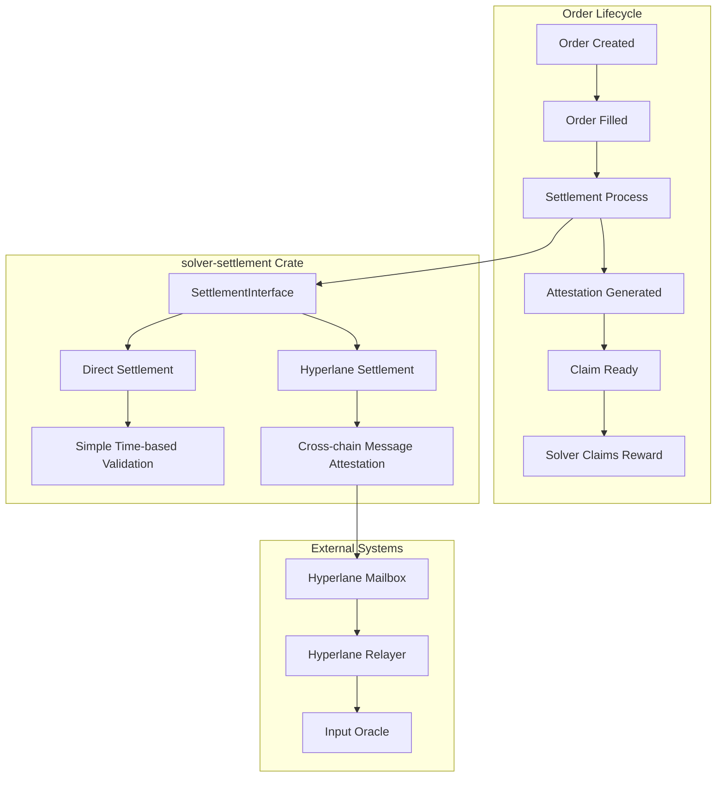
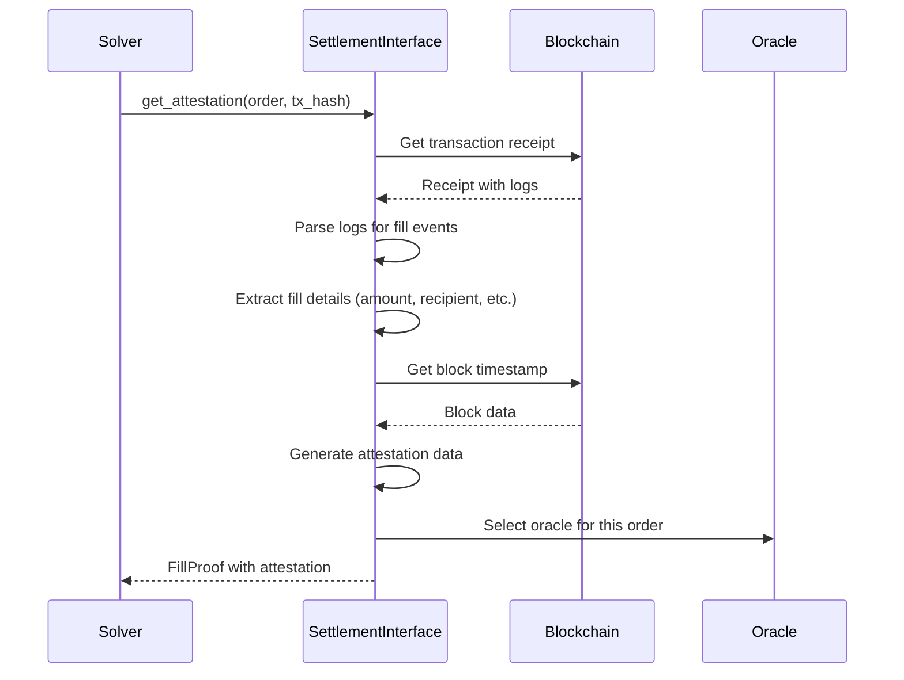
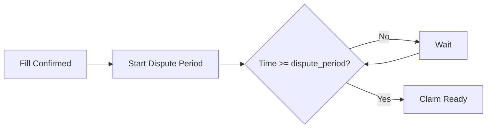
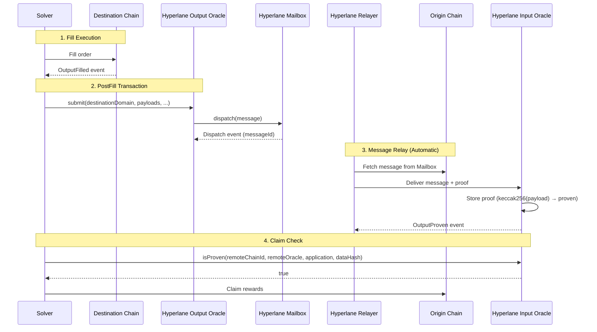
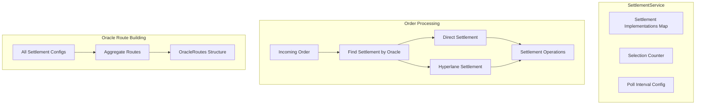
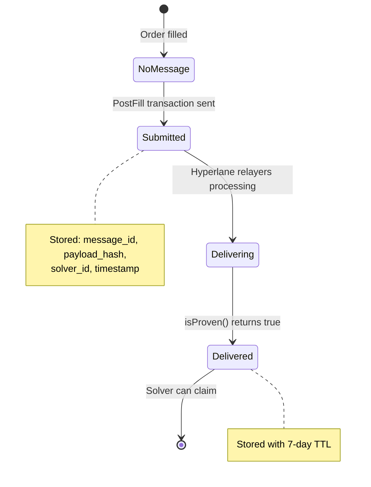
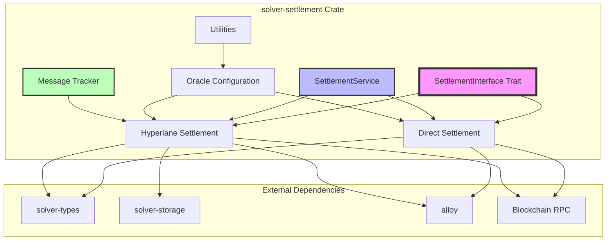

# solver-settlement

## Table of Contents

1. [Executive Summary](#executive-summary)
2. [Architectural Overview](#architectural-overview)
3. [Core Abstractions](#core-abstractions)
4. [Settlement Interface](#settlement-interface)
5. [Implementation: Direct Settlement](#implementation-direct-settlement)
6. [Implementation: Hyperlane Settlement](#implementation-hyperlane-settlement)
7. [Utilities & Configuration](#utilities--configuration)
8. [Settlement Service](#settlement-service)
9. [Oracle Configuration & Selection](#oracle-configuration--selection)
10. [Message Lifecycle & State Management](#message-lifecycle--state-management)
11. [Error Handling & Validation](#error-handling--validation)
12. [Testing Strategy](#testing-strategy)
13. [Advanced Technical Details](#advanced-technical-details)

---

## Executive Summary

**Purpose**: The `solver-settlement` crate is the **attestation and finalization layer** for cross-chain order execution in the OIF (Onchain Intent Framework) solver system. It manages the complete settlement lifecycle from fill validation to claim readiness, supporting multiple oracle/attestation mechanisms.

**Key Responsibilities**:
- ✅ Validate that orders have been correctly filled on destination chains
- 🔐 Generate cryptographic proofs of fill execution (attestations)
- 🌉 Coordinate cross-chain oracle messaging for attestations
- ⏰ Manage timing constraints (dispute periods, message delivery)
- 💰 Enable solvers to claim rewards after successful settlement

**Architecture Pattern**: Plugin-based settlement implementations with a unified interface, allowing different oracle systems (Direct, Hyperlane, Wormhole, LayerZero, etc.) to coexist.

---

## Architectural Overview

### System Context



### Design Philosophy

**1. Settlement Agnosticism**: The crate is **order-type agnostic**. It doesn't care about order semantics (ERC7683, OFA, etc.) — it only handles oracle/attestation mechanics.

**2. Pluggable Architecture**: New settlement mechanisms can be added by:
   - Implementing the `SettlementInterface` trait
   - Providing a factory function
   - Registering via `ImplementationRegistry`

**3. Extensibility Through Configuration**: Each settlement implementation defines its own config schema, validated at runtime.

---

## Core Abstractions

### Settlement vs Order

**Critical Distinction**:

```rust
// ❌ NOT the responsibility of settlement
struct Order {
    id: String,
    inputs: Vec<Input>,      // What the user provides
    outputs: Vec<Output>,    // What the user receives
    // ... order semantics
}

// ✅ Settlement's responsibility
struct FillProof {
    tx_hash: TransactionHash,      // Where was it filled?
    block_number: u64,              // When was it filled?
    attestation_data: Option<Vec<u8>>, // Proof data (optional)
    filled_timestamp: u64,          // Timestamp for timing checks
    oracle_address: String,         // Which oracle attests?
}
```

**Settlement Layer Concerns**:
- "Has the fill transaction been confirmed?"
- "Does the oracle have proof of execution?"
- "Have timing constraints been satisfied?"
- "Can the solver claim rewards now?"

**Order Layer Concerns** (handled elsewhere):
- "Does the fill satisfy the order requirements?"
- "Are amounts correct?"
- "Is the recipient correct?"

---

## Settlement Interface

### Trait Definition

```rust:1:235:crates/solver-settlement/src/lib.rs
pub trait SettlementInterface: Send + Sync {
	/// Get the oracle configuration for this settlement
	fn oracle_config(&self) -> &OracleConfig;

	/// Check if a specific route is supported
	fn is_route_supported(&self, input_chain: u64, output_chain: u64) -> bool;

	/// Check if a specific input oracle is supported on a chain
	fn is_input_oracle_supported(&self, chain_id: u64, oracle: &Address) -> bool;

	/// Check if a specific output oracle is supported on a chain
	fn is_output_oracle_supported(&self, chain_id: u64, oracle: &Address) -> bool;

	/// Get all supported input oracles for a chain
	fn get_input_oracles(&self, chain_id: u64) -> Vec<Address>;

	/// Get all supported output oracles for a chain
	fn get_output_oracles(&self, chain_id: u64) -> Vec<Address>;

	/// Select an oracle from available options based on the configured strategy
	fn select_oracle(
		&self,
		oracles: &[Address],
		selection_context: Option<u64>,
	) -> Option<Address>;

	/// Returns the configuration schema for this settlement implementation
	fn config_schema(&self) -> Box<dyn ConfigSchema>;

	/// Gets attestation data for a filled order
	async fn get_attestation(
		&self,
		order: &Order,
		tx_hash: &TransactionHash,
	) -> Result<FillProof, SettlementError>;

	/// Checks if the solver can claim rewards for this fill
	async fn can_claim(&self, order: &Order, fill_proof: &FillProof) -> bool;

	/// Generates a transaction to execute after fill confirmation (optional)
	async fn generate_post_fill_transaction(
		&self,
		_order: &Order,
		_fill_receipt: &TransactionReceipt,
	) -> Result<Option<Transaction>, SettlementError>;

	/// Generates a transaction to execute before claiming (optional)
	async fn generate_pre_claim_transaction(
		&self,
		_order: &Order,
		_fill_proof: &FillProof,
	) -> Result<Option<Transaction>, SettlementError>;

	/// Called after certain transaction types are confirmed on-chain
	async fn handle_transaction_confirmed(
		&self,
		_order: &Order,
		_tx_type: TransactionType,
		_receipt: &TransactionReceipt,
	) -> Result<(), SettlementError>;
}
```

### Key Methods Deep Dive

#### 1. `get_attestation`

**Purpose**: Extract proof data from a fill transaction.

**Flow**:


**Implementation Differences**:
- **Direct**: Simple receipt validation, stores order ID as attestation data
- **Hyperlane**: Tracks cross-chain message IDs for attestation validation

#### 2. `can_claim`

**Purpose**: Determine if all settlement requirements are met.

**Timing Logic**:

```rust
// Direct Settlement: Time-based dispute period
async fn can_claim(&self, order: &Order, fill_proof: &FillProof) -> bool {
    let current_timestamp = get_current_block_timestamp().await;
    let dispute_end = fill_proof.filled_timestamp + self.dispute_period_seconds;
    
    current_timestamp >= dispute_end
}

// Hyperlane Settlement: Message delivery confirmation
async fn can_claim(&self, order: &Order, fill_proof: &FillProof) -> bool {
    let message_id = extract_message_id_from_attestation(fill_proof)?;
    self.check_message_delivered(message_id).await
}
```

#### 3. `generate_post_fill_transaction` & `generate_pre_claim_transaction`

**Purpose**: Create optional transactions for oracle interactions.

**Transaction Types**:

| Type | Timing | Purpose | Example Use Case |
|------|--------|---------|------------------|
| **PostFill** | After fill confirmation | Submit attestation to oracle | Hyperlane: Submit cross-chain message |
| **PreClaim** | Before claiming rewards | Finalize oracle state | Wormhole: Relay VAA to input oracle |

**Hyperlane PostFill Example**:

```rust:1108:1220:crates/solver-settlement/src/implementations/hyperlane.rs
async fn generate_post_fill_transaction(
    &self,
    order: &Order,
    fill_receipt: &TransactionReceipt,
) -> Result<Option<Transaction>, SettlementError> {
    // Get chains
    let dest_chain = order.output_chains.first().map(|c| c.chain_id)?;
    let origin_chain = order.input_chains.first().map(|c| c.chain_id)?;

    // Extract fill details from OutputFilled event
    let (solver_bytes, fill_timestamp) =
        extract_fill_details_from_logs(&fill_receipt.logs, &order_id_bytes)?;

    // Create FillDescription payload
    let fill_description = encode_fill_description(
        solver_identifier,
        order_id_bytes,
        fill_timestamp,
        output.token,
        output.amount,
        output.recipient,
        output.call,
        output.context,
    )?;

    // Build Hyperlane submit call
    let call_data = IHyperlaneOracle::submit_0Call {
        destinationDomain: origin_chain as u32,
        recipientOracle: input_oracle_address,
        gasLimit: gas_limit,
        customMetadata: vec![].into(),
        source: output_settler.settler_address.clone(),
        payloads: vec![fill_description].into(),
    };

    Ok(Some(Transaction {
        to: Some(oracle_address),
        data: call_data.abi_encode(),
        value: gas_payment,  // For cross-chain gas payment
        chain_id: dest_chain,
        // ... other fields
    }))
}
```

**What's Happening**:
1. Extract fill details (solver, timestamp, outputs) from OutputFilled event logs
2. Encode a `FillDescription` payload (custom format for Hyperlane)
3. Estimate cross-chain gas payment
4. Generate a transaction calling the Hyperlane oracle's `submit` function
5. This sends a cross-chain message from destination → origin chain

---

## Implementation: Direct Settlement

### Overview

**Philosophy**: Minimalist settlement for **same-chain** or **optimistic bridge** scenarios where explicit cross-chain messaging isn't required.

**Mechanism**: Time-based dispute period before allowing claims.

### Architecture



### Key Components

#### Configuration Schema

```rust:72:113:crates/solver-settlement/src/implementations/direct.rs
pub struct DirectSettlementSchema;

impl ConfigSchema for DirectSettlementSchema {
	fn validate(&self, config: &toml::Value) -> Result<(), solver_types::ValidationError> {
		let schema = Schema::new(
			// Required fields
			vec![
				Field::new(
					"dispute_period_seconds",
					FieldType::Integer {
						min: Some(0),
						max: Some(86400),  // Max 24 hours
					},
				),
				Field::new(
					"oracles",
					FieldType::Table(Schema::new(
						vec![
							Field::new("input", FieldType::Table(Schema::new(vec![], vec![]))),
							Field::new("output", FieldType::Table(Schema::new(vec![], vec![]))),
						],
						vec![],
					)),
				),
				Field::new("routes", FieldType::Table(Schema::new(vec![], vec![]))),
			],
			// Optional fields
			vec![Field::new("oracle_selection_strategy", FieldType::String)],
		);

		schema.validate(config)
	}
}
```

**Config Example**:

```toml
[settlements.direct]
dispute_period_seconds = 300  # 5 minutes

[settlements.direct.oracles]
input = { 31337 = ["0x1111111111111111111111111111111111111111"] }
output = { 31338 = ["0x2222222222222222222222222222222222222222"] }

[settlements.direct.routes]
31337 = [31338]
31338 = [31337]

oracle_selection_strategy = "RoundRobin"
```

#### Attestation Generation

```rust:125:229:crates/solver-settlement/src/implementations/direct.rs
async fn get_attestation(
    &self,
    order: &Order,
    tx_hash: &TransactionHash,
) -> Result<FillProof, SettlementError> {
    // 1. Get chains from order
    let origin_chain_id = order.input_chains.first().map(|c| c.chain_id)?;
    let destination_chain_id = order.output_chains.first().map(|c| c.chain_id)?;

    // 2. Get provider for destination chain (where fill happened)
    let provider = self.providers.get(&destination_chain_id)?;

    // 3. Select oracle deterministically using order ID hash
    let oracle_addresses = self.get_input_oracles(origin_chain_id);
    let order_id_bytes = order.id.as_bytes();
    let mut hasher = std::collections::hash_map::DefaultHasher::new();
    std::hash::Hasher::write(&mut hasher, order_id_bytes);
    let selection_context = std::hash::Hasher::finish(&hasher);
    let oracle_address = self.select_oracle(&oracle_addresses, Some(selection_context))?;

    // 4. Get transaction receipt
    let hash = FixedBytes::<32>::from_slice(&tx_hash.0);
    let receipt = provider.get_transaction_receipt(hash).await?;

    // 5. Verify transaction succeeded
    if !receipt.status() {
        return Err(SettlementError::ValidationFailed("Transaction failed".to_string()));
    }

    // 6. Get block timestamp
    let block = provider.get_block_by_number(receipt.block_number).await?;
    let block_timestamp = block.header.timestamp;

    // 7. Build FillProof
    Ok(FillProof {
        tx_hash: tx_hash.clone(),
        block_number: receipt.block_number,
        oracle_address: with_0x_prefix(&hex::encode(&oracle_address.0)),
        attestation_data: Some(order.id.as_bytes().to_vec()),  // Simple: just order ID
        filled_timestamp: block_timestamp,
    })
}
```

**Key Design Decisions**:

1. **Deterministic Oracle Selection**: Uses order ID hash as selection context, ensuring same oracle is consistently chosen for a given order
2. **Minimal Attestation Data**: Just stores the order ID bytes — no complex cryptographic proofs
3. **Block Timestamp Usage**: Relies on block timestamps (not block numbers) for timing, which is more accurate for cross-chain scenarios

#### Claim Readiness Check

```rust:231:267:crates/solver-settlement/src/implementations/direct.rs
async fn can_claim(&self, order: &Order, fill_proof: &FillProof) -> bool {
    // Get the destination chain ID from the order
    let destination_chain_id = match order.output_chains.first() {
        Some(chain) => chain.chain_id,
        None => return false,
    };

    // Get the appropriate provider for this chain
    let provider = match self.providers.get(&destination_chain_id) {
        Some(p) => p,
        None => return false,
    };

    // Get current block to check timestamp
    let current_block = match provider.get_block_number().await {
        Ok(block_num) => match provider.get_block_by_number(block_num.into()).await {
            Ok(Some(block)) => block,
            Ok(None) => return false,
            Err(_) => return false,
        },
        Err(_) => return false,
    };

    // Check if dispute period has passed using timestamps
    let current_timestamp = current_block.header.timestamp;
    let dispute_end_timestamp = fill_proof.filled_timestamp + self.dispute_period_seconds;

    if current_timestamp < dispute_end_timestamp {
        return false; // Still in dispute period
    }

    true
}
```

**Robustness**: All RPC failures return `false` (safe default — don't claim if unsure).

#### PostFill & PreClaim Transactions

```rust:269:347:crates/solver-settlement/src/implementations/direct.rs
async fn generate_post_fill_transaction(
    &self,
    order: &Order,
    _fill_receipt: &TransactionReceipt,
) -> Result<Option<Transaction>, SettlementError> {
    let dest_chain = order.output_chains.first().map(|c| c.chain_id)?;
    let oracle_addresses = self.get_output_oracles(dest_chain);
    
    if oracle_addresses.is_empty() {
        return Ok(None);  // No oracle configured, no PostFill needed
    }

    // For testing: send to solver's own address
    // Realistically, this would call a real oracle method
    let data = Vec::new(); // Empty calldata for simple ETH transfer

    Ok(Some(Transaction {
        to: Some(order.solver_address.clone()),
        data,
        value: U256::ZERO,
        chain_id: dest_chain,
        nonce: None,
        gas_limit: Some(21000),
        gas_price: None,
        max_fee_per_gas: None,
        max_priority_fee_per_gas: None,
    }))
}
```

**Note**: The current implementation returns a **stub transaction** (ETH transfer to self) for testing. In production, this would call an oracle method like `attestFill()`.

---

## Implementation: Hyperlane Settlement

### Overview

**Philosophy**: Full cross-chain attestation using Hyperlane's message passing protocol.

**Mechanism**: 
1. After fill on destination chain, submit cross-chain message to Hyperlane oracle
2. Hyperlane relayers deliver message to origin chain
3. Input oracle on origin chain receives and stores proof
4. Solver can claim once `isProven()` returns true

### Architecture



### Key Components

#### Message Tracker

**Problem**: Hyperlane messages are asynchronous. The solver needs to:
1. Track which messages have been submitted
2. Know when messages have been delivered
3. Persist this state across restarts

**Solution**: `MessageTracker` with persistent storage.

```rust:322:530:crates/solver-settlement/src/implementations/hyperlane.rs
#[derive(Debug, Clone, Serialize, Deserialize)]
struct HyperlaneMessageState {
	submitted: Option<SubmittedMessage>,
	delivered: Option<DeliveredMessage>,
}

#[derive(Clone)]
pub struct MessageTracker {
	storage: Arc<StorageService>,
	/// Cache of recently accessed messages (order_id -> state)
	cache: Arc<RwLock<HashMap<String, HyperlaneMessageState>>>,
}

impl MessageTracker {
	/// Load message state for a specific order
	async fn load_message(&self, order_id: &str) -> Option<HyperlaneMessageState> {
		// Check cache first
		{
			let cache = self.cache.read().await;
			if let Some(state) = cache.get(order_id) {
				return Some(state.clone());
			}
		}

		// Try to load from storage
		let key = Self::storage_key(order_id);
		match self.storage.retrieve::<HyperlaneMessageState>(
			StorageKey::SettlementMessages.as_str(), 
			&key
		).await {
			Ok(state) => {
				// Update cache
				let mut cache = self.cache.write().await;
				cache.insert(order_id.to_string(), state.clone());
				Some(state)
			},
			Err(_) => None,
		}
	}

	/// Save message state for a specific order
	async fn save_message(
		&self,
		order_id: &str,
		state: &HyperlaneMessageState,
	) -> Result<(), SettlementError> {
		let key = Self::storage_key(order_id);

		// Save to storage with TTL (7 days after message is delivered)
		let ttl = if state.delivered.is_some() {
			Some(std::time::Duration::from_secs(7 * 24 * 60 * 60))
		} else {
			None // No TTL for pending messages
		};

		self.storage.store_with_ttl(
			StorageKey::SettlementMessages.as_str(),
			&key,
			state,
			None, // No indexes needed
			ttl,
		).await?;

		// Update cache
		let mut cache = self.cache.write().await;
		cache.insert(order_id.to_string(), state.clone());

		Ok(())
	}
}
```

**Storage Strategy**:
- **Pending messages**: No TTL (stored indefinitely until delivered)
- **Delivered messages**: 7-day TTL (auto-cleanup after claim window)
- **Cache layer**: In-memory cache for hot messages

#### FillDescription Encoding

**Problem**: Hyperlane oracles need a deterministic payload format to hash and verify.

**Format**: Custom binary encoding matching Solidity's `MandateOutputEncodingLib`:

```rust:178:242:crates/solver-settlement/src/implementations/hyperlane.rs
/// Encode FillDescription according to MandateOutputEncodingLib
/// Layout:
/// - solver (32 bytes)
/// - orderId (32 bytes)
/// - timestamp (4 bytes)
/// - token (32 bytes)
/// - amount (32 bytes)
/// - recipient (32 bytes)
/// - call length (2 bytes) + call data
/// - context length (2 bytes) + context data
fn encode_fill_description(
	solver_identifier: [u8; 32],
	order_id: [u8; 32],
	timestamp: u32,
	token: [u8; 32],
	amount: U256,
	recipient: [u8; 32],
	call_data: Vec<u8>,
	context: Vec<u8>,
) -> Result<Vec<u8>, SettlementError> {
	// Check length constraints
	if call_data.len() > u16::MAX as usize {
		return Err(SettlementError::ValidationFailed("Call data too large".into()));
	}
	if context.len() > u16::MAX as usize {
		return Err(SettlementError::ValidationFailed("Context data too large".into()));
	}

	let mut payload = Vec::with_capacity(
		32 + 32 + 4 + 32 + 32 + 32 + 2 + call_data.len() + 2 + context.len()
	);

	// Solver identifier (32 bytes)
	payload.extend_from_slice(&solver_identifier);
	
	// Order ID (32 bytes)
	payload.extend_from_slice(&order_id);
	
	// Timestamp (4 bytes) - uint32 big endian
	payload.extend_from_slice(&timestamp.to_be_bytes());
	
	// Token (32 bytes)
	payload.extend_from_slice(&token);
	
	// Amount (32 bytes) - big endian
	let amount_bytes = amount.to_be_bytes::<32>();
	payload.extend_from_slice(&amount_bytes);
	
	// Recipient (32 bytes)
	payload.extend_from_slice(&recipient);
	
	// Call length (2 bytes) and call data
	payload.extend_from_slice(&(call_data.len() as u16).to_be_bytes());
	payload.extend_from_slice(&call_data);
	
	// Context length (2 bytes) and context
	payload.extend_from_slice(&(context.len() as u16).to_be_bytes());
	payload.extend_from_slice(&context);

	Ok(payload)
}
```

**Critical**: This encoding **must match exactly** the Solidity implementation. Even a single byte mismatch will cause the proof verification to fail.

#### Payload Hash Computation

```rust:545:575:crates/solver-settlement/src/implementations/hyperlane.rs
fn compute_payload_hash(
    &self,
    order: &Order,
    solver_identifier: [u8; 32],
    timestamp: u32,
) -> Result<[u8; 32], SettlementError> {
    // Extract output details from order
    let output = extract_output_details(order)?;
    let order_id_bytes = order_id_to_bytes32(&order.id);

    // Encode the FillDescription payload
    let payload = encode_fill_description(
        solver_identifier,
        order_id_bytes,
        timestamp,
        output.token,
        output.amount,
        output.recipient,
        output.call,
        output.context,
    )?;

    // Hash the payload (matches oracle's storage)
    let mut hasher = Keccak256::new();
    hasher.update(&payload);
    let hash = hasher.finalize();

    let mut result = [0u8; 32];
    result.copy_from_slice(&hash);
    Ok(result)
}
```

**Why Compute This**: The input oracle stores `keccak256(payload)` as the proof. We need to compute the same hash to check `isProven()`.

#### Message Delivery Check

```rust:618:714:crates/solver-settlement/src/implementations/hyperlane.rs
async fn check_delivery(
    &self,
    order: &Order,
    message_id: [u8; 32],
) -> Result<bool, SettlementError> {
    let order_id = &order.id;

    // Load message state
    let mut state = self.message_tracker.load_message(order_id).await
        .unwrap_or(HyperlaneMessageState {
            submitted: None,
            delivered: None,
        });

    // Already delivered?
    if state.delivered.is_some() {
        return Ok(true);
    }

    // Get submission info with pre-computed payload hash
    let submission = match state.submitted.as_ref() {
        Some(s) => s,
        None => {
            return Err(SettlementError::ValidationFailed(
                "No submission info".to_string(),
            ));
        },
    };

    // Use stored chains and payload hash
    let origin_chain = submission.origin_chain;
    let dest_chain = submission.destination_chain;
    let payload_hash = submission.payload_hash;

    // Select oracles
    let input_oracle = self.select_oracle(&self.get_input_oracles(dest_chain), None)?;
    let output_oracle = self.select_oracle(&self.get_output_oracles(origin_chain), None)?;

    // Get application address (OutputSettler)
    let application = order.output_chains.first()?.settler_address.clone();

    // Convert to bytes32 format
    let mut remote_oracle_bytes = [0u8; 32];
    remote_oracle_bytes[12..].copy_from_slice(&output_oracle.0);

    let mut application_bytes = [0u8; 32];
    application_bytes[12..].copy_from_slice(&application.0);

    // Call isProven on input oracle
    let is_proven = self.is_payload_proven(
        dest_chain,          // Chain where we call isProven
        input_oracle,        // Input oracle on destination chain
        origin_chain,        // Remote chain (origin of message)
        remote_oracle_bytes, // Output oracle on origin chain
        application_bytes,
        payload_hash,
    ).await?;

    if is_proven {
        let now = SystemTime::now().duration_since(UNIX_EPOCH)?.as_secs();

        state.delivered = Some(DeliveredMessage {
            message_id,
            delivery_timestamp: now,
            payload_hash,
        });

        self.message_tracker.save_message(order_id, &state).await?;
    }

    Ok(is_proven)
}
```

**Flow**:
1. Check if message already marked as delivered in tracker
2. If not, query the input oracle's `isProven()` function
3. If proven, update tracker state and persist to storage
4. Return delivery status

#### PostFill Transaction Generation

```rust:1108:1220:crates/solver-settlement/src/implementations/hyperlane.rs
async fn generate_post_fill_transaction(
    &self,
    order: &Order,
    fill_receipt: &TransactionReceipt,
) -> Result<Option<Transaction>, SettlementError> {
    // Extract fill details from OutputFilled event
    let order_id_bytes = order_id_to_bytes32(&order.id);
    let (solver_bytes, fill_timestamp) = 
        extract_fill_details_from_logs(&fill_receipt.logs, &order_id_bytes)?;

    let mut solver_identifier = [0u8; 32];
    solver_identifier.copy_from_slice(&solver_bytes);

    // Create FillDescription payload
    let output = extract_output_details(order)?;
    let fill_description = encode_fill_description(
        solver_identifier,
        order_id_bytes,
        fill_timestamp,
        output.token,
        output.amount,
        output.recipient,
        output.call,
        output.context,
    )?;

    // Create payloads array
    let payloads = vec![fill_description];

    // Calculate gas limit based on payload size
    let total_payload_size: usize = payloads.iter().map(|p| p.len()).sum();
    let gas_limit = self.calculate_message_gas_limit(total_payload_size);

    // Estimate gas payment
    let gas_payment = self.estimate_gas_payment(
        dest_chain,
        origin_chain as u32,
        recipient_oracle.clone(),
        gas_limit,
        vec![],  // No custom metadata
        output_settler.settler_address.clone(),
        payloads.clone(),
    ).await?;

    // Build submit call
    let call_data = IHyperlaneOracle::submit_0Call {
        destinationDomain: origin_chain as u32,
        recipientOracle: recipient_oracle_address,
        gasLimit: gas_limit,
        customMetadata: vec![].into(),
        source: output_settler_address,
        payloads: payloads.into_iter().map(Into::into).collect(),
    };

    Ok(Some(Transaction {
        to: Some(oracle_address),
        data: call_data.abi_encode(),
        value: gas_payment,  // Important: Pays for cross-chain gas
        chain_id: dest_chain,
        nonce: None,
        gas_limit: None,
        gas_price: None,
        max_fee_per_gas: None,
        max_priority_fee_per_gas: None,
    }))
}
```

**Key Steps**:
1. **Extract Fill Details**: Parse OutputFilled event logs to get solver and timestamp
2. **Encode Payload**: Create FillDescription in exact binary format
3. **Estimate Gas**: Call `quoteGasPayment()` on oracle to get cross-chain gas cost
4. **Build Transaction**: Create transaction calling Hyperlane oracle's `submit()` function with the correct `value` for gas payment

#### Transaction Confirmation Handler

```rust:1232:1318:crates/solver-settlement/src/implementations/hyperlane.rs
async fn handle_transaction_confirmed(
    &self,
    order: &Order,
    tx_type: TransactionType,
    receipt: &TransactionReceipt,
) -> Result<(), SettlementError> {
    // Only handle PostFill transactions
    if matches!(tx_type, TransactionType::PostFill) {
        // Extract message ID from Dispatch event logs
        let message_id = self.extract_message_id_from_logs(&receipt.logs)?;

        // Get chains
        let origin_chain = order.input_chains.first().map(|c| c.chain_id)?;
        let dest_chain = order.output_chains.first().map(|c| c.chain_id)?;

        // Get fill transaction to extract solver and timestamp
        let dest_provider = self.providers.get(&dest_chain)?;
        let fill_receipt = dest_provider
            .get_transaction_receipt(order.fill_tx_hash?)
            .await?;

        // Extract solver and timestamp from fill logs
        let order_id_bytes = order_id_to_bytes32(&order.id);
        let (solver_bytes, timestamp) = extract_fill_details_from_logs(&fill_receipt.logs, &order_id_bytes)?;

        let mut solver_id = [0u8; 32];
        solver_id.copy_from_slice(&solver_bytes);

        // Compute payload hash once and store it
        let payload_hash = self.compute_payload_hash(order, solver_id, timestamp)?;

        // Store in message tracker
        self.message_tracker.track_submission(
            order.id.clone(),
            message_id,
            dest_chain,   // origin_chain in submission
            origin_chain, // destination_chain in submission
            receipt.hash.clone(),
            U256::ZERO,   // TODO: Gas payment from receipt
            payload_hash,
            solver_id,
            timestamp,
        ).await?;
    }
    Ok(())
}
```

**Purpose**: After PostFill transaction is confirmed, extract the Hyperlane message ID from the `Dispatch` event and store all necessary data for later delivery checking.

**Critical Data Stored**:
- `message_id`: For tracking
- `payload_hash`: Pre-computed for `isProven()` checks
- `solver_identifier` & `timestamp`: For regenerating payload if needed
- Chain IDs: For correct oracle selection

---

## Utilities & Configuration

### Oracle Configuration Structure

```rust:59:70:crates/solver-settlement/src/lib.rs
#[derive(Debug, Clone)]
pub struct OracleConfig {
	/// Input oracle addresses by chain ID (multiple per chain possible)
	pub input_oracles: HashMap<u64, Vec<Address>>,
	/// Output oracle addresses by chain ID (multiple per chain possible)
	pub output_oracles: HashMap<u64, Vec<Address>>,
	/// Valid routes: input_chain -> [output_chains]
	pub routes: HashMap<u64, Vec<u64>>,
	/// Strategy for selecting oracles when multiple are available
	pub selection_strategy: OracleSelectionStrategy,
}
```

**Design**: Supports **multiple oracles per chain** to enable:
- High availability (fallback oracles)
- Load balancing (round-robin strategy)
- Protocol diversity (different oracle implementations)

### Oracle Selection Strategies

```rust:42:57:crates/solver-settlement/src/lib.rs
#[derive(Debug, Clone, Copy, PartialEq, Eq)]
pub enum OracleSelectionStrategy {
	/// Always use the first available oracle
	First,
	/// Round-robin through available oracles
	RoundRobin,
	/// Random selection from available oracles
	Random,
}

impl Default for OracleSelectionStrategy {
	fn default() -> Self {
		Self::First
	}
}
```

#### Selection Implementation

```rust:127:161:crates/solver-settlement/src/lib.rs
fn select_oracle(
    &self,
    oracles: &[Address],
    selection_context: Option<u64>,
) -> Option<Address> {
    if oracles.is_empty() {
        return None;
    }

    match self.oracle_config().selection_strategy {
        OracleSelectionStrategy::First => oracles.first().cloned(),
        
        OracleSelectionStrategy::RoundRobin => {
            // Use provided context for deterministic distribution
            let context = selection_context.unwrap_or(0);
            let index = (context as usize) % oracles.len();
            oracles.get(index).cloned()
        },
        
        OracleSelectionStrategy::Random => {
            use std::collections::hash_map::RandomState;
            use std::hash::BuildHasher;

            let context = selection_context.unwrap_or_else(|| {
                std::time::SystemTime::now()
                    .duration_since(std::time::UNIX_EPOCH)
                    .map(|d| d.as_secs())
                    .unwrap_or(0)
            });

            let index = (RandomState::new().hash_one(context) as usize) % oracles.len();
            oracles.get(index).cloned()
        },
    }
}
```

**Context Parameter**: Allows deterministic selection based on order ID or other identifiers. This ensures the **same oracle is used consistently** for a given order throughout its lifecycle.

### Configuration Parsing Utilities

```rust:154:189:crates/solver-settlement/src/utils.rs
pub fn parse_oracle_config(config: &toml::Value) -> Result<OracleConfig, SettlementError> {
	// Parse oracles section
	let oracles_table = config.get("oracles")?;

	let input_oracles = parse_oracle_table(
		oracles_table.get("input")?
	)?;

	let output_oracles = parse_oracle_table(
		oracles_table.get("output")?
	)?;

	// Parse routes section
	let routes = parse_routes_table(config.get("routes")?)?;

	// Validate that routes reference valid chains
	validate_routes(&input_oracles, &output_oracles, &routes)?;

	// Parse optional selection strategy
	let selection_strategy = parse_selection_strategy(
		config.get("oracle_selection_strategy")
			.and_then(|v| v.as_str()),
	);

	Ok(OracleConfig {
		input_oracles,
		output_oracles,
		routes,
		selection_strategy,
	})
}
```

#### Validation Logic

```rust:191:218:crates/solver-settlement/src/utils.rs
fn validate_routes(
	input_oracles: &HashMap<u64, Vec<Address>>,
	output_oracles: &HashMap<u64, Vec<Address>>,
	routes: &HashMap<u64, Vec<u64>>,
) -> Result<(), SettlementError> {
	for (from_chain, to_chains) in routes {
		// Source chain must have input oracle
		if !input_oracles.contains_key(from_chain) {
			return Err(SettlementError::ValidationFailed(format!(
				"Route from chain {} has no input oracle configured",
				from_chain
			)));
		}

		// All destination chains must have output oracles
		for to_chain in to_chains {
			if !output_oracles.contains_key(to_chain) {
				return Err(SettlementError::ValidationFailed(format!(
					"Route from chain {} to chain {} has no output oracle configured",
					from_chain, to_chain
				)));
			}
		}
	}

	Ok(())
}
```

**Purpose**: Ensures configuration integrity — every route must have the necessary oracles on both ends.

---

## Settlement Service

### Architecture



### Core Service Implementation

```rust:269:562:crates/solver-settlement/src/lib.rs
pub struct SettlementService {
	/// Map of implementation names to their instances
	implementations: HashMap<String, Box<dyn SettlementInterface>>,
	/// Track order count for round-robin selection
	selection_counter: Arc<AtomicU64>,
	/// Poll interval for settlement monitoring in seconds
	poll_interval_seconds: u64,
}

impl SettlementService {
	/// Creates a new SettlementService
	pub fn new(
		implementations: HashMap<String, Box<dyn SettlementInterface>>,
		poll_interval_seconds: u64,
	) -> Self {
		Self {
			implementations,
			selection_counter: Arc::new(AtomicU64::new(0)),
			poll_interval_seconds,
		}
	}

	/// Gets a specific settlement implementation by name
	pub fn get(&self, name: &str) -> Option<&dyn SettlementInterface> {
		self.implementations.get(name).map(|b| b.as_ref())
	}

	/// Find settlement by oracle address
	pub fn get_settlement_for_oracle(
		&self,
		chain_id: u64,
		oracle_address: &Address,
		is_input: bool,
	) -> Result<&dyn SettlementInterface, SettlementError> {
		for settlement in self.implementations.values() {
			if is_input {
				if settlement.is_input_oracle_supported(chain_id, oracle_address) {
					return Ok(settlement.as_ref());
				}
			} else if settlement.is_output_oracle_supported(chain_id, oracle_address) {
				return Ok(settlement.as_ref());
			}
		}
		Err(SettlementError::ValidationFailed(format!(
			"No settlement found for {} oracle {} on chain {}",
			if is_input { "input" } else { "output" },
			oracle_address,
			chain_id
		)))
	}

	/// Find settlement for an order based on its oracles
	pub fn find_settlement_for_order(
		&self,
		order: &Order,
	) -> Result<&dyn SettlementInterface, SettlementError> {
		let order_data = order.parse_order_data()?;
		let input_oracle_str = order_data.input_oracle();
		let input_oracle = solver_types::utils::parse_address(&input_oracle_str)?;
		let origin_chain = order_data.origin_chain_id();

		// Find settlement by input oracle
		self.get_settlement_for_oracle(origin_chain, &input_oracle, true)
	}
}
```

### Oracle Route Building

**Purpose**: Aggregate all settlement configurations into a single `OracleRoutes` structure for the solver to know which oracle pairs are valid.

```rust:309:350:crates/solver-settlement/src/lib.rs
pub fn build_oracle_routes(&self) -> OracleRoutes {
    let mut supported_routes = HashMap::new();

    for settlement in self.implementations.values() {
        let config = settlement.oracle_config();

        // For each input oracle
        for (input_chain, input_oracles) in &config.input_oracles {
            for input_oracle in input_oracles {
                let input_info = OracleInfo {
                    chain_id: *input_chain,
                    oracle: input_oracle.clone(),
                };

                let mut valid_outputs = Vec::new();

                // Add all valid output destinations
                if let Some(dest_chains) = config.routes.get(input_chain) {
                    for dest_chain in dest_chains {
                        // Add all output oracles on that destination
                        if let Some(output_oracles) = config.output_oracles.get(dest_chain) {
                            for output_oracle in output_oracles {
                                valid_outputs.push(OracleInfo {
                                    chain_id: *dest_chain,
                                    oracle: output_oracle.clone(),
                                });
                            }
                        }
                    }
                }

                // Only insert if there are valid routes from this input oracle
                if !valid_outputs.is_empty() {
                    supported_routes.insert(input_info, valid_outputs);
                }
            }
        }
    }

    OracleRoutes { supported_routes }
}
```

**Output**: A map of `(input_chain, input_oracle) -> Vec<(output_chain, output_oracle)>` representing all valid cross-chain oracle routes.

### Quote Generation Helpers

```rust:457:508:crates/solver-settlement/src/lib.rs
pub fn get_any_settlement_for_chains(
    &self,
    origin_chain_id: u64,
    destination_chain_id: u64,
) -> Option<(&dyn SettlementInterface, Address, Address)> {
    // Collect all settlements that support both chains
    let mut available_settlements = Vec::new();

    for settlement in self.implementations.values() {
        let input_oracles = settlement
            .oracle_config()
            .input_oracles
            .get(&origin_chain_id);
        let output_oracles = settlement
            .oracle_config()
            .output_oracles
            .get(&destination_chain_id);

        // Need both input oracle for origin and output oracle for destination
        if input_oracles.is_some() && !input_oracles.unwrap().is_empty()
            && output_oracles.is_some() && !output_oracles.unwrap().is_empty()
        {
            available_settlements.push((
                settlement.as_ref(),
                input_oracles.cloned().unwrap(),
                output_oracles.cloned().unwrap(),
            ));
        }
    }

    if available_settlements.is_empty() {
        return None;
    }

    // Get selection context for deterministic oracle selection
    let context = self.selection_counter.fetch_add(1, Ordering::Relaxed);

    // Use first available settlement
    let (settlement, input_oracles, output_oracles) = &available_settlements[0];

    // Select input oracle for origin chain
    let input_oracle = settlement.select_oracle(input_oracles, Some(context))?;

    // Select output oracle for destination chain
    let output_oracle = settlement.select_oracle(output_oracles, Some(context + 1))?;

    Some((*settlement, input_oracle, output_oracle))
}
```

**Use Case**: When generating quotes, the solver needs to pick oracles. This method finds a settlement that supports the chain pair and returns appropriate oracle addresses.

---

## Oracle Configuration & Selection

### Multi-Oracle Design

**Why Multiple Oracles Per Chain?**

1. **Redundancy**: If one oracle is down, use another
2. **Load Balancing**: Distribute orders across oracles
3. **Protocol Diversity**: Support different oracle implementations (Hyperlane, Wormhole, etc.) on same chain
4. **Gradual Migration**: Add new oracle versions without downtime

### Configuration Example

```toml
[settlements.hyperlane]
oracle_selection_strategy = "RoundRobin"

[settlements.hyperlane.oracles]
input = {
    84532 = [
        "0x1111111111111111111111111111111111111111",  # Primary Hyperlane Input Oracle
        "0x2222222222222222222222222222222222222222"   # Backup Input Oracle
    ],
    8453 = [
        "0x3333333333333333333333333333333333333333"
    ]
}
output = {
    84532 = [
        "0x4444444444444444444444444444444444444444",
        "0x5555555555555555555555555555555555555555"
    ],
    8453 = [
        "0x6666666666666666666666666666666666666666"
    ]
}

[settlements.hyperlane.routes]
84532 = [8453]  # Base Sepolia -> Base Mainnet
8453 = [84532]  # Base Mainnet -> Base Sepolia
```

### Selection Algorithms

#### 1. First Strategy

```rust
// Always use first oracle
OracleSelectionStrategy::First => oracles.first().cloned()
```

**Use Case**: When you have a primary oracle and backups, but always prefer the primary.

#### 2. Round-Robin Strategy

```rust
OracleSelectionStrategy::RoundRobin => {
    let context = selection_context.unwrap_or(0);
    let index = (context as usize) % oracles.len();
    oracles.get(index).cloned()
}
```

**Use Case**: Distribute load evenly across oracles. The `context` parameter (typically order nonce or ID hash) ensures deterministic selection.

**Example**:
- Oracle 1, Oracle 2, Oracle 3
- Order 1 (context=0): Oracle 1
- Order 2 (context=1): Oracle 2
- Order 3 (context=2): Oracle 3
- Order 4 (context=3): Oracle 1 (wraps around)

#### 3. Random Strategy

```rust
OracleSelectionStrategy::Random => {
    let context = selection_context.unwrap_or_else(|| {
        std::time::SystemTime::now()
            .duration_since(std::time::UNIX_EPOCH)
            .map(|d| d.as_secs())
            .unwrap_or(0)
    });

    let index = (RandomState::new().hash_one(context) as usize) % oracles.len();
    oracles.get(index).cloned()
}
```

**Use Case**: When you want unpredictable distribution (e.g., to avoid attackers targeting specific oracles).

### Route Validation

**Invariant**: For every route `A -> B`, there must be:
- An input oracle on chain A
- An output oracle on chain B

```rust:191:218:crates/solver-settlement/src/utils.rs
fn validate_routes(
	input_oracles: &HashMap<u64, Vec<Address>>,
	output_oracles: &HashMap<u64, Vec<Address>>,
	routes: &HashMap<u64, Vec<u64>>,
) -> Result<(), SettlementError> {
	for (from_chain, to_chains) in routes {
		// Source chain must have input oracle
		if !input_oracles.contains_key(from_chain) {
			return Err(SettlementError::ValidationFailed(format!(
				"Route from chain {} has no input oracle configured",
				from_chain
			)));
		}

		// All destination chains must have output oracles
		for to_chain in to_chains {
			if !output_oracles.contains_key(to_chain) {
				return Err(SettlementError::ValidationFailed(format!(
					"Route from chain {} to chain {} has no output oracle configured",
					from_chain, to_chain
				)));
			}
		}
	}

	Ok(())
}
```

**Rationale**: Prevents misconfiguration that would lead to orders failing at settlement.

---

## Message Lifecycle & State Management

### Hyperlane Message States



### Storage Schema

```rust:322:366:crates/solver-settlement/src/implementations/hyperlane.rs
#[derive(Debug, Clone, Serialize, Deserialize)]
struct HyperlaneMessageState {
	submitted: Option<SubmittedMessage>,
	delivered: Option<DeliveredMessage>,
}

#[derive(Debug, Clone, Serialize, Deserialize)]
struct SubmittedMessage {
	#[serde(with = "hex::serde")]
	message_id: [u8; 32],
	origin_chain: u64,
	destination_chain: u64,
	submission_tx_hash: TransactionHash,
	submission_timestamp: u64,
	#[serde(with = "u256_serde")]
	gas_payment: U256,
	// Store computed payload hash to avoid recomputing
	#[serde(with = "hex::serde")]
	payload_hash: [u8; 32],
	// Store fill details for later use
	#[serde(with = "hex::serde")]
	solver_identifier: [u8; 32],
	fill_timestamp: u32,
}

#[derive(Debug, Clone, Serialize, Deserialize)]
struct DeliveredMessage {
	#[serde(with = "hex::serde")]
	message_id: [u8; 32],
	delivery_timestamp: u64,
	#[serde(with = "hex::serde")]
	payload_hash: [u8; 32],
}
```

### Storage Key Strategy

```rust:376:379:crates/solver-settlement/src/implementations/hyperlane.rs
fn storage_key(order_id: &str) -> String {
    format!("hyperlane:{}", order_id)
}
```

**Namespace**: `SettlementMessages:hyperlane:{order_id}`

### TTL Management

```rust:408:441:crates/solver-settlement/src/implementations/hyperlane.rs
async fn save_message(
    &self,
    order_id: &str,
    state: &HyperlaneMessageState,
) -> Result<(), SettlementError> {
    let key = Self::storage_key(order_id);

    // Save to storage with TTL (7 days after message is delivered)
    let ttl = if state.delivered.is_some() {
        Some(std::time::Duration::from_secs(7 * 24 * 60 * 60))
    } else {
        None // No TTL for pending messages
    };

    self.storage.store_with_ttl(
        StorageKey::SettlementMessages.as_str(),
        &key,
        state,
        None, // No indexes needed
        ttl,
    ).await?;

    // Update cache
    let mut cache = self.cache.write().await;
    cache.insert(order_id.to_string(), state.clone());

    Ok(())
}
```

**Rationale**:
- **Pending messages**: No TTL — must track indefinitely until delivered
- **Delivered messages**: 7-day TTL — gives solver plenty of time to claim, then auto-cleanup

### Cache Layer

```rust:329:335:crates/solver-settlement/src/implementations/hyperlane.rs
pub struct MessageTracker {
	storage: Arc<StorageService>,
	/// Cache of recently accessed messages (order_id -> state)
	cache: Arc<RwLock<HashMap<String, HyperlaneMessageState>>>,
}
```

**Purpose**: Reduce storage I/O for frequently checked orders.

**Read Flow**:
1. Check in-memory cache
2. If miss, load from persistent storage
3. Update cache with loaded value
4. Return value

**Write Flow**:
1. Write to persistent storage
2. Update cache
3. Return success

---

## Error Handling & Validation

### Error Types

```rust:28:40:crates/solver-settlement/src/lib.rs
#[derive(Debug, Error)]
pub enum SettlementError {
	/// Error that occurs when settlement validation fails
	#[error("Validation failed: {0}")]
	ValidationFailed(String),
	/// Error that occurs when a fill proof is invalid
	#[error("Invalid proof")]
	InvalidProof,
	/// Error that occurs when a fill doesn't match order requirements
	#[error("Fill does not match order requirements")]
	FillMismatch,
}
```

**Design**: Simple, high-level errors. Detailed context in error messages.

### Validation Layers

#### 1. Configuration Validation (At Startup)

```rust:84:112:crates/solver-settlement/src/implementations/direct.rs
impl ConfigSchema for DirectSettlementSchema {
	fn validate(&self, config: &toml::Value) -> Result<(), solver_types::ValidationError> {
		let schema = Schema::new(
			// Required fields
			vec![
				Field::new(
					"dispute_period_seconds",
					FieldType::Integer {
						min: Some(0),
						max: Some(86400),
					},
				),
				Field::new(
					"oracles",
					FieldType::Table(Schema::new(
						vec![
							Field::new("input", FieldType::Table(Schema::new(vec![], vec![]))),
							Field::new("output", FieldType::Table(Schema::new(vec![], vec![]))),
						],
						vec![],
					)),
				),
				Field::new("routes", FieldType::Table(Schema::new(vec![], vec![]))),
			],
			// Optional fields
			vec![Field::new("oracle_selection_strategy", FieldType::String)],
		);

		schema.validate(config)
	}
}
```

**Purpose**: Fail fast at startup if configuration is invalid.

#### 2. Route Validation

```rust:191:218:crates/solver-settlement/src/utils.rs
fn validate_routes(
	input_oracles: &HashMap<u64, Vec<Address>>,
	output_oracles: &HashMap<u64, Vec<Address>>,
	routes: &HashMap<u64, Vec<u64>>,
) -> Result<(), SettlementError> {
	for (from_chain, to_chains) in routes {
		// Source chain must have input oracle
		if !input_oracles.contains_key(from_chain) {
			return Err(SettlementError::ValidationFailed(format!(
				"Route from chain {} has no input oracle configured",
				from_chain
			)));
		}

		// All destination chains must have output oracles
		for to_chain in to_chains {
			if !output_oracles.contains_key(to_chain) {
				return Err(SettlementError::ValidationFailed(format!(
					"Route from chain {} to chain {} has no output oracle configured",
					from_chain, to_chain
				)));
			}
		}
	}

	Ok(())
}
```

**Purpose**: Ensure oracle topology is complete.

#### 3. Runtime Validation (During Operations)

```rust:190:205:crates/solver-settlement/src/implementations/direct.rs
// Get transaction receipt
let receipt = provider
    .get_transaction_receipt(hash)
    .await
    .map_err(|e| {
        SettlementError::ValidationFailed(format!("Failed to get receipt: {}", e))
    })?
    .ok_or_else(|| {
        SettlementError::ValidationFailed("Transaction not found".to_string())
    })?;

// Check if transaction was successful
if !receipt.status() {
    return Err(SettlementError::ValidationFailed(
        "Transaction failed".to_string(),
    ));
}
```

**Purpose**: Validate on-chain state at critical points.

### Safe Defaults

```rust:231:267:crates/solver-settlement/src/implementations/direct.rs
async fn can_claim(&self, order: &Order, fill_proof: &FillProof) -> bool {
    let destination_chain_id = match order.output_chains.first() {
        Some(chain) => chain.chain_id,
        None => return false,  // Safe default: don't claim if uncertain
    };

    let provider = match self.providers.get(&destination_chain_id) {
        Some(p) => p,
        None => return false,  // Safe default
    };

    let current_block = match provider.get_block_number().await {
        Ok(block_num) => match provider.get_block_by_number(block_num.into()).await {
            Ok(Some(block)) => block,
            Ok(None) => return false,  // Safe default
            Err(_) => return false,     // Safe default
        },
        Err(_) => return false,         // Safe default
    };

    // ... rest of logic
}
```

**Philosophy**: When in doubt, return `false` for `can_claim()`. Better to delay a claim than to claim incorrectly.

---

## Testing Strategy

### Test Coverage

#### Unit Tests (Direct Settlement)

```rust:400:883:crates/solver-settlement/src/implementations/direct.rs
#[cfg(test)]
mod tests {
	use super::*;

	#[tokio::test(flavor = "multi_thread")]
	async fn test_direct_settlement_new_success() {
		let networks = create_test_networks();
		let oracle_config = create_test_oracle_config();

		let result = DirectSettlement::new(&networks, oracle_config, 300).await;
		assert!(result.is_ok());

		let settlement = result.unwrap();
		assert_eq!(settlement.dispute_period_seconds, 300);
		assert!(settlement.providers.contains_key(&1));
		assert!(settlement.providers.contains_key(&2));
	}

	#[test]
	fn test_config_schema_validation_valid() {
		let schema = DirectSettlementSchema;
		let config = /* valid TOML */;
		let result = schema.validate(&config);
		assert!(result.is_ok());
	}

	#[test]
	fn test_config_schema_validation_invalid_dispute_period() {
		let schema = DirectSettlementSchema;
		let config = /* invalid dispute period */;
		let result = schema.validate(&config);
		assert!(result.is_err());
	}
}
```

**Coverage**:
- ✅ Initialization with valid/invalid configs
- ✅ Schema validation edge cases
- ✅ Oracle selection logic
- ✅ Provider creation failures

#### Utility Tests

```rust:220:755:crates/solver-settlement/src/utils.rs
#[cfg(test)]
mod tests {
	use super::*;

	#[test]
	fn test_parse_selection_strategy() {
		assert_eq!(
			parse_selection_strategy(Some("First")),
			OracleSelectionStrategy::First
		);
		assert_eq!(
			parse_selection_strategy(Some("RoundRobin")),
			OracleSelectionStrategy::RoundRobin
		);
	}

	#[test]
	fn test_parse_oracle_table_success() {
		// Valid oracle table parsing
	}

	#[test]
	fn test_parse_oracle_table_invalid_chain_id() {
		// Error handling for invalid chain IDs
	}

	#[test]
	fn test_validate_routes_missing_input_oracle() {
		// Route validation failures
	}
}
```

**Coverage**:
- ✅ TOML parsing for oracle tables
- ✅ Route validation logic
- ✅ Selection strategy parsing
- ✅ Address validation

### Mock Strategy

```rust:15:15:crates/solver-settlement/Cargo.toml
mockall = { version = "0.13", optional = true }
```

```rust:77:78:crates/solver-settlement/src/lib.rs
#[cfg_attr(feature = "testing", mockall::automock)]
#[async_trait]
pub trait SettlementInterface: Send + Sync {
    // ...
}
```

**Purpose**: Enable mocking of `SettlementInterface` for testing higher-level components (e.g., solver core) without needing real blockchain connections.

---

## Advanced Technical Details

### Payload Hash Computation (Hyperlane)

**Critical Invariant**: The payload hash computed in Rust **must match exactly** the hash computed in Solidity.

#### Solidity Side (MandateOutputEncodingLib)

```solidity
function encodeFillDescription(
    FillDescription memory fill
) internal pure returns (bytes memory) {
    return abi.encodePacked(
        fill.solver,          // bytes32
        fill.orderId,         // bytes32
        fill.timestamp,       // uint32
        fill.token,           // bytes32
        fill.amount,          // uint256
        fill.recipient,       // bytes32
        uint16(fill.call.length),
        fill.call,
        uint16(fill.context.length),
        fill.context
    );
}

function hashFillDescription(
    FillDescription memory fill
) internal pure returns (bytes32) {
    return keccak256(encodeFillDescription(fill));
}
```

#### Rust Side

```rust:188:242:crates/solver-settlement/src/implementations/hyperlane.rs
fn encode_fill_description(
	solver_identifier: [u8; 32],
	order_id: [u8; 32],
	timestamp: u32,
	token: [u8; 32],
	amount: U256,
	recipient: [u8; 32],
	call_data: Vec<u8>,
	context: Vec<u8>,
) -> Result<Vec<u8>, SettlementError> {
	let mut payload = Vec::with_capacity(
		32 + 32 + 4 + 32 + 32 + 32 + 2 + call_data.len() + 2 + context.len()
	);

	// Solver identifier (32 bytes)
	payload.extend_from_slice(&solver_identifier);
	
	// Order ID (32 bytes)
	payload.extend_from_slice(&order_id);
	
	// Timestamp (4 bytes) - uint32 big endian
	payload.extend_from_slice(&timestamp.to_be_bytes());
	
	// Token (32 bytes)
	payload.extend_from_slice(&token);
	
	// Amount (32 bytes) - big endian
	let amount_bytes = amount.to_be_bytes::<32>();
	payload.extend_from_slice(&amount_bytes);
	
	// Recipient (32 bytes)
	payload.extend_from_slice(&recipient);
	
	// Call length (2 bytes) and call data
	payload.extend_from_slice(&(call_data.len() as u16).to_be_bytes());
	payload.extend_from_slice(&call_data);
	
	// Context length (2 bytes) and context
	payload.extend_from_slice(&(context.len() as u16).to_be_bytes());
	payload.extend_from_slice(&context);

	Ok(payload)
}
```

**Verification Steps**:
1. Encode fill description using identical layout
2. Hash with Keccak256
3. Compare against on-chain `isProven(payloadHash)` call

**Testing Approach**: Integration tests with real contracts to verify hash matching.

### Gas Estimation for Cross-Chain Messages

```rust:825:885:crates/solver-settlement/src/implementations/hyperlane.rs
async fn estimate_gas_payment(
    &self,
    oracle_chain: u64,
    destination_chain: u32,
    recipient_oracle: solver_types::Address,
    gas_limit: U256,
    custom_metadata: Vec<u8>,
    source: solver_types::Address,
    payloads: Vec<Vec<u8>>,
) -> Result<U256, SettlementError> {
    // Get output oracle address
    let oracle_address = self.select_oracle(&self.get_output_oracles(oracle_chain), None)?;

    // Get provider
    let provider = self.providers.get(&oracle_chain)?;

    // Build the quoteGasPayment call
    let call_data = IHyperlaneOracle::quoteGasPayment_0Call {
        destinationDomain: destination_chain,
        recipientOracle: recipient_oracle_address,
        gasLimit: gas_limit,
        customMetadata: custom_metadata.into(),
        source: source_address,
        payloads: payloads.into_iter().map(Into::into).collect(),
    };

    // Create call request
    let call_request = alloy_rpc_types::eth::transaction::TransactionRequest {
        to: Some(oracle_address_as_txkind),
        input: call_data.abi_encode().into(),
        ..Default::default()
    };

    // Make eth_call to get the quote
    let result = provider.call(call_request).await?;

    // Decode the result
    let quote = U256::from_be_slice(&result);

    Ok(quote)
}
```

**Purpose**: Get accurate gas payment from Hyperlane IGP (Interchain Gas Paymaster) before sending transaction.

**Why Important**: Underpaying = message not relayed. Overpaying = wasted funds.

### Address Conversion for Hyperlane

**Challenge**: Hyperlane uses `bytes32` for addresses (to support non-EVM chains), but Ethereum uses 20-byte addresses.

```rust:82:100:crates/solver-settlement/src/implementations/hyperlane.rs
fn interop_address_to_bytes32(addr: &InteropAddress) -> [u8; 32] {
	let mut bytes32 = [0u8; 32];

	// Get the raw bytes from the InteropAddress
	let raw_bytes = addr.to_bytes();

	// For Ethereum addresses (20 bytes), right-align in 32 bytes
	if let Ok(eth_addr) = addr.ethereum_address() {
		// Put the 20-byte Ethereum address in the last 20 bytes of the 32-byte array
		bytes32[12..].copy_from_slice(eth_addr.as_slice());
	} else {
		// For other address formats, use the raw bytes right-aligned
		let len = raw_bytes.len().min(32);
		bytes32[32 - len..].copy_from_slice(&raw_bytes[..len]);
	}

	bytes32
}
```

**Conversion Rule**: 
- Ethereum address `0x1234...ABCD` (20 bytes)
- Becomes `0x0000000000000000000000001234...ABCD` (32 bytes, left-padded with zeros)

**Why**: Matches Solidity's `abi.encodePacked(address)` behavior when cast to bytes32.

### Log Parsing for Fill Events

```rust:140:176:crates/solver-settlement/src/implementations/hyperlane.rs
fn extract_fill_details_from_logs(
	logs: &[solver_types::Log],
	order_id: &[u8; 32],
) -> Result<(Vec<u8>, u32), SettlementError> {
	// OutputFilled event signature
	let output_filled_signature = keccak256("OutputFilled(bytes32,bytes32,uint32,(bytes32,bytes32,uint256,bytes32,uint256,bytes32,bytes,bytes),uint256)");

	for log in logs {
		// Check if this is an OutputFilled event
		if log.topics.len() >= 2 && log.topics[0].0 == output_filled_signature.0 {
			// Topic[1] is indexed orderId
			if log.topics[1].0 == *order_id {
				// The data contains: solver (bytes32), timestamp (uint32), MandateOutput, finalAmount
				if log.data.len() >= 64 {
					let solver = log.data[0..32].to_vec();
					let timestamp_bytes = &log.data[32..64];
					// Timestamp is uint32, stored in the last 4 bytes of the 32-byte slot
					let timestamp = u32::from_be_bytes([
						timestamp_bytes[28],
						timestamp_bytes[29],
						timestamp_bytes[30],
						timestamp_bytes[31],
					]);

					return Ok((solver, timestamp));
				}
			}
		}
	}

	Err(SettlementError::ValidationFailed(
		"OutputFilled event not found in logs".into(),
	))
}
```

**Solidity Event**:
```solidity
event OutputFilled(
    bytes32 indexed orderId,
    bytes32 indexed solver,
    uint32 timestamp,
    MandateOutput output,
    uint256 finalAmount
);
```

**Parsing Logic**:
1. Find event by signature hash
2. Match `orderId` in `topics[1]`
3. Extract `solver` from first 32 bytes of data
4. Extract `timestamp` from next 32 bytes (uint32 in last 4 bytes)

### Message ID Extraction

```rust:716:754:crates/solver-settlement/src/implementations/hyperlane.rs
fn extract_message_id_from_logs(
    &self,
    logs: &[solver_types::Log],
) -> Result<[u8; 32], SettlementError> {
    // Dispatch event signature: Dispatch(address,uint32,bytes32,bytes32)
    let dispatch_signature = keccak256("Dispatch(address,uint32,bytes32,bytes32)");

    // DispatchId event signature: DispatchId(bytes32)
    let dispatch_id_signature = keccak256("DispatchId(bytes32)");

    // First try to find Dispatch event
    for log in logs {
        if log.topics.is_empty() {
            continue;
        }

        // Check for Dispatch event
        if log.topics[0].0 == dispatch_signature.0 {
            // Message ID is the 4th indexed parameter (topics[3])
            if log.topics.len() > 3 {
                return Ok(log.topics[3].0);
            }
        }

        // Check for DispatchId event
        if log.topics[0].0 == dispatch_id_signature.0 {
            // Message ID is the 1st indexed parameter (topics[1])
            if log.topics.len() > 1 {
                return Ok(log.topics[1].0);
            }
        }
    }

    Err(SettlementError::ValidationFailed(
        "No Dispatch or DispatchId event found in transaction logs".to_string(),
    ))
}
```

**Purpose**: Extract the Hyperlane message ID from the PostFill transaction receipt.

**Why Two Event Types**: Different Hyperlane versions emit different events. Support both for compatibility.

---

## Conclusion

### Key Takeaways

1. **Settlement ≠ Order Validation**: Settlement handles attestation mechanics, not order semantics

2. **Pluggable Design**: Easy to add new settlement mechanisms (Wormhole, LayerZero, etc.)

3. **Multi-Oracle Support**: Robust handling of multiple oracles per chain for redundancy and load balancing

4. **State Management**: Sophisticated message tracking with persistent storage and TTL management

5. **Cross-Chain Complexity**: Hyperlane implementation shows full lifecycle management for asynchronous cross-chain messages

6. **Safe Defaults**: Error handling prioritizes safety (don't claim if uncertain)

7. **Configuration Validation**: Strong validation at multiple layers prevents runtime failures

### Architecture Strengths

✅ **Separation of Concerns**: Settlement isolated from order logic
✅ **Extensibility**: Easy to add new settlement types
✅ **Testability**: Mock support and comprehensive unit tests
✅ **Production Ready**: Persistent storage, TTL management, error handling
✅ **Performance**: Caching layer for hot messages

### Future Enhancements

**Potential Additions**:
1. **Optimistic Settlement**: Challenge-based finalization
2. **Wormhole Integration**: VAA-based attestation
3. **LayerZero Integration**: Ultra-light node verification
4. **Parallel Message Tracking**: Support batch orders with multiple messages
5. **Gas Optimization**: Dynamic gas limit calculation based on payload complexity
6. **Oracle Reputation**: Track oracle reliability and auto-failover

---

## Visual Summary



**Core Flow**:
```
Order Filled → get_attestation() → generate_post_fill_transaction() → 
handle_transaction_confirmed() → can_claim() → generate_pre_claim_transaction() → 
Claim Ready
```

This crate is the **glue between order execution and reward claiming**, handling all the complex attestation and oracle coordination needed for secure cross-chain settlement.

