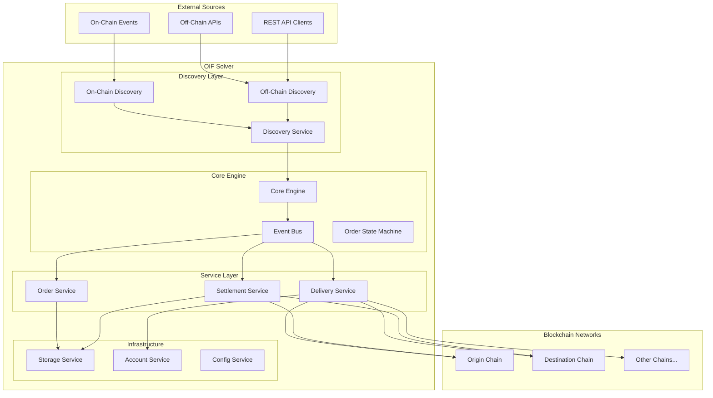
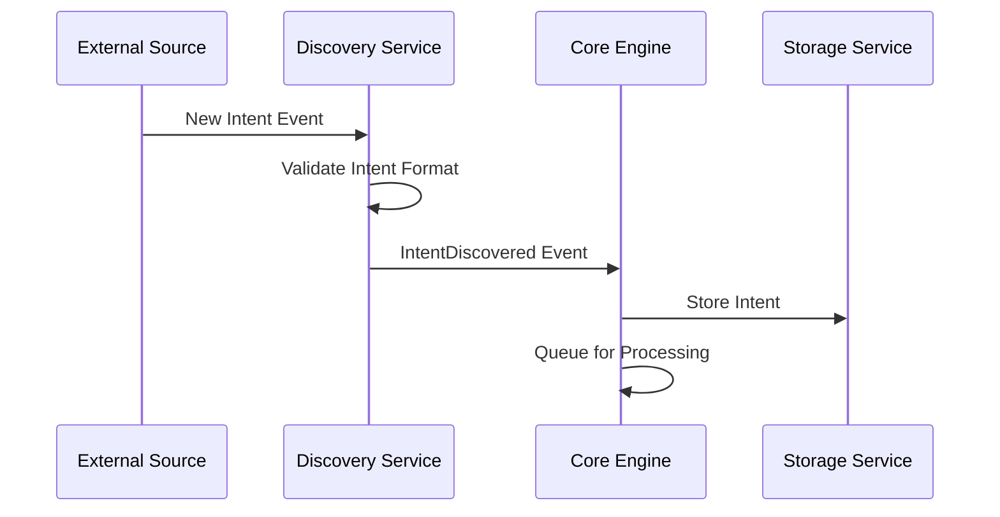
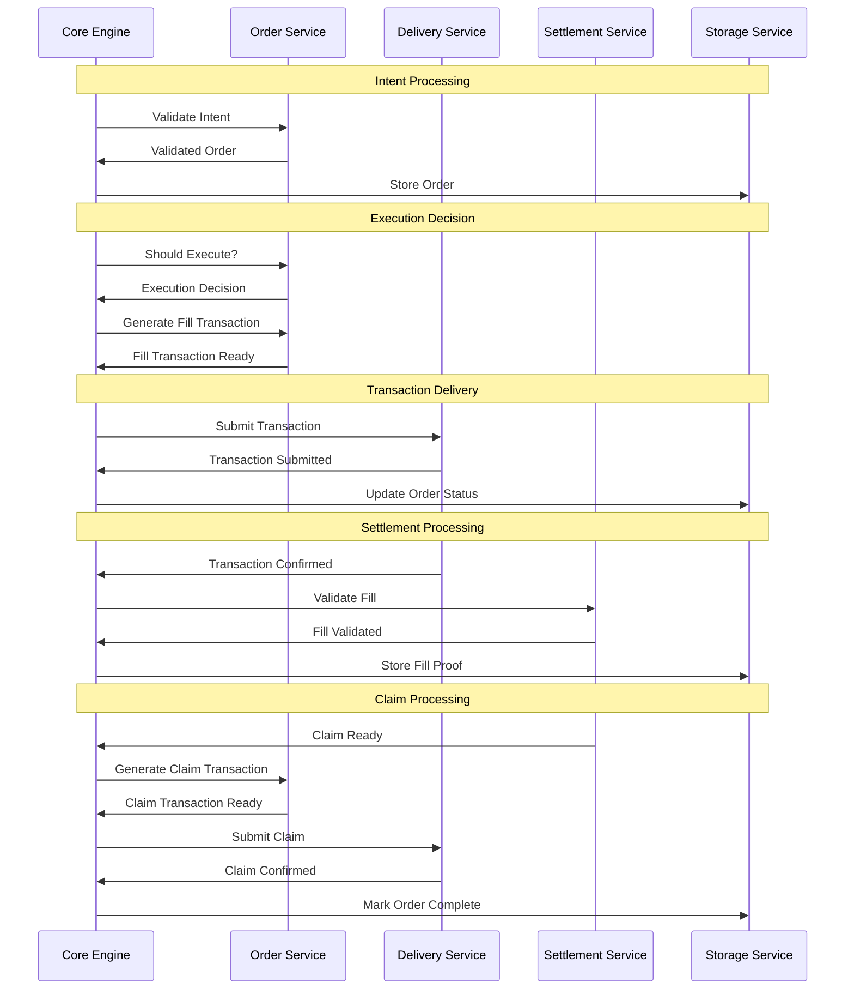
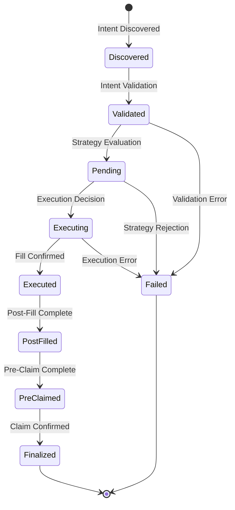

# Architecture Guide

This document provides a comprehensive overview of the OIF Solver's architecture, design principles, and how the different components work together to enable cross-chain intent execution.

## Design Principles

### Modular Architecture

The OIF Solver is built as a collection of loosely-coupled, specialized components. Each component has a single responsibility and communicates with others through well-defined interfaces. This approach provides:

- **Maintainability**: Individual components can be developed, tested, and debugged in isolation
- **Extensibility**: New implementations can be added without modifying existing code
- **Testability**: Each component can be unit tested with mocked dependencies

### Event-Driven Design

All components communicate through a centralized event system, enabling:

- **Asynchronous Processing**: Components don't block each other
- **Loose Coupling**: Components only need to know about events, not other components
- **Scalability**: Easy to add new event handlers and processors
- **Observability**: All interactions are captured as events for monitoring

### Multi-Chain Native

Built from the ground up for cross-chain operations:

- **Concurrent Monitoring**: Simultaneously monitor multiple blockchain networks
- **Chain-Specific Optimizations**: Each network can have tailored configurations
- **Unified Interface**: Consistent API regardless of the underlying blockchain
- **Future-Proof**: Easy to add support for new blockchain networks

## High-Level Architecture

## Component Architecture

### Core Engine (solver-core)

The orchestration layer that coordinates all other components.

**Responsibilities:**

- Event-driven workflow orchestration
- Order state management and transitions
- Component lifecycle management
- Error handling and recovery
- Graceful shutdown coordination

**Event Flow:**

1. Receives events from discovery services
2. Routes events to appropriate handlers
3. Manages order state transitions
4. Coordinates multi-step operations

### Discovery Layer (solver-discovery)

Monitors various sources for new cross-chain intents.

**Discovery Sources:**

- **On-Chain Discovery**: Monitors blockchain events for intent submissions
- **Off-Chain Discovery**: Receives intents via REST API endpoints
- **Future Sources**: Extensible to support new discovery mechanisms

### Service Layer

#### Order Service (solver-order)

Handles intent validation, execution strategy evaluation, and transaction generation.

**Order Lifecycle:**

1. **Validation**: Parse and validate intent data
2. **Strategy Evaluation**: Determine optimal execution timing
3. **Transaction Generation**: Create blockchain transactions
4. **State Updates**: Track order progress

#### Delivery Service (solver-delivery)

Manages reliable transaction submission (alloy-implementation) and monitoring across multiple blockchain networks.

**Features:**

- Multi-chain transaction submission
- Confirmation monitoring with configurable depth
- Gas estimation and pricing
- Transaction status tracking

#### Settlement Service (solver-settlement)

Handles post-execution settlement verification and claim processing.

**Settlement Flow:**

1. **Fill Validation**: Verify transaction execution and extract proofs
2. **Dispute Period Monitoring**: Wait for required settlement windows
3. **Claim Generation**: Create claim transactions when ready
4. **Oracle Verification**: Validate cross-chain proofs

### Infrastructure Layer

#### Storage Service (solver-storage)

Provides persistent state management with TTL support.

**Features:**

- Configurable TTL for different data types
- Automatic cleanup of expired data
- Multiple backend implementations (file, future: database)
- Atomic operations for critical data

#### Account Service (solver-account)

Manages cryptographic keys and signing on-chain operations.

**Security Features:**

- Secure key storage and handling
- Multiple account support
- Per-network account mapping

## Data Flow Architecture

### Intent Discovery Flow

### Order Processing Flow

## State Management

### Order State Machine

Orders progress through defined states with clear transitions:

**State Descriptions:**

- **Discovered**: Intent received but not yet processed
- **Validated**: Intent successfully parsed and validated
- **Pending**: Awaiting execution decision from strategy
- **Executing**: Fill transaction in progress
- **Executed**: Fill transaction confirmed
- **PostFilled**: Post-fill processing completed
- **PreClaimed**: Pre-claim transaction completed (if required)
- **Finalized**: Order fully completed with claim
- **Failed**: Order failed at some stage

## Error Handling Strategy

### Layered Error Handling

1. **Component Level**: Each component handles its specific errors
2. **Service Level**: Services aggregate and transform component errors
3. **Core Level**: Core engine handles workflow errors and recovery
4. **Application Level**: Top-level error handling for unrecoverable errors

This architecture provides a solid foundation for reliable, scalable cross-chain intent execution while remaining flexible for future requirements and enhancements.
