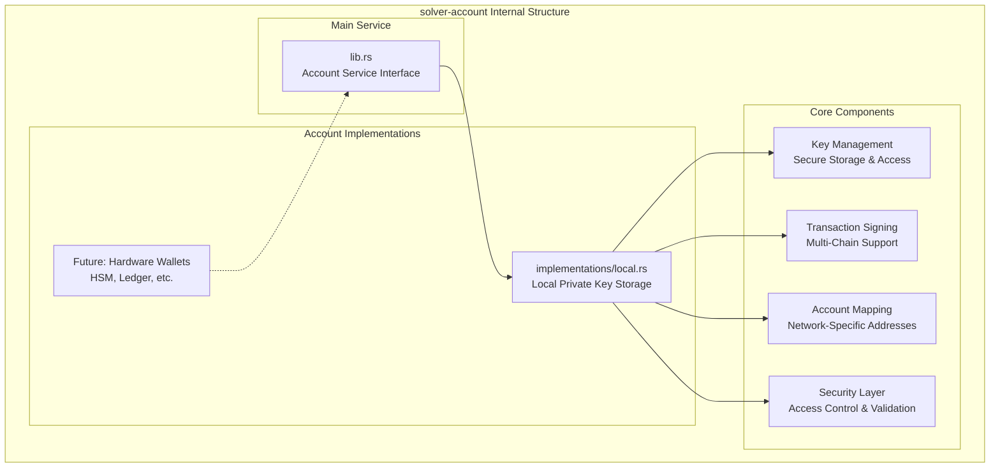
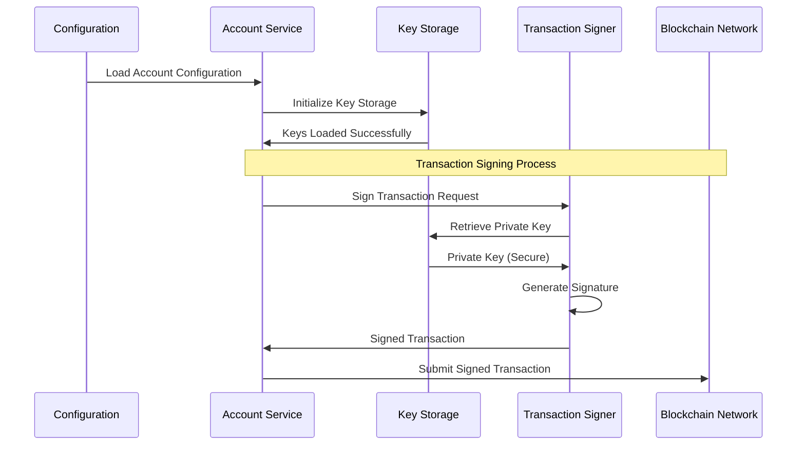

# solver-account

## Purpose & Scope

The `solver-account` crate manages cryptographic key storage, transaction signing, and account management for the OIF Solver. It provides secure key handling, multi-network account mapping, and transaction signing capabilities while maintaining security best practices for private key management.

## Internal Architecture

## Account Management Flow

## Implementation Caveats

### 🔒 Security Considerations

- **Private Key Storage**: Keys must be encrypted at rest and never logged

## Extension Points

### Custom Account Implementations

1. Implement the `AccountService` trait for new account types
2. Add support for hardware wallets (Ledger, Trezor, etc.)
3. Integrate with enterprise key management systems
4. Add support for multi-signature accounts

The solver-account crate provides secure, flexible account management with strong cryptographic foundations while supporting multiple blockchain networks and various key storage mechanisms.
