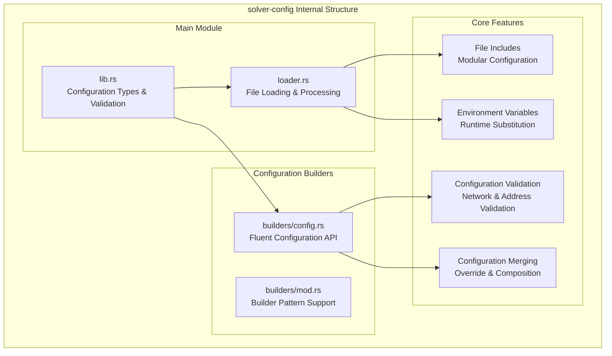
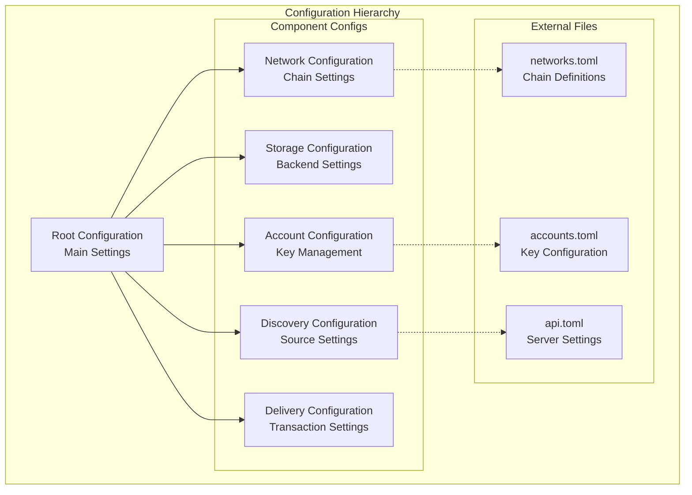

# solver-config

## Purpose & Scope

The `solver-config` crate provides configuration parsing, validation, and management for the OIF Solver system. It handles TOML configuration files with include support, environment variable substitution, and comprehensive validation of network addresses, parameters, and component settings.

## Internal Architecture

## Configuration Structure

The solver-config crate provides flexible, powerful configuration management with strong validation and modular organization while supporting complex deployment scenarios and operational requirements.
