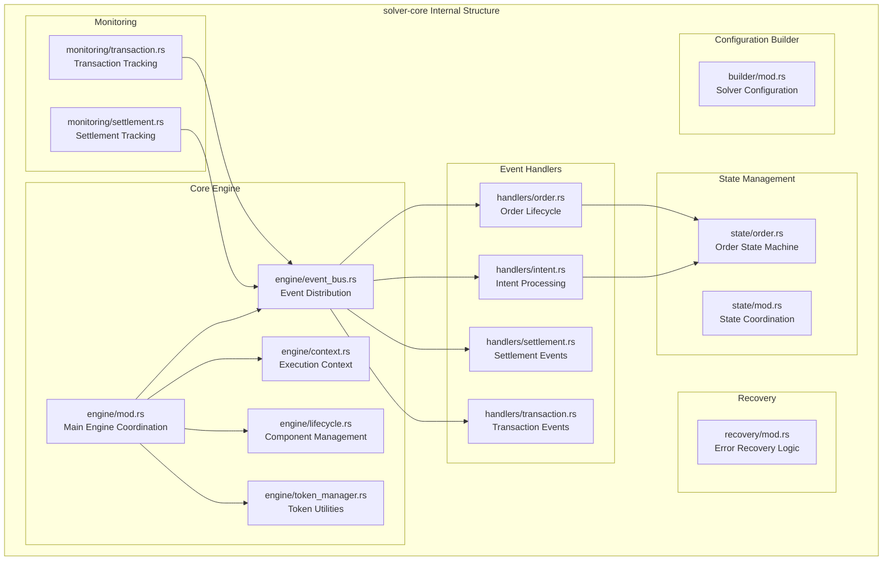
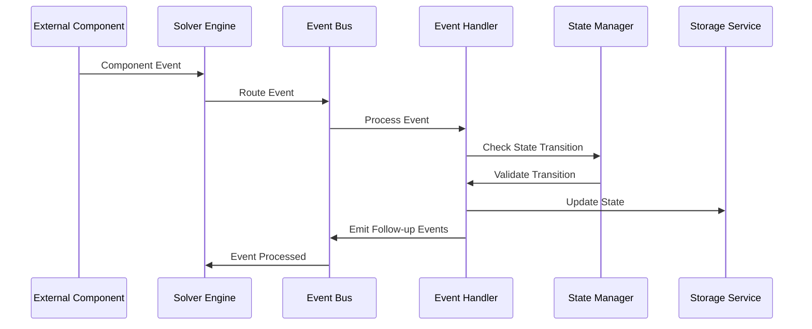

# solver-core

## Purpose & Scope

The `solver-core` crate serves as the orchestration engine for the entire OIF Solver system. It provides event-driven workflow coordination, order state management, and component lifecycle management. This crate acts as the central nervous system that coordinates all other solver components through a unified event bus architecture.

## Internal Architecture

## Event Flow Architecture

## Extension Points

### Adding New Event Handlers

1. Implement the `EventHandler` trait
2. Register with the event bus during engine initialization
3. Handle relevant events and emit follow-up events as needed

### Custom State Machines

1. Implement the `StateMachine` trait for your state/event types
2. Integrate with the existing state management system
3. Ensure proper state persistence and recovery

### Monitoring Components

1. Create monitoring services that subscribe to relevant events
2. Implement health checks and metrics collection
3. Register with the lifecycle manager for proper shutdown handling

The solver-core crate provides the foundation for reliable, event-driven cross-chain intent execution while maintaining clear separation of concerns and extensibility for future requirements.
