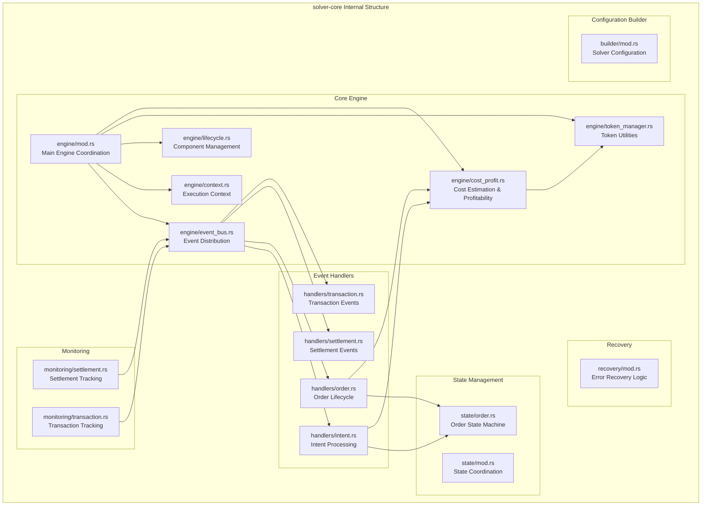
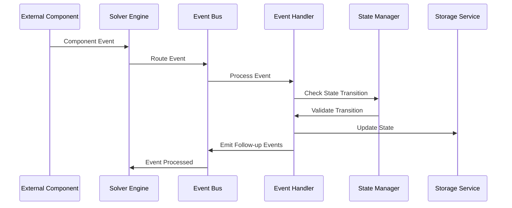

# solver-core

## Purpose & Scope

The `solver-core` crate serves as the orchestration engine for the entire OIF Solver system. It provides event-driven workflow coordination, order state management, and component lifecycle management. This crate acts as the central nervous system that coordinates all other solver components through a unified event bus architecture.

## Internal Architecture

## Event Flow Architecture

## Cost & Profitability Logic

The `CostProfitService` is a critical component that ensures orders are economically viable before execution. It provides comprehensive cost estimation and profitability validation across multiple blockchain networks.

### Cost Estimation Process

The service calculates execution costs through several components:

**1. Gas Cost Estimation**

- **Open Transaction**: Cost to initiate the order on the origin chain
- **Fill Transaction**: Cost to fulfill the order on the destination chain
- **Claim Transaction**: Cost to claim rewards/settle on the origin chain
- Uses configurable gas units per transaction type with fallback estimates
- Converts gas costs to USD using current gas prices and ETH/USD rates

**2. Operational Cost Calculation**

- Commission fees (configurable basis points)
- Gas buffer (safety margin for gas price volatility)
- Rate buffer (protection against price fluctuations)
- All costs normalized to USD for consistent comparison

### Profitability Validation

The profit margin calculation follows this formula:

**Validation Process:**

1. Parse order data to extract input/output amounts and token addresses
2. Use `TokenManager` to get token metadata (symbol, decimals)
3. Convert all token amounts to USD using `PricingService`
4. Calculate total execution costs from `CostEstimate`
5. Compute profit margin percentage
6. Validate against configurable solver's minimum profitability threshold

## Extension Points

### Adding New Event Handlers

1. Implement the `EventHandler` trait
2. Register with the event bus during engine initialization
3. Handle relevant events and emit follow-up events as needed

### Custom State Machines

1. Implement the `StateMachine` trait for your state/event types
2. Integrate with the existing state management system
3. Ensure proper state persistence and recovery

### Monitoring Components

1. Create monitoring services that subscribe to relevant events
2. Implement health checks and metrics collection
3. Register with the lifecycle manager for proper shutdown handling

The solver-core crate provides the foundation for reliable, event-driven cross-chain intent execution while maintaining clear separation of concerns and extensibility for future requirements.
