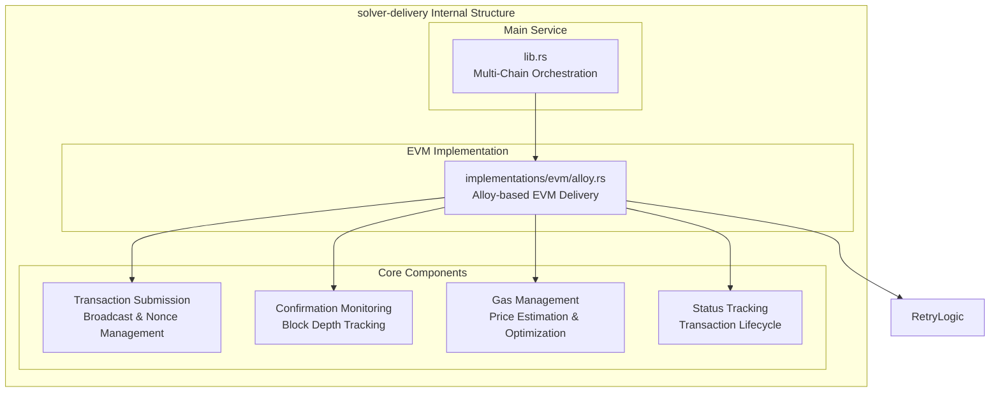
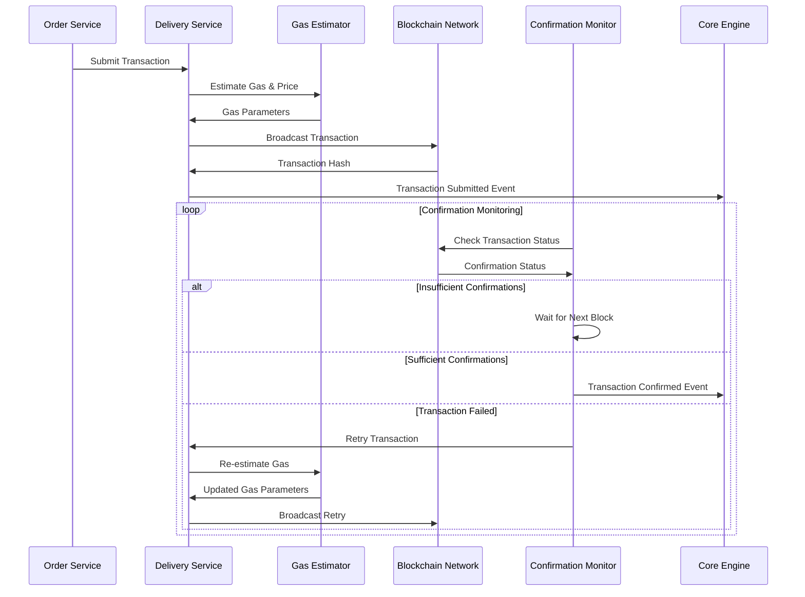

# solver-delivery

## Purpose & Scope

The `solver-delivery` crate manages reliable transaction submission and monitoring across multiple blockchain networks. It handles gas optimization, confirmation tracking, retry logic, and provides a unified interface for multi-chain transaction delivery regardless of the underlying blockchain implementation.

## Internal Architecture

## Transaction Delivery Flow

## Implementation Caveats

### ⛽ Gas Management Complexity

- **EIP-1559**
- **Network Congestion**: Gas prices can spike rapidly during network congestion
- **Priority Fee Optimization**: Balancing cost vs confirmation speed requires careful tuning
- **Gas Limit Estimation**: Contract interactions may require complex gas limit calculations

### 🔍 Monitoring and Observability

- **Transaction Tracing**: Complete audit trail for all transaction attempts
- **Performance Metrics**: Gas efficiency, confirmation times, and success rates
- **Error Analysis**: Categorizing and analyzing transaction failures
- **Cost Tracking**: Monitoring gas costs across different networks and strategies

## Extension Points

### Adding New Blockchain Networks

1. Create implementation modules for the new blockchain type
2. Implement the `DeliveryService` trait with network-specific logic
3. Add network-specific gas estimation and confirmation logic
4. Handle network-specific transaction formats and requirements

The solver-delivery crate provides robust, multi-chain transaction delivery with sophisticated gas management and retry mechanisms while maintaining flexibility for different blockchain networks and use cases.
