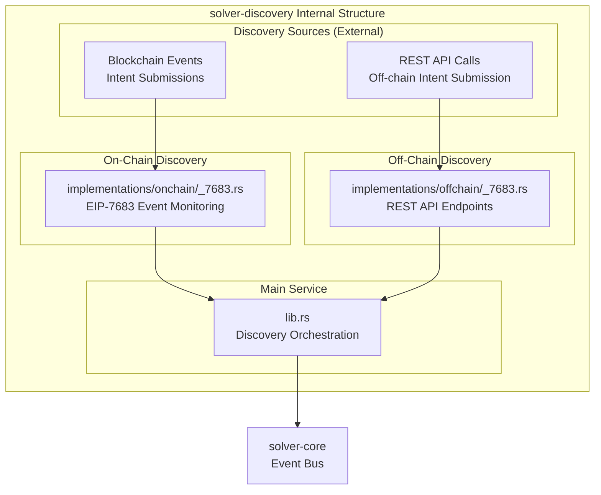
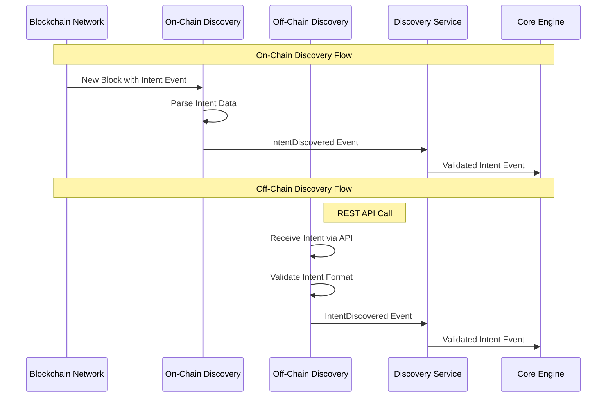

# solver-discovery

## Purpose & Scope

The `solver-discovery` crate is responsible for monitoring multiple sources to discover new cross-chain intents. It provides a unified interface for both on-chain blockchain event monitoring and off-chain API-based intent submission. This crate acts as the entry point for all intents into the solver system.

## Internal Architecture



## Discovery Flow



## Implementation Caveats

### 📡 Off-Chain Discovery Considerations

- **API Security**: Must validate and authenticate incoming intent submissions
- **Data Validation**: Thorough validation of intent structure before processing
- **Duplicate Detection**: Same intent might be submitted via multiple channels

### ⚡ Performance and Scalability

- **Concurrent Monitoring**: Each network is monitored in parallel to avoid blocking
- **Event Processing**: High-frequency events require efficient batching and processing

## Configuration Examples

### Off-Chain and On-Chain discovery API Configuration example

```toml
[discovery]

[discovery.implementations.onchain_eip7683]
network_ids = [31337, 31338]

[discovery.implementations.offchain_eip7683]
api_host = "127.0.0.1"
api_port = 8081
network_ids = [31337]
```

## Extension Points

### Adding New Protocol Standards

1. Create new implementation modules under `implementations/onchain/` or `implementations/offchain/`
2. Implement the `DiscoverySource` trait
3. Add protocol-specific event parsing and validation
4. Register with the main discovery service

The solver-discovery crate provides flexible, reliable intent discovery across multiple sources while maintaining clear separation between on-chain and off-chain discovery mechanisms.
