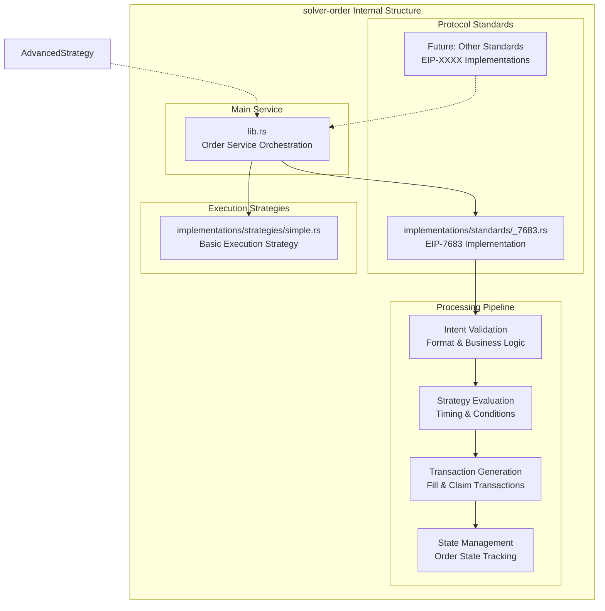
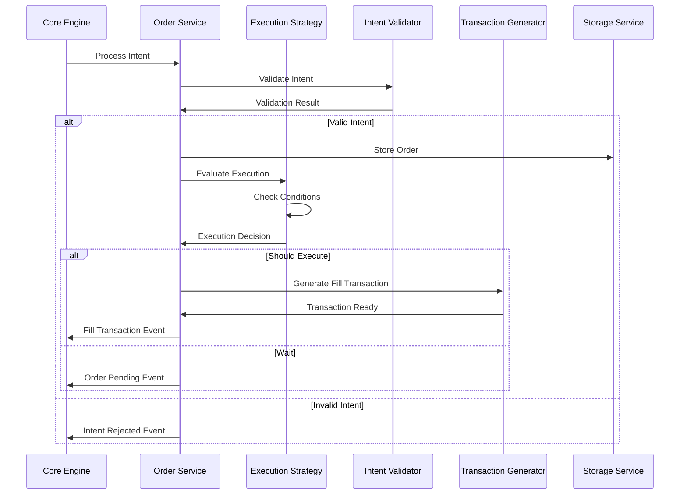

# solver-order

## Purpose & Scope

The `solver-order` crate handles the core business logic of intent processing, including validation, execution strategy evaluation, and transaction generation. It transforms raw intents into executable blockchain transactions while applying sophisticated execution strategies to optimize timing, gas costs, and success rates.

## Internal Architecture

## Processing Pipeline

## Implementation Caveats

### Intent Validation Complexity

- **Multi-Protocol Support**: Different intent standards have varying validation requirements
- **Asset Verification**: Must verify asset existence, decimals, and contract validity across chains
- **Signature Validation**: EIP-712 signature verification requires careful message reconstruction
- **Cross-Chain State**: Validating cross-chain asset balances and allowances is inherently slow

The solver-order crate provides sophisticated intent processing capabilities while maintaining flexibility for different protocols and execution strategies.
