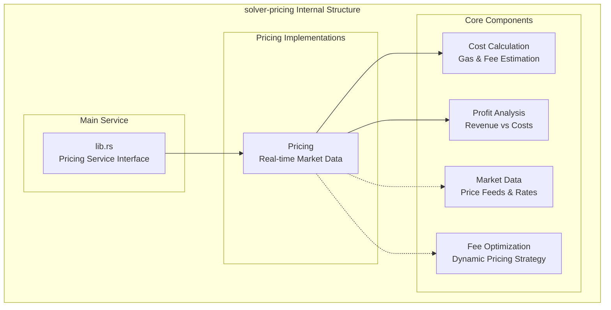
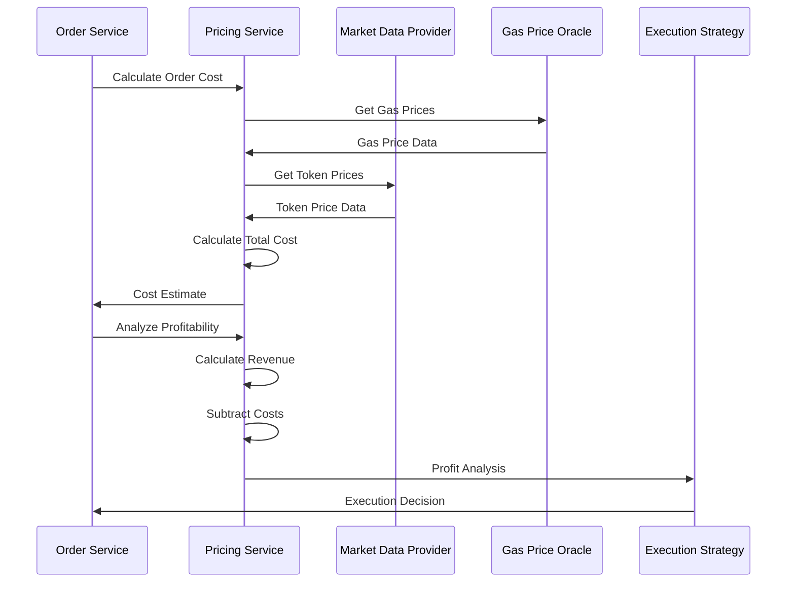

# solver-pricing

## Purpose & Scope

The `solver-pricing` crate handles fee calculation, cost estimation, and pricing strategies for cross-chain intent execution. It provides profit analysis, gas cost estimation, and dynamic pricing mechanisms to ensure economically viable order execution across multiple blockchain networks.

## Internal Architecture (TBD)



## Pricing Calculation Flow



## Configuration Examples (TBD)

### Pricing Service Configuration (TBD)

```toml
[pricing]
default_price_source = "coingecko"
price_cache_ttl_seconds = 60
gas_price_cache_ttl_seconds = 30
min_profit_threshold_usd = 5.0
max_slippage_bps = 100  # 1%

[pricing.sources.coingecko]
api_key = "${COINGECKO_API_KEY}"
base_url = "https://api.coingecko.com/api/v3"
rate_limit_per_minute = 50

[pricing.sources.chainlink]
enabled = true
fallback_priority = 2

[pricing.gas_oracles]
[pricing.gas_oracles.ethereum]
source = "ethgasstation"
api_key = "${ETH_GAS_API_KEY}"
fallback_multiplier = 1.2

[pricing.gas_oracles.polygon]
source = "polygonscan"
api_key = "${POLYGON_API_KEY}"
fallback_multiplier = 1.1
```

The solver-pricing crate provides comprehensive pricing and cost analysis capabilities while maintaining flexibility for different market data sources and pricing strategies across multiple blockchain networks.
