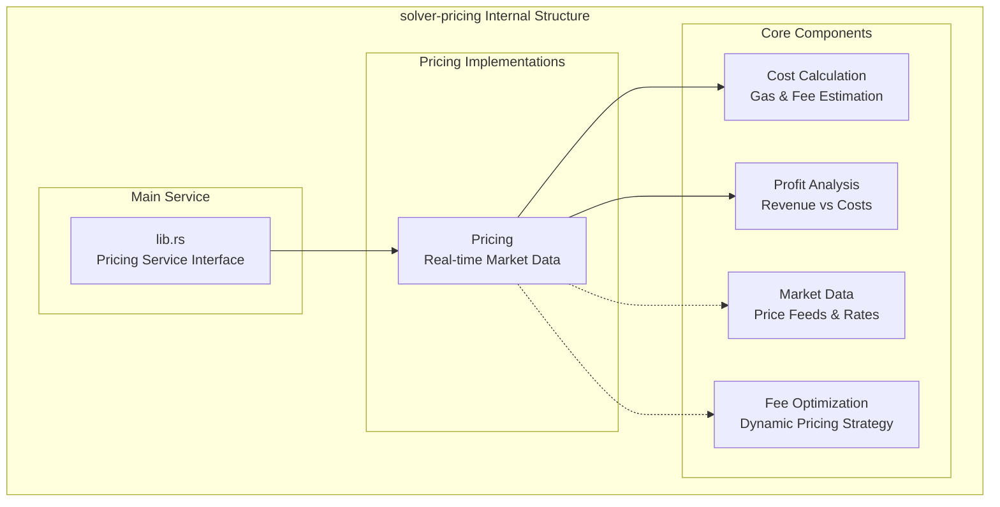
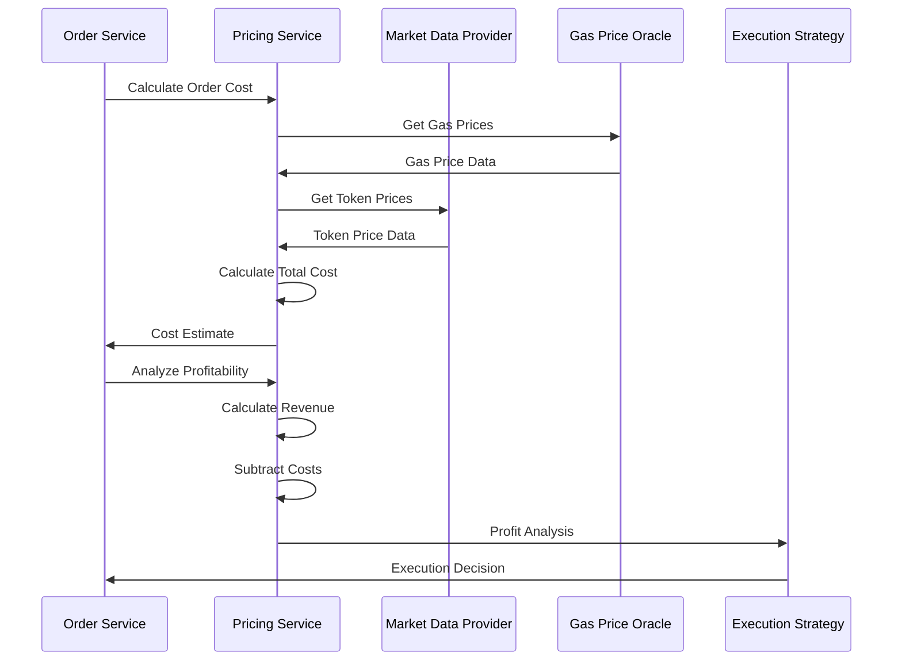

# solver-pricing

## Purpose & Scope

The `solver-pricing` crate handles fee calculation, cost estimation, and pricing strategies for cross-chain intent execution. It provides profit analysis, gas cost estimation, and dynamic pricing mechanisms to ensure economically viable order execution across multiple blockchain networks.

## Internal Architecture (TBD)



## Pricing Calculation Flow



## Configuration Example

### Pricing Service Configuration

```toml
[pricing]
primary = "coingecko"

[pricing.implementations.mock]
# Uses default ETH/USD price of 4615.16
# Optional: override specific pair prices
# [pricing.implementations.mock.pair_prices]
# "ETH/USD" = "4615.16"
# "SOL/USD" = "240.50"

[pricing.implementations.coingecko]
# Optional API key for higher rate limits
# api_key = "CG-YOUR-API-KEY-HERE"
cache_duration_seconds = 60
rate_limit_delay_ms = 1200  # Free tier: 1200ms, Pro tier: 100ms

# Custom prices for demo/test tokens (in USD)
[pricing.implementations.coingecko.custom_prices]
TOKA = "200.00"
TOKB = "195.00"

# Optional: custom token ID mappings for CoinGecko
# [pricing.implementations.coingecko.token_id_map]
# "CUSTOM" = "custom-token-id"

# Gas configuration (separate from pricing service)
[gas]
[gas.flows.compact_resource_lock]
open = 0
fill = 76068
claim = 121995

[gas.flows.permit2_escrow]
open = 143116
fill = 76068
claim = 59953
```

The solver-pricing crate provides comprehensive pricing and cost analysis capabilities while maintaining flexibility for different market data sources and pricing strategies across multiple blockchain networks.
