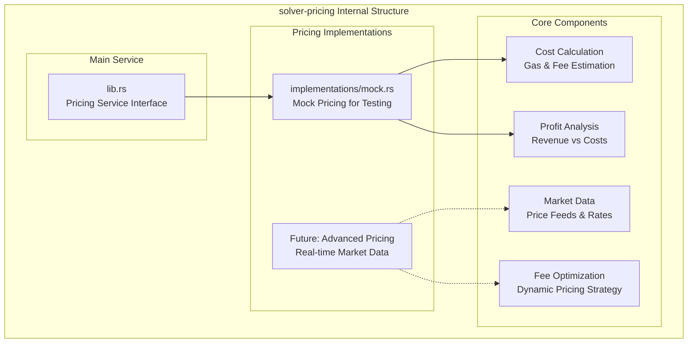
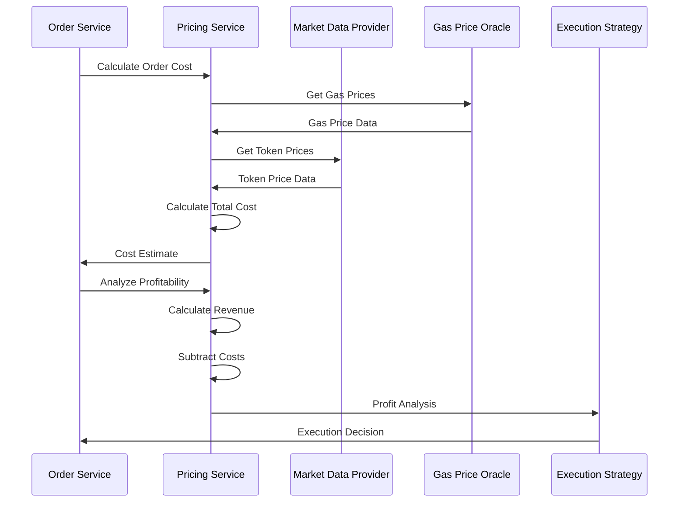

# solver-pricing

## Purpose & Scope

The `solver-pricing` crate handles fee calculation, cost estimation, and pricing strategies for cross-chain intent execution. It provides profit analysis, gas cost estimation, and dynamic pricing mechanisms to ensure economically viable order execution across multiple blockchain networks.

## Internal Architecture



## Pricing Calculation Flow



## Key APIs

### Pricing Service Interface

```rust
pub trait PricingService: Send + Sync {
    async fn calculate_execution_cost(&self, order: &Order) -> Result<ExecutionCost>;
    async fn estimate_profit(&self, order: &Order) -> Result<ProfitEstimate>;
    async fn get_token_price(&self, token: &Address, chain_id: u64) -> Result<TokenPrice>;
    async fn calculate_optimal_fee(&self, order: &Order) -> Result<FeeStructure>;
}

pub struct ExecutionCost {
    pub gas_costs: HashMap<u64, u64>, // per chain_id
    pub bridge_fees: Vec<BridgeFee>,
    pub protocol_fees: Vec<ProtocolFee>,
    pub total_cost_usd: f64,
}

pub struct ProfitEstimate {
    pub revenue_usd: f64,
    pub total_cost_usd: f64,
    pub net_profit_usd: f64,
    pub profit_margin: f64,
    pub break_even_gas_price: u64,
}
```

### Token Pricing

```rust
pub struct TokenPrice {
    pub address: Address,
    pub symbol: String,
    pub price_usd: f64,
    pub decimals: u8,
    pub last_updated: DateTime<Utc>,
    pub source: PriceSource,
}

pub enum PriceSource {
    Mock,
    Coingecko,
    Chainlink,
    UniswapV3,
    DEXAggregator,
}
```

### Fee Structure

```rust
pub struct FeeStructure {
    pub base_fee: u64,
    pub priority_fee: Option<u64>,
    pub protocol_fee_bps: u16, // basis points
    pub solver_fee_bps: u16,
    pub total_fee_usd: f64,
}

pub struct BridgeFee {
    pub bridge_name: String,
    pub source_chain: u64,
    pub dest_chain: u64,
    pub fee_amount: u64,
    pub fee_token: Address,
}
```

## Implementation Caveats

### 💰 Market Data Challenges

- **Price Feed Reliability**: External price sources may be unavailable or inaccurate
- **Latency Issues**: Market data may be stale by the time execution occurs
- **Cross-Chain Price Differences**: Same token may have different prices on different chains
- **Low Liquidity Tokens**: Pricing for tokens with limited market data

### ⚡ Gas Price Volatility

- **Dynamic Gas Markets**: Gas prices can change rapidly, especially during network congestion
- **EIP-1559 Complexity**: Base fee and priority fee calculations for optimal inclusion
- **Cross-Chain Variations**: Different networks have vastly different gas cost structures
- **MEV Impact**: Maximum Extractable Value affects optimal gas pricing strategies

### 📋 Profit Calculation Complexity

- **Multi-Asset Orders**: Orders involving multiple tokens across different chains
- **Slippage Estimation**: Price impact from large trades affects profitability
- **Opportunity Cost**: Cost of capital locked during multi-step execution
- **Risk Premiums**: Accounting for execution risk and potential losses

### 🔄 Dynamic Pricing Strategy

- **Competition**: Other solvers affect optimal pricing strategies
- **Market Conditions**: Bull/bear markets require different fee structures
- **Network Congestion**: Higher fees during peak usage periods
- **Protocol Changes**: Network upgrades can affect cost structures

### 📊 Performance Requirements

- **Real-Time Calculations**: Pricing must be calculated quickly for timely execution
- **Caching Strategy**: Balance between fresh data and performance
- **Batch Processing**: Efficient pricing for multiple orders simultaneously
- **Error Handling**: Graceful degradation when pricing sources fail

## Usage Examples

### Basic Cost Calculation

```rust
use solver_pricing::{PricingService, Order};

let pricing_service = PricingService::new(pricing_config);

// Calculate execution costs for an order
let execution_cost = pricing_service
    .calculate_execution_cost(&order)
    .await?;

println!("Total execution cost: ${:.2}", execution_cost.total_cost_usd);
println!("Gas costs:");
for (chain_id, cost) in &execution_cost.gas_costs {
    println!("  Chain {}: {} wei", chain_id, cost);
}

if !execution_cost.bridge_fees.is_empty() {
    println!("Bridge fees:");
    for fee in &execution_cost.bridge_fees {
        println!("  {}: {} ({}->{})", 
            fee.bridge_name, fee.fee_amount, fee.source_chain, fee.dest_chain);
    }
}
```

### Profitability Analysis

```rust
use solver_pricing::{ProfitEstimate};

// Analyze order profitability
let profit_estimate = pricing_service
    .estimate_profit(&order)
    .await?;

println!("Profit Analysis:");
println!("  Revenue: ${:.2}", profit_estimate.revenue_usd);
println!("  Total Cost: ${:.2}", profit_estimate.total_cost_usd);
println!("  Net Profit: ${:.2}", profit_estimate.net_profit_usd);
println!("  Profit Margin: {:.2}%", profit_estimate.profit_margin * 100.0);

if profit_estimate.net_profit_usd > 0.0 {
    println!("✅ Order is profitable");
} else {
    println!("❌ Order is not profitable");
    println!("Break-even gas price: {} gwei", 
        profit_estimate.break_even_gas_price / 1_000_000_000);
}
```

### Token Price Retrieval

```rust
use solver_pricing::{TokenPrice, Address};

// Get token prices for profit calculation
let usdc_address = Address::from_str("0xA0b86a33E6441b5b19CA3f0e0f83f8e61c5F6ba7")?;
let weth_address = Address::from_str("0x82aF49447D8a07e3bd95BD0d56f35241523fBab1")?;

let usdc_price = pricing_service
    .get_token_price(&usdc_address, 42161) // Arbitrum
    .await?;

let weth_price = pricing_service
    .get_token_price(&weth_address, 42161)
    .await?;

println!("USDC Price: ${:.6} ({})", usdc_price.price_usd, usdc_price.source);
println!("WETH Price: ${:.2} ({})", weth_price.price_usd, weth_price.source);

// Calculate USD values
let usdc_amount = 1000; // 1000 USDC
let usdc_value = (usdc_amount as f64) * usdc_price.price_usd;
println!("1000 USDC = ${:.2}", usdc_value);
```

### Dynamic Fee Optimization

```rust
use solver_pricing::{FeeStructure};

// Calculate optimal fee structure
let optimal_fee = pricing_service
    .calculate_optimal_fee(&order)
    .await?;

println!("Optimal Fee Structure:");
println!("  Base Fee: {} gwei", optimal_fee.base_fee / 1_000_000_000);
if let Some(priority_fee) = optimal_fee.priority_fee {
    println!("  Priority Fee: {} gwei", priority_fee / 1_000_000_000);
}
println!("  Protocol Fee: {}bps", optimal_fee.protocol_fee_bps);
println!("  Solver Fee: {}bps", optimal_fee.solver_fee_bps);
println!("  Total Fee: ${:.2}", optimal_fee.total_fee_usd);
```

### Mock Pricing for Testing

```rust
use solver_pricing::{MockPricing, TokenPrice, PriceSource};

// Set up mock pricing for tests
let mut mock_pricing = MockPricing::new();

// Configure mock token prices
mock_pricing.set_token_price(
    &usdc_address,
    1, // Ethereum
    TokenPrice {
        address: usdc_address,
        symbol: "USDC".to_string(),
        price_usd: 0.999,
        decimals: 6,
        last_updated: Utc::now(),
        source: PriceSource::Mock,
    },
)?;

// Configure mock gas prices
mock_pricing.set_gas_price(1, 20_000_000_000); // 20 gwei for Ethereum
mock_pricing.set_gas_price(137, 30_000_000_000); // 30 gwei for Polygon

// Use mock pricing in tests
let cost = mock_pricing.calculate_execution_cost(&test_order).await?;
assert!(cost.total_cost_usd > 0.0);
```

## Configuration Examples

### Pricing Service Configuration

```toml
[pricing]
default_price_source = "coingecko"
price_cache_ttl_seconds = 60
gas_price_cache_ttl_seconds = 30
min_profit_threshold_usd = 5.0
max_slippage_bps = 100  # 1%

[pricing.sources.coingecko]
api_key = "${COINGECKO_API_KEY}"
base_url = "https://api.coingecko.com/api/v3"
rate_limit_per_minute = 50

[pricing.sources.chainlink]
enabled = true
fallback_priority = 2

[pricing.gas_oracles]
[pricing.gas_oracles.ethereum]
source = "ethgasstation"
api_key = "${ETH_GAS_API_KEY}"
fallback_multiplier = 1.2

[pricing.gas_oracles.polygon]
source = "polygonscan"
api_key = "${POLYGON_API_KEY}"
fallback_multiplier = 1.1
```

### Fee Structure Configuration

```toml
[pricing.fees]
base_solver_fee_bps = 10  # 0.1%
max_solver_fee_bps = 50   # 0.5%
protocol_fee_bps = 5      # 0.05%

[pricing.fees.dynamic]
enabled = true
congestion_multiplier = 1.5
competition_adjustment = true
profit_margin_target = 0.15  # 15%

[pricing.fees.by_network]
[pricing.fees.by_network.ethereum]
min_gas_price_gwei = 10
max_gas_price_gwei = 200
priority_fee_multiplier = 1.1

[pricing.fees.by_network.polygon]
min_gas_price_gwei = 20
max_gas_price_gwei = 1000
priority_fee_multiplier = 1.05
```

## Dependencies

- **reqwest**: HTTP client for external price API calls
- **tokio**: Async runtime for concurrent price fetching
- **serde**: JSON serialization for API responses
- **rust_decimal**: Precise decimal arithmetic for financial calculations
- **chrono**: Time handling for price data timestamps
- **dashmap**: Concurrent caching for price and gas data
- **solver-types**: Shared type definitions for orders and tokens
- **solver-config**: Configuration management for pricing parameters
- **alloy**: Ethereum types and address handling

## Extension Points

### Custom Price Sources

1. Implement price feed integrations for additional sources (DEX aggregators, CEX APIs)
2. Add support for custom token price calculation methods
3. Integrate with on-chain price oracles (Chainlink, Band Protocol)
4. Implement cross-chain arbitrage price discovery

### Advanced Pricing Strategies

1. Machine learning-based profit optimization
2. Dynamic fee adjustment based on market conditions
3. Competition-aware pricing strategies
4. Risk-adjusted pricing with volatility considerations

### Performance Optimizations

1. Batch price fetching for multiple tokens
2. Advanced caching strategies with predictive pre-loading
3. Price streaming for real-time market data
4. Efficient price interpolation and extrapolation

The solver-pricing crate provides comprehensive pricing and cost analysis capabilities while maintaining flexibility for different market data sources and pricing strategies across multiple blockchain networks.