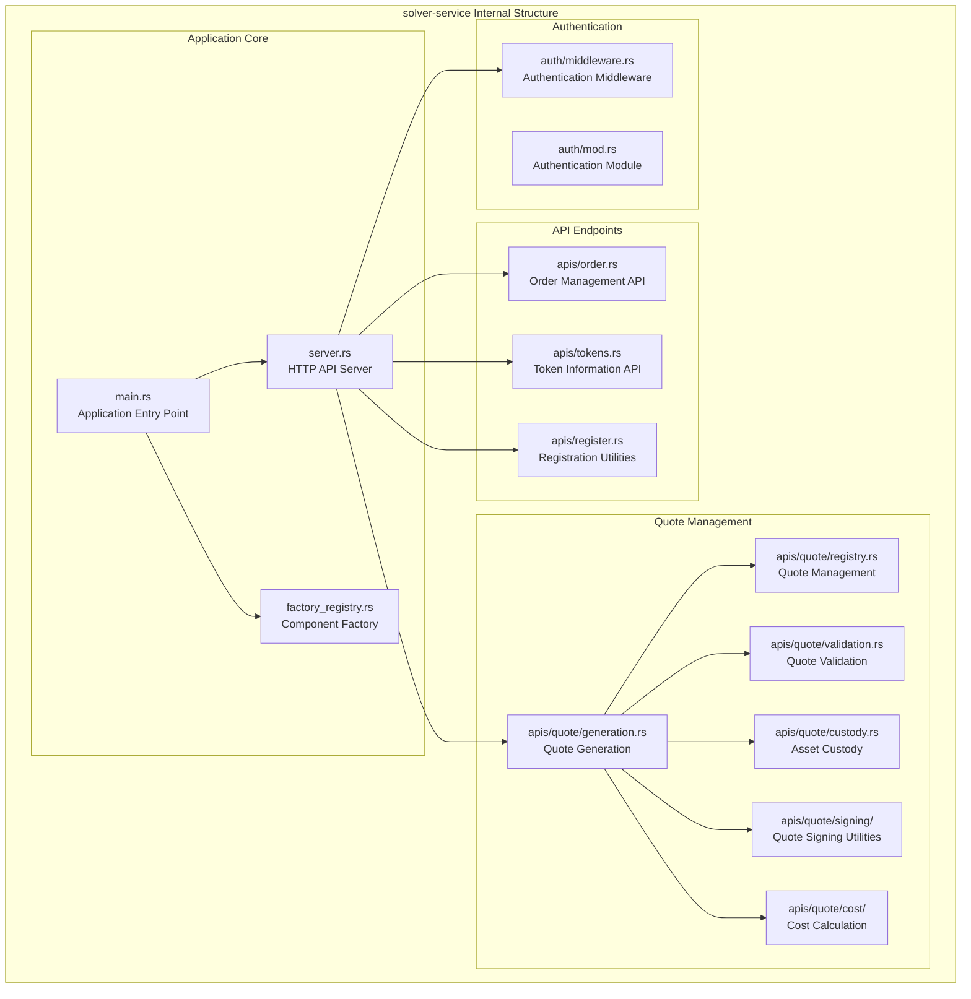
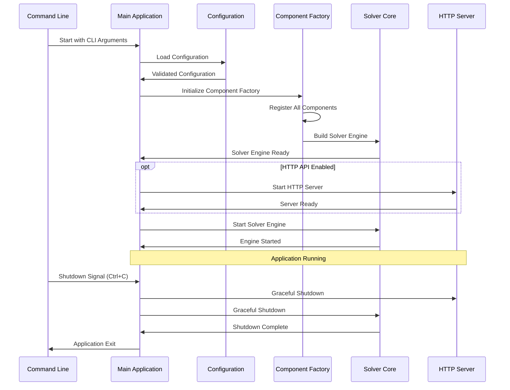

# solver-service

## Purpose & Scope

The `solver-service` crate serves as the main executable that integrates all solver components into a cohesive application. It provides the command-line interface, HTTP API server, component factory registry, and application lifecycle management. This crate acts as the entry point and orchestration layer for the entire OIF Solver system.

## Internal Architecture



## Application Lifecycle



## Implementation Caveats

### 🔐 Authentication and Authorization

- **JWT Token Management**: Secure token generation, validation, and refresh
- **Role-Based Access**: Different API endpoints may require different permissions
- **Audit Logging**: Log all authenticated operations for security analysis

## Configuration Examples

### Application Configuration

```toml
# Application-level settings
[app]
name = "OIF Solver Production"
version = "1.0.0"
log_level = "info"
log_format = "json"
shutdown_timeout_seconds = 30

# HTTP API configuration
[api]
enabled = true
bind_address = "0.0.0.0:8080"
max_request_size = 1048576  # 1MB
request_timeout_seconds = 30
enable_cors = true
allowed_origins = ["https://app.example.com"]

# Authentication configuration
[api.auth]
type = "jwt"
jwt_secret = "${JWT_SECRET}"
jwt_expiry_seconds = 3600
require_auth = true
```

The solver-service crate provides a robust, production-ready application framework that integrates all solver components while maintaining operational excellence through comprehensive monitoring, logging, and configuration management.
