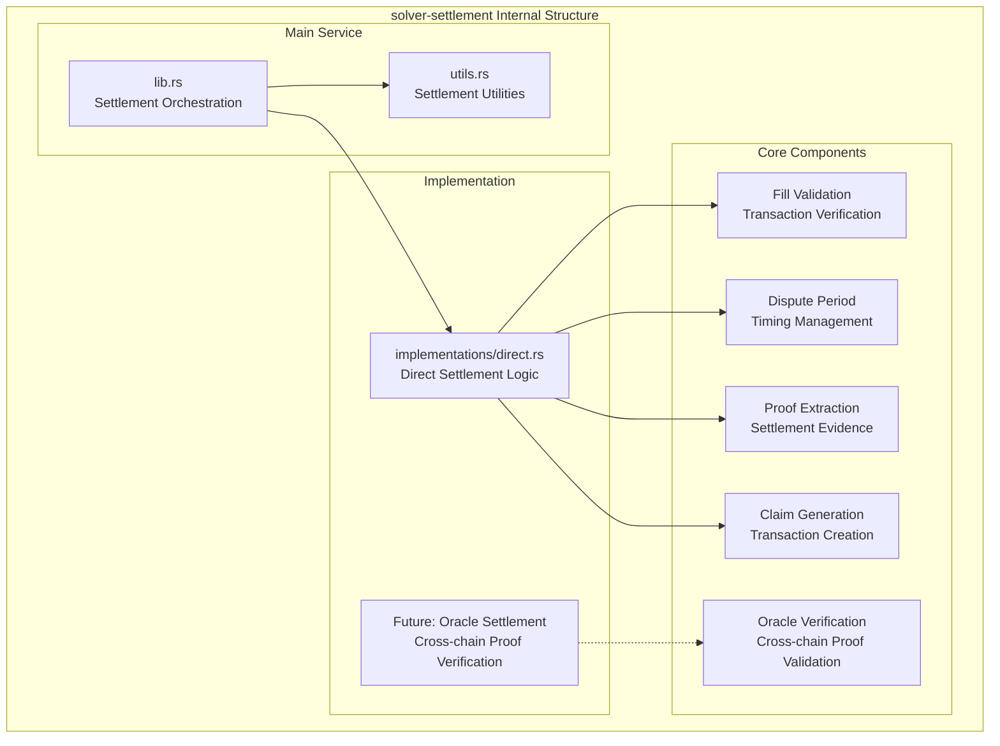
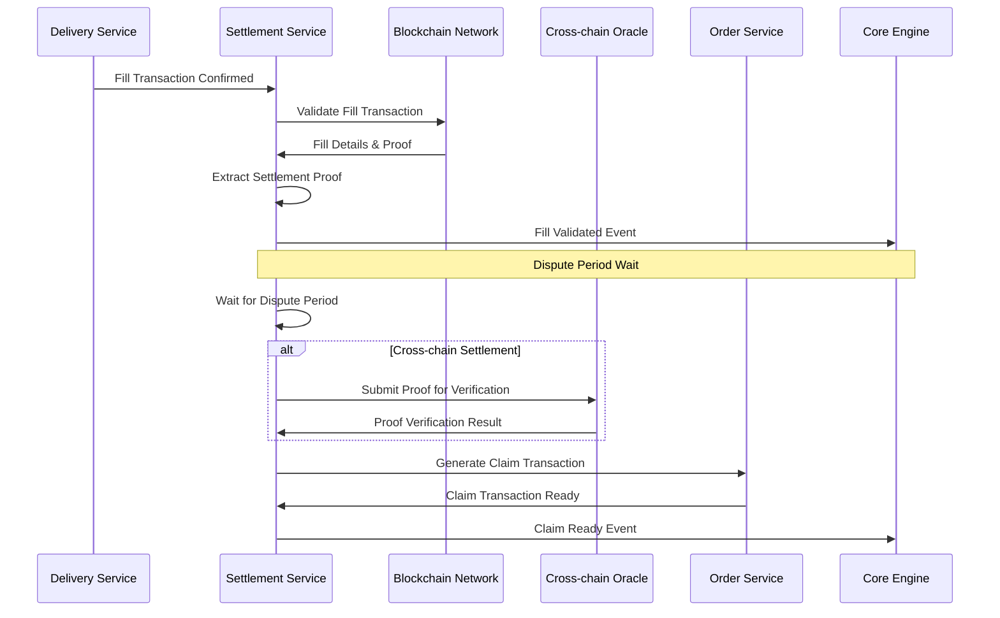

# solver-settlement

## Purpose & Scope

The `solver-settlement` crate handles post-execution settlement verification, claim processing, and dispute resolution for cross-chain intents. It validates fill transactions, manages dispute periods, coordinates oracle verification for cross-chain proofs, and generates claim transactions when ready.

## Internal Architecture

## Settlement Flow

## Implementation Caveats

### ⏰ Timing Complexity

- **Dispute Periods**: Different protocols have varying dispute/challenge periods
- **Block Finality**: Must wait for sufficient finality before extracting proofs
- **Claim Deadlines**: Claims may have expiration deadlines that must be met

The solver-settlement crate provides comprehensive post-execution settlement capabilities while maintaining flexibility for different protocols, oracle systems, and dispute resolution mechanisms.
