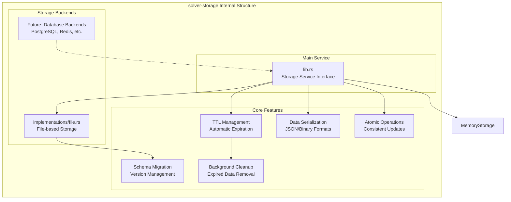
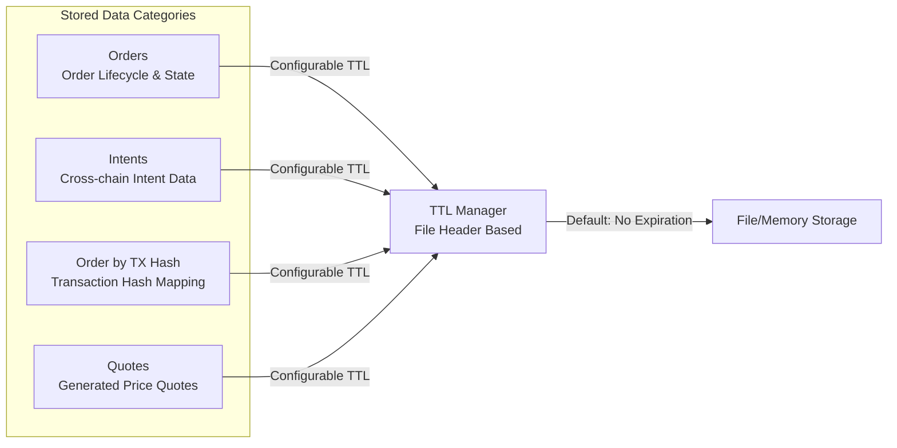

# solver-storage

## Purpose & Scope

The `solver-storage` crate provides persistent storage abstraction with TTL (Time-To-Live) management for the OIF Solver system. It handles order state persistence, intent caching, proof storage, and configuration data with automatic cleanup of expired data across multiple storage backends.

## Internal Architecture



## Storage Data Types



## Configuration Examples

### Storage Backend Configuration

```toml
# Storage configuration with TTL management
[storage]
primary = "file"
cleanup_interval_seconds = 3600

[storage.implementations.file]
storage_path = "./data/storage"
ttl_orders = 0                  # Permanent
ttl_intents = 86400             # 24 hours
ttl_order_by_tx_hash = 86400    # 24 hours
```

## Extension Points

### Custom Storage Backends

1. Implement the `StorageService` trait for new backends
2. Add backend-specific configuration options
3. Handle backend-specific features (e.g., transactions, indexes)

The solver-storage crate provides flexible, persistent storage capabilities with automatic cleanup and multiple backend support while maintaining data consistency and performance across the solver system.
