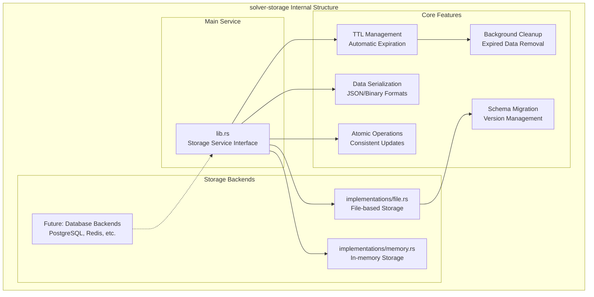
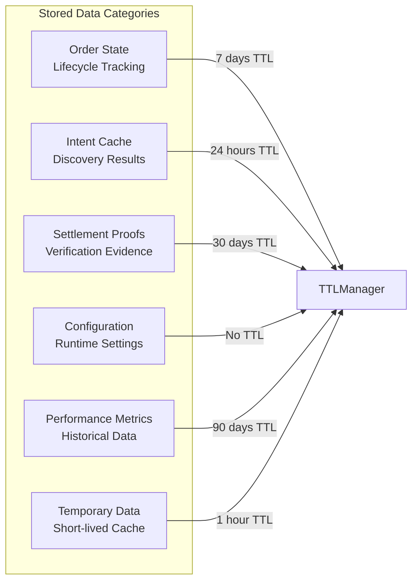

# solver-storage

## Purpose & Scope

The `solver-storage` crate provides persistent storage abstraction with TTL (Time-To-Live) management for the OIF Solver system. It handles order state persistence, intent caching, proof storage, and configuration data with automatic cleanup of expired data across multiple storage backends.

## Internal Architecture



## Storage Data Types



## Configuration Examples

### Storage Backend Configuration

```toml
[storage]
backend = "file"
data_dir = "/var/lib/solver/data"
default_ttl_seconds = 86400  # 24 hours
cleanup_interval_seconds = 3600  # 1 hour
max_key_size = 256
max_value_size = 1048576  # 1MB

[storage.ttl]
order_state_seconds = 604800      # 7 days
intent_cache_seconds = 86400      # 24 hours
settlement_proof_seconds = 2592000 # 30 days
configuration_seconds = 0         # No expiration
metrics_seconds = 7776000         # 90 days
temporary_seconds = 3600          # 1 hour
```

## Extension Points

### Custom Storage Backends

1. Implement the `StorageService` trait for new backends
2. Add backend-specific configuration options
3. Handle backend-specific features (e.g., transactions, indexes)

The solver-storage crate provides flexible, persistent storage capabilities with automatic cleanup and multiple backend support while maintaining data consistency and performance across the solver system.
