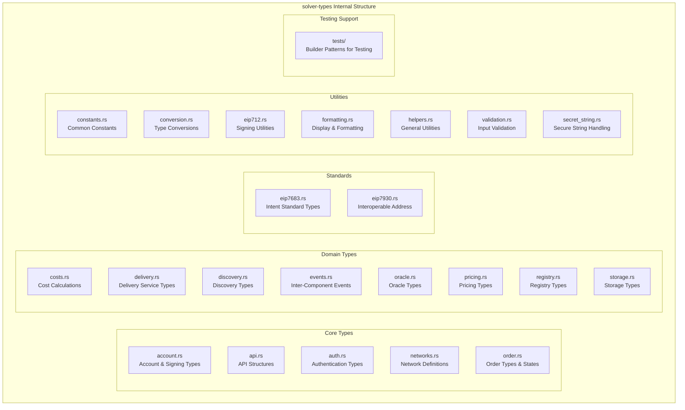

# solver-types

## Purpose & Scope

The `solver-types` crate serves as the foundational layer for the entire OIF Solver ecosystem, providing shared data structures, traits, and type definitions used across all components. This crate ensures type consistency and enables seamless communication between different solver components.

## Internal Architecture

## Dependencies

- **No Business Logic**: Pure data types and utilities only
- **Workspace Consistency**: Uses workspace-level dependency versions

This foundational crate ensures type safety and consistency across the entire solver ecosystem while providing comprehensive testing utilities and clear extension points for future protocol support.
